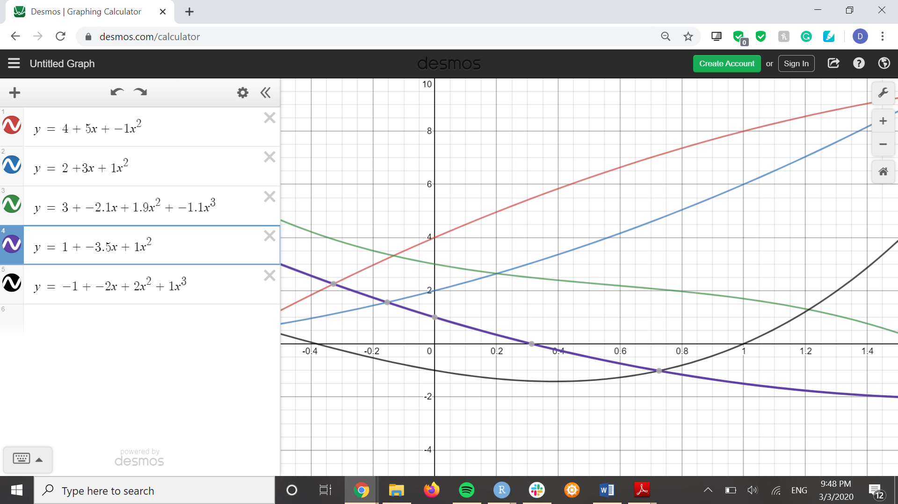

```{r message=FALSE, warning=FALSE, include=FALSE}
pacman::p_load(readr, haven, readxl, downloader, tidyverse, ggbeeswarm, mosaic, stringr, pander, DT, ggplot2, alr3, foreign, measurements)
```

----

**Corrections Made**

1. I clarified in my code for `RBdata2` that the `Y` variable was `RBdata$Y`.
2. I added a column to show the difference between the $R^2$ and the validated adjusted $R^2$.
3. I wrote out an explanation to who and why the winner was.
4. I wrote out an explanation defining what the dots and circles meant in the plots.

----

# Regression Battleship {.tabset .tabset-pills .tabset-fade}

## Creating your Data {.tabset}

Remember the rules...

### Rules

1. Your csv must contain 11 columns of data.
    * The first column must be your (1) Y-variable (labeled as "Y").
    * The other ten columns must be (10) X-variables (labeled as "X1", "X2", ... , "X10").
    
2. Your Y-variable (or some transformation of the Y-variable) must have been created from a linear regression model using only X-variables (or transformations of those X-variables) from within your data set.
    * Be very careful with transformations. You must ensure that you do not break the rules of a linear regression if you choose to use transformations.
    * If you choose transformations, only these functions are allowed when transforming X and Y variables: 1/Y^2, 1/Y, log(Y), sqrt(Y), Y^2, Y^3, 1/X^2, 1/X, log(X), sqrt(X), X^2, X^3, X^4, X^5. Don't forget to check Rule #3 carefully if you choose transformations.
    
3. Your sample size must be sufficiently large so that when the true model is fit to your data using lm(...), all p-values of X-variable terms (not including the intercept) found in the summary(...) are significant.


### True Model

Write out your final "true" model in mathematical form. Make sure it matches your code.


$$
  Y_i = \beta_0 + \beta_1 X_{10} + \beta_2 X_{10}^2 + \beta_3 X_2 + \beta_4 X_{10}X_2 + \beta_5 X_{10}^2 X_2 + \beta_6 X_3 + \beta_7 X_{10} X_3 + \beta_8 X_{10}^2 X_3 + \beta_9 X_{10}^3 X_3 + \\ \beta_{10} X_4 + \beta_{11} X_{10} X_4 + \beta_{12} X_{10}^2 X_4 + \beta_{13} X_5 + \beta_{14} X_{10} X5 + \beta{15} X_{10}^2 X_5 + \beta{16} X_{10}^3 X_5 + \epsilon_i
$$

### The Code to Make the Data

```{r}
set.seed(122) #This ensures the randomness is the "same" everytime if you play the entire R-chunk as one entire piece of code. If you run lines separately, your data might not come out the same every time.

## To begin, decide on your sample size. (You may have to revise it later to ensure all values in your lm(...) are significant.)
  
n <- 155
  
## Then, create 10 X-variables using functions like rnorm(n, mean, sd), rchisq(n, df), rf(n, df1, df2), rt(n, df), rbeta(n, a, b), runif(n, a, b) or sample(c(1,0), n, replace=TRUE)...

 X1 <- runif(n, -1, 2.5) #replace this
 X2 <- sample(c(1,0), n, replace = TRUE) #replace this
 X3 <- sample(c(1,0), n, replace = TRUE) #replace this
 X4 <- sample(c(1,0), n, replace = TRUE) #replace this
 X5 <- sample(c(1,0), n, replace = TRUE) #replace this
 X6 <- sample(c(1,0), n, replace = TRUE) #replace this
 X7 <- runif(n, 0, 4) #replace this
 X8 <- 1.2 + 2*X5 + .2*X7*X5 + .3*X2 + -.3*X7*X2 + .5*X2*X5 + .1*X7*X2*X5 + 2.3*X3 + .2*X7*X3 + -.02*((X7)^2)*X3 + 3*X4 + -.3*X7*X4 + 3*((X7)^2)*X4 #replace this
 X9 <- 4 + 5*X1 + -1*((X1)^2) + 1*X6 + 3*X6*X1 + 1*((X1)^2)*X6 + 9.3*X2 + 3.1*X1*X2 + 1.9*((X1)^2)*X2 + -1*((X1)^3)*X2 + 8*X3 + -3.5*X1*X3 + 1*((X1)^2)*X3 #+ 0*X4 + -2*X1*X4 + .2*((X1)^2)*X4 + .3*((X1)^3)*X4 #replace this
 X10 <- runif(n, -.5, 1.5) #replace this
 
## Then, create betas, errors (by choosing sigma), and Y
 
beta0 <- 4
beta1 <- 5    
beta2 <- -1
beta3 <- -2
beta4 <- -2
beta5 <- 2
beta6 <- -1
beta7 <- -7.1
beta8 <- 2.9
beta9 <- -1.1
beta10 <- -3
beta11 <- -8.5
beta12 <- 2
beta13 <- -5
beta14 <- -7
beta15 <- 3
beta16 <- 1

 
 sigma <- .04 #change to whatever you want
 

 ################################
 # You CANNOT change this part:
 errors <- rnorm(n, 0, sigma)
 ################################ 
 
 #An example of how to make Y...
 # Y <-  beta0 + beta1*X1 + beta2*X2 + beta3*X4*X2 + errors
 
 Y <- beta0 + beta1*X10 + beta2*((X10)^2) + beta3*X2 + beta4*X10*X2 + beta5*((X10)^2)*X2 + beta6*X3 + beta7*X10*X3 + beta8*((X10)^2)*X3 + beta9*((X10)^3)*X3 + beta10*X4 + beta11*X10*X4 + beta12*((X10)^2)*X4 + beta13*X5 + beta14*X10*X5 + beta15*((X10)^2)*X5 + beta16*((X10)^3)*X5 + errors #...edit this code and replace it with your model
 
 # You can include Y' or X' instead of Y or X if you wish.
 # Remember, only these functions are allowed when transforming
 # variables: 1/Y^2, 1/Y, log(Y), sqrt(Y), Y^2, Y^3, 1/X^2, 1/X, log(X), sqrt(X), X^2, X^3, X^4, X^5. 
 #########################################################
 # ILLEGAL: Y = (beta0 + beta1*X5)^2 + epsilon ###########
 #########################################################
 # Legal: sqrt(Y) = beta0 + beta1*X5^2 + epsilon #########
 #########################################################
 # You can only transform individual terms, not groups of terms.
 # And the beta's cannot be part of the transformation.

 
 # Load your data into a data set:
 RBdata <- data.frame(Y, X1, X2, X3, X4, X5, X6, X7, X8, X9, X10)
 
 #Now fit your model to make sure it comes out significant:
  mylm <- lm(Y ~ X10 + I(X10^2) + X2 + X10:X2 + I(X10^2):X2 + X3 + X10:X3 + I(X10^2):X3 + I(X10^3):X3 + X4 + X10:X4 + I(X10^2):X4 + X5 + X10:X5 + I(X10^2):X5 + I(X10^3):X5, data=RBdata) #edit this code
 #mylm <- lm(Y ~ X10)
 summary(mylm) 
 #all p-values must be significant, except "(Intercept)"

 
 #Plot your True model along with the correct estimated model
 #(Model must be visualizable with a 2D scatterplot.)
 #mylm <- lm(Y ~ X10, data = RBdata)
plot(Y ~ X10, RBdata)
pairs(RBdata, panel = panel.smooth, pch=16, cex=0.7, col="black") 
#pairs(cbind(R = mylm$res, Fit = mylm$fit, RBdata), panel = panel.smooth, pch=16, cex=0.7, col="black")
```

```{r}
b <- mylm$coefficients
plot(Y ~ X10, data = RBdata)

#1
X2 <- 0
X3 <- 0
X4 <- 0
X5 <- 0
curve(beta0 + beta1*x + beta2*x^2 + beta3*X2 + beta4*x*X2 + beta5*(x^2)*X2 + beta6*X3 + beta7*x*X3 + beta8*(x^2)*X3 + beta9*(x^3)*X3 + beta10*X4 + beta11*x*X4 + beta12*(x^2)*X4 + beta13*X5 + beta14*x*X5 + beta15*(x^2)*X5 + beta16*(x^3)*X5, add = T)

#2
X2 <- 1
X3 <- 0
X4 <- 0
X5 <- 0
curve(beta0 + beta1*x + beta2*x^2 + beta3*X2 + beta4*x*X2 + beta5*(x^2)*X2 + beta6*X3 + beta7*x*X3 + beta8*(x^2)*X3 + beta9*(x^3)*X3 + beta10*X4 + beta11*x*X4 + beta12*(x^2)*X4 + beta13*X5 + beta14*x*X5 + beta15*(x^2)*X5 + beta16*(x^3)*X5, add = T)

#3
X2 <- 1
X3 <- 1
X4 <- 0
X5 <- 0
curve(beta0 + beta1*x + beta2*x^2 + beta3*X2 + beta4*x*X2 + beta5*(x^2)*X2 + beta6*X3 + beta7*x*X3 + beta8*(x^2)*X3 + beta9*(x^3)*X3 + beta10*X4 + beta11*x*X4 + beta12*(x^2)*X4 + beta13*X5 + beta14*x*X5 + beta15*(x^2)*X5 + beta16*(x^3)*X5, add = T)

#4
X2 <- 1
X3 <- 1
X4 <- 1
X5 <- 0
curve(beta0 + beta1*x + beta2*x^2 + beta3*X2 + beta4*x*X2 + beta5*(x^2)*X2 + beta6*X3 + beta7*x*X3 + beta8*(x^2)*X3 + beta9*(x^3)*X3 + beta10*X4 + beta11*x*X4 + beta12*(x^2)*X4 + beta13*X5 + beta14*x*X5 + beta15*(x^2)*X5 + beta16*(x^3)*X5, add = T)

#5
X2 <- 1
X3 <- 1
X4 <- 1
X5 <- 1
curve(beta0 + beta1*x + beta2*x^2 + beta3*X2 + beta4*x*X2 + beta5*(x^2)*X2 + beta6*X3 + beta7*x*X3 + beta8*(x^2)*X3 + beta9*(x^3)*X3 + beta10*X4 + beta11*x*X4 + beta12*(x^2)*X4 + beta13*X5 + beta14*x*X5 + beta15*(x^2)*X5 + beta16*(x^3)*X5, add = T)

#6
X2 <- 0
X3 <- 1
X4 <- 0
X5 <- 0
curve(beta0 + beta1*x + beta2*x^2 + beta3*X2 + beta4*x*X2 + beta5*(x^2)*X2 + beta6*X3 + beta7*x*X3 + beta8*(x^2)*X3 + beta9*(x^3)*X3 + beta10*X4 + beta11*x*X4 + beta12*(x^2)*X4 + beta13*X5 + beta14*x*X5 + beta15*(x^2)*X5 + beta16*(x^3)*X5, add = T)

#7
X2 <- 1
X3 <- 0
X4 <- 1
X5 <- 0
curve(beta0 + beta1*x + beta2*x^2 + beta3*X2 + beta4*x*X2 + beta5*(x^2)*X2 + beta6*X3 + beta7*x*X3 + beta8*(x^2)*X3 + beta9*(x^3)*X3 + beta10*X4 + beta11*x*X4 + beta12*(x^2)*X4 + beta13*X5 + beta14*x*X5 + beta15*(x^2)*X5 + beta16*(x^3)*X5, add = T)

#8
X2 <- 1
X3 <- 0
X4 <- 1
X5 <- 1
curve(beta0 + beta1*x + beta2*x^2 + beta3*X2 + beta4*x*X2 + beta5*(x^2)*X2 + beta6*X3 + beta7*x*X3 + beta8*(x^2)*X3 + beta9*(x^3)*X3 + beta10*X4 + beta11*x*X4 + beta12*(x^2)*X4 + beta13*X5 + beta14*x*X5 + beta15*(x^2)*X5 + beta16*(x^3)*X5, add = T)

#9
X2 <- 1
X3 <- 0
X4 <- 0
X5 <- 1
curve(beta0 + beta1*x + beta2*x^2 + beta3*X2 + beta4*x*X2 + beta5*(x^2)*X2 + beta6*X3 + beta7*x*X3 + beta8*(x^2)*X3 + beta9*(x^3)*X3 + beta10*X4 + beta11*x*X4 + beta12*(x^2)*X4 + beta13*X5 + beta14*x*X5 + beta15*(x^2)*X5 + beta16*(x^3)*X5, add = T)

#10
X2 <- 0
X3 <- 1
X4 <- 1
X5 <- 0
curve(beta0 + beta1*x + beta2*x^2 + beta3*X2 + beta4*x*X2 + beta5*(x^2)*X2 + beta6*X3 + beta7*x*X3 + beta8*(x^2)*X3 + beta9*(x^3)*X3 + beta10*X4 + beta11*x*X4 + beta12*(x^2)*X4 + beta13*X5 + beta14*x*X5 + beta15*(x^2)*X5 + beta16*(x^3)*X5, add = T)

#11
X2 <- 0
X3 <- 1
X4 <- 0
X5 <- 1
curve(beta0 + beta1*x + beta2*x^2 + beta3*X2 + beta4*x*X2 + beta5*(x^2)*X2 + beta6*X3 + beta7*x*X3 + beta8*(x^2)*X3 + beta9*(x^3)*X3 + beta10*X4 + beta11*x*X4 + beta12*(x^2)*X4 + beta13*X5 + beta14*x*X5 + beta15*(x^2)*X5 + beta16*(x^3)*X5, add = T)

#12
X2 <- 0
X3 <- 1
X4 <- 1
X5 <- 1
curve(beta0 + beta1*x + beta2*x^2 + beta3*X2 + beta4*x*X2 + beta5*(x^2)*X2 + beta6*X3 + beta7*x*X3 + beta8*(x^2)*X3 + beta9*(x^3)*X3 + beta10*X4 + beta11*x*X4 + beta12*(x^2)*X4 + beta13*X5 + beta14*x*X5 + beta15*(x^2)*X5 + beta16*(x^3)*X5, add = T)

#13
X2 <- 0
X3 <- 0
X4 <- 1
X5 <- 0
curve(beta0 + beta1*x + beta2*x^2 + beta3*X2 + beta4*x*X2 + beta5*(x^2)*X2 + beta6*X3 + beta7*x*X3 + beta8*(x^2)*X3 + beta9*(x^3)*X3 + beta10*X4 + beta11*x*X4 + beta12*(x^2)*X4 + beta13*X5 + beta14*x*X5 + beta15*(x^2)*X5 + beta16*(x^3)*X5, add = T)

#14
X2 <- 0
X3 <- 0
X4 <- 1
X5 <- 1
curve(beta0 + beta1*x + beta2*x^2 + beta3*X2 + beta4*x*X2 + beta5*(x^2)*X2 + beta6*X3 + beta7*x*X3 + beta8*(x^2)*X3 + beta9*(x^3)*X3 + beta10*X4 + beta11*x*X4 + beta12*(x^2)*X4 + beta13*X5 + beta14*x*X5 + beta15*(x^2)*X5 + beta16*(x^3)*X5, add = T)

#15
X2 <- 1
X3 <- 1
X4 <- 0
X5 <- 1
curve(beta0 + beta1*x + beta2*x^2 + beta3*X2 + beta4*x*X2 + beta5*(x^2)*X2 + beta6*X3 + beta7*x*X3 + beta8*(x^2)*X3 + beta9*(x^3)*X3 + beta10*X4 + beta11*x*X4 + beta12*(x^2)*X4 + beta13*X5 + beta14*x*X5 + beta15*(x^2)*X5 + beta16*(x^3)*X5, add = T)

#16
X2 <- 0
X3 <- 0
X4 <- 0
X5 <- 1
curve(beta0 + beta1*x + beta2*x^2 + beta3*X2 + beta4*x*X2 + beta5*(x^2)*X2 + beta6*X3 + beta7*x*X3 + beta8*(x^2)*X3 + beta9*(x^3)*X3 + beta10*X4 + beta11*x*X4 + beta12*(x^2)*X4 + beta13*X5 + beta14*x*X5 + beta15*(x^2)*X5 + beta16*(x^3)*X5, add = T)

#1 Estimate
X2 <- 0
X3 <- 0
X4 <- 0
X5 <- 0
curve(b[1] + b[2]*x + b[3]*x^2 + b[4]*X2 + b[8]*x*X2 + b[9]*(x^2)*X2 + b[5]*X3 + b[10]*x*X3 + b[11]*(x^2)*X3 + b[12]*(x^3)*X3 + b[6]*X4 + b[13]*x*X4 + b[14]*(x^2)*X4 + b[7]*X5 + b[15]*x*X5 + b[16]*(x^2)*X5 + b[17]*(x^3)*X5, add = T, col = "skyblue")

#2 Estimate
X2 <- 1
X3 <- 0
X4 <- 0
X5 <- 0
curve(b[1] + b[2]*x + b[3]*x^2 + b[4]*X2 + b[8]*x*X2 + b[9]*(x^2)*X2 + b[5]*X3 + b[10]*x*X3 + b[11]*(x^2)*X3 + b[12]*(x^3)*X3 + b[6]*X4 + b[13]*x*X4 + b[14]*(x^2)*X4 + b[7]*X5 + b[15]*x*X5 + b[16]*(x^2)*X5 + b[17]*(x^3)*X5, add = T, col = "skyblue")

#3 Estimate
X2 <- 1
X3 <- 1
X4 <- 0
X5 <- 0
curve(b[1] + b[2]*x + b[3]*x^2 + b[4]*X2 + b[8]*x*X2 + b[9]*(x^2)*X2 + b[5]*X3 + b[10]*x*X3 + b[11]*(x^2)*X3 + b[12]*(x^3)*X3 + b[6]*X4 + b[13]*x*X4 + b[14]*(x^2)*X4 + b[7]*X5 + b[15]*x*X5 + b[16]*(x^2)*X5 + b[17]*(x^3)*X5, add = T, col = "skyblue")

#4 Estimate
X2 <- 1
X3 <- 1
X4 <- 1
X5 <- 0
curve(b[1] + b[2]*x + b[3]*x^2 + b[4]*X2 + b[8]*x*X2 + b[9]*(x^2)*X2 + b[5]*X3 + b[10]*x*X3 + b[11]*(x^2)*X3 + b[12]*(x^3)*X3 + b[6]*X4 + b[13]*x*X4 + b[14]*(x^2)*X4 + b[7]*X5 + b[15]*x*X5 + b[16]*(x^2)*X5 + b[17]*(x^3)*X5, add = T, col = "skyblue")

#5 Estimate
X2 <- 1
X3 <- 1
X4 <- 1
X5 <- 1
curve(b[1] + b[2]*x + b[3]*x^2 + b[4]*X2 + b[8]*x*X2 + b[9]*(x^2)*X2 + b[5]*X3 + b[10]*x*X3 + b[11]*(x^2)*X3 + b[12]*(x^3)*X3 + b[6]*X4 + b[13]*x*X4 + b[14]*(x^2)*X4 + b[7]*X5 + b[15]*x*X5 + b[16]*(x^2)*X5 + b[17]*(x^3)*X5, add = T, col = "skyblue")

#6 Estimate
X2 <- 1
X3 <- 0
X4 <- 1
X5 <- 0
curve(b[1] + b[2]*x + b[3]*x^2 + b[4]*X2 + b[8]*x*X2 + b[9]*(x^2)*X2 + b[5]*X3 + b[10]*x*X3 + b[11]*(x^2)*X3 + b[12]*(x^3)*X3 + b[6]*X4 + b[13]*x*X4 + b[14]*(x^2)*X4 + b[7]*X5 + b[15]*x*X5 + b[16]*(x^2)*X5 + b[17]*(x^3)*X5, add = T, col = "skyblue")

#7 Estimate
X2 <- 1
X3 <- 0
X4 <- 1
X5 <- 1
curve(b[1] + b[2]*x + b[3]*x^2 + b[4]*X2 + b[8]*x*X2 + b[9]*(x^2)*X2 + b[5]*X3 + b[10]*x*X3 + b[11]*(x^2)*X3 + b[12]*(x^3)*X3 + b[6]*X4 + b[13]*x*X4 + b[14]*(x^2)*X4 + b[7]*X5 + b[15]*x*X5 + b[16]*(x^2)*X5 + b[17]*(x^3)*X5, add = T, col = "skyblue")

#8 Estimate
X2 <- 1
X3 <- 0
X4 <- 0
X5 <- 1
curve(b[1] + b[2]*x + b[3]*x^2 + b[4]*X2 + b[8]*x*X2 + b[9]*(x^2)*X2 + b[5]*X3 + b[10]*x*X3 + b[11]*(x^2)*X3 + b[12]*(x^3)*X3 + b[6]*X4 + b[13]*x*X4 + b[14]*(x^2)*X4 + b[7]*X5 + b[15]*x*X5 + b[16]*(x^2)*X5 + b[17]*(x^3)*X5, add = T, col = "skyblue")

#9 Estimate
X2 <- 0
X3 <- 1
X4 <- 0
X5 <- 0
curve(b[1] + b[2]*x + b[3]*x^2 + b[4]*X2 + b[8]*x*X2 + b[9]*(x^2)*X2 + b[5]*X3 + b[10]*x*X3 + b[11]*(x^2)*X3 + b[12]*(x^3)*X3 + b[6]*X4 + b[13]*x*X4 + b[14]*(x^2)*X4 + b[7]*X5 + b[15]*x*X5 + b[16]*(x^2)*X5 + b[17]*(x^3)*X5, add = T, col = "skyblue")

#10 Estimate
X2 <- 0
X3 <- 1
X4 <- 1
X5 <- 0
curve(b[1] + b[2]*x + b[3]*x^2 + b[4]*X2 + b[8]*x*X2 + b[9]*(x^2)*X2 + b[5]*X3 + b[10]*x*X3 + b[11]*(x^2)*X3 + b[12]*(x^3)*X3 + b[6]*X4 + b[13]*x*X4 + b[14]*(x^2)*X4 + b[7]*X5 + b[15]*x*X5 + b[16]*(x^2)*X5 + b[17]*(x^3)*X5, add = T, col = "skyblue")

#11 Estimate
X2 <- 0
X3 <- 1
X4 <- 0
X5 <- 1
curve(b[1] + b[2]*x + b[3]*x^2 + b[4]*X2 + b[8]*x*X2 + b[9]*(x^2)*X2 + b[5]*X3 + b[10]*x*X3 + b[11]*(x^2)*X3 + b[12]*(x^3)*X3 + b[6]*X4 + b[13]*x*X4 + b[14]*(x^2)*X4 + b[7]*X5 + b[15]*x*X5 + b[16]*(x^2)*X5 + b[17]*(x^3)*X5, add = T, col = "skyblue")

#12 Estimate
X2 <- 0
X3 <- 1
X4 <- 1
X5 <- 1
curve(b[1] + b[2]*x + b[3]*x^2 + b[4]*X2 + b[8]*x*X2 + b[9]*(x^2)*X2 + b[5]*X3 + b[10]*x*X3 + b[11]*(x^2)*X3 + b[12]*(x^3)*X3 + b[6]*X4 + b[13]*x*X4 + b[14]*(x^2)*X4 + b[7]*X5 + b[15]*x*X5 + b[16]*(x^2)*X5 + b[17]*(x^3)*X5, add = T, col = "skyblue")

#13 Estimate
X2 <- 0
X3 <- 0
X4 <- 1
X5 <- 0
curve(b[1] + b[2]*x + b[3]*x^2 + b[4]*X2 + b[8]*x*X2 + b[9]*(x^2)*X2 + b[5]*X3 + b[10]*x*X3 + b[11]*(x^2)*X3 + b[12]*(x^3)*X3 + b[6]*X4 + b[13]*x*X4 + b[14]*(x^2)*X4 + b[7]*X5 + b[15]*x*X5 + b[16]*(x^2)*X5 + b[17]*(x^3)*X5, add = T, col = "skyblue")

#14 Estimate
X2 <- 0
X3 <- 0
X4 <- 1
X5 <- 1
curve(b[1] + b[2]*x + b[3]*x^2 + b[4]*X2 + b[8]*x*X2 + b[9]*(x^2)*X2 + b[5]*X3 + b[10]*x*X3 + b[11]*(x^2)*X3 + b[12]*(x^3)*X3 + b[6]*X4 + b[13]*x*X4 + b[14]*(x^2)*X4 + b[7]*X5 + b[15]*x*X5 + b[16]*(x^2)*X5 + b[17]*(x^3)*X5, add = T, col = "skyblue")

#15 Estimate
X2 <- 1
X3 <- 1
X4 <- 0
X5 <- 1
curve(b[1] + b[2]*x + b[3]*x^2 + b[4]*X2 + b[8]*x*X2 + b[9]*(x^2)*X2 + b[5]*X3 + b[10]*x*X3 + b[11]*(x^2)*X3 + b[12]*(x^3)*X3 + b[6]*X4 + b[13]*x*X4 + b[14]*(x^2)*X4 + b[7]*X5 + b[15]*x*X5 + b[16]*(x^2)*X5 + b[17]*(x^3)*X5, add = T, col = "skyblue")

#16 Estimate
X2 <- 0
X3 <- 0
X4 <- 0
X5 <- 1
curve(b[1] + b[2]*x + b[3]*x^2 + b[4]*X2 + b[8]*x*X2 + b[9]*(x^2)*X2 + b[5]*X3 + b[10]*x*X3 + b[11]*(x^2)*X3 + b[12]*(x^3)*X3 + b[6]*X4 + b[13]*x*X4 + b[14]*(x^2)*X4 + b[7]*X5 + b[15]*x*X5 + b[16]*(x^2)*X5 + b[17]*(x^3)*X5, add = T, col = "skyblue")
```


```{r}
# b <- mylm$coefficients
# 
# colors <- c("brown3", "darkcyan", "darkgoldenrod", "blueviolet", "chartreuse4")
# 
# RBdata %>%
#   ggplot(aes(y = Y, x = X10)) +
#   geom_point(pch = 21) +
#   stat_function(fun = function(x, X2 = 0, X3 = 0, X4 = 0, X5 = 0) b[1] + b[2]*x + b[3]*x^2 + b[4]*X2 + b[5]*x*X2 + b[6]*(x^2)*X2 + b[7]*X3 + b[8]*x*X3 + b[9]*(x^2)*X3 + b[10]*(x^3)*X3 + b[11]*X4 + b[12]*x*X4 + b[13]*(x^2)*X4 + b[14]*X5 + b[15]*x*X5 + b[16]*(x^2)*X5 + b[17]*(x^3)*X5,
#                 aes(color = "a"), linetype = 1) +
# stat_function(fun = function(x, X2 = 1, X3 = 0, X4 = 0, X5 = 0) b[1] + b[2]*x + b[3]*x^2 + b[4]*X2 + b[5]*x*X2 + b[6]*(x^2)*X2 + b[7]*X3 + b[8]*x*X3 + b[9]*(x^2)*X3 + b[10]*(x^3)*X3 + b[11]*X4 + b[12]*x*X4 + b[13]*(x^2)*X4 + b[14]*X5 + b[15]*x*X5 + b[16]*(x^2)*X5 + b[17]*(x^3)*X5,
#                 aes(color = "b"), linetype = 1) +
# stat_function(fun = function(x, X2 = 0, X3 = 1, X4 = 0, X5 = 0) b[1] + b[2]*x + b[3]*x^2 + b[4]*X2 + b[5]*x*X2 + b[6]*(x^2)*X2 + b[7]*X3 + b[8]*x*X3 + b[9]*(x^2)*X3 + b[10]*(x^3)*X3 + b[11]*X4 + b[12]*x*X4 + b[13]*(x^2)*X4 + b[14]*X5 + b[15]*x*X5 + b[16]*(x^2)*X5 + b[17]*(x^3)*X5,
#                 aes(color = "c"), linetype = 1) +
#   stat_function(fun = function(x, X2 = 0, X3 = 0, X4 = 1, X5 = 0) b[1] + b[2]*x + b[3]*x^2 + b[4]*X2 + b[5]*x*X2 + b[6]*(x^2)*X2 + b[7]*X3 + b[8]*x*X3 + b[9]*(x^2)*X3 + b[10]*(x^3)*X3 + b[11]*X4 + b[12]*x*X4 + b[13]*(x^2)*X4 + b[14]*X5 + b[15]*x*X5 + b[16]*(x^2)*X5 + b[17]*(x^3)*X5,
#                 aes(color = "d"), linetype = 1) +
#   stat_function(fun = function(x, X2 = 0, X3 = 0, X4 = 0, X5 = 1) b[1] + b[2]*x + b[3]*x^2 + b[4]*X2 + b[5]*x*X2 + b[6]*(x^2)*X2 + b[7]*X3 + b[8]*x*X3 + b[9]*(x^2)*X3 + b[10]*(x^3)*X3 + b[11]*X4 + b[12]*x*X4 + b[13]*(x^2)*X4 + b[14]*X5 + b[15]*x*X5 + b[16]*(x^2)*X5 + b[17]*(x^3)*X5,
#                 aes(color = "e"), linetype = 1) +
#   stat_function(fun = function(x, X2 = 0, X3 = 0, X4 = 0, X5 = 0) beta0 + beta1*x + beta2*x^2 + beta3*X2 + beta4*x*X2 + beta5*(x^2)*X2 + beta6*X3 + beta7*x*X3 + beta8*(x^2)*X3 + beta9*(x^3)*X3 + beta10*X4 + beta11*x*X4 + beta12*(x^2)*X4 + beta13*X5 + beta14*x*X5 + beta15*(x^2)*X5 + beta16*(x^3)*X5,
#                 aes(color = "f"), linetype = 2) +
# stat_function(fun = function(x, X2 = 1, X3 = 0, X4 = 0, X5 = 0) beta0 + beta1*x + beta2*x^2 + beta3*X2 + beta4*x*X2 + beta5*(x^2)*X2 + beta6*X3 + beta7*x*X3 + beta8*(x^2)*X3 + beta9*(x^3)*X3 + beta10*X4 + beta11*x*X4 + beta12*(x^2)*X4 + beta13*X5 + beta14*x*X5 + beta15*(x^2)*X5 + beta16*(x^3)*X5,
#                 aes(color = "g"), linetype = 2) +
# stat_function(fun = function(x, X2 = 0, X3 = 1, X4 = 0, X5 = 0) beta0 + beta1*x + beta2*x^2 + beta3*X2 + beta4*x*X2 + beta5*(x^2)*X2 + beta6*X3 + beta7*x*X3 + beta8*(x^2)*X3 + beta9*(x^3)*X3 + beta10*X4 + beta11*x*X4 + beta12*(x^2)*X4 + beta13*X5 + beta14*x*X5 + beta15*(x^2)*X5 + beta16*(x^3)*X5,
#                 aes(color = "h"), linetype = 2) +
#   stat_function(fun = function(x, X2 = 0, X3 = 0, X4 = 1, X5 = 0) beta0 + beta1*x + beta2*x^2 + beta3*X2 + beta4*x*X2 + beta5*(x^2)*X2 + beta6*X3 + beta7*x*X3 + beta8*(x^2)*X3 + beta9*(x^3)*X3 + beta10*X4 + beta11*x*X4 + beta12*(x^2)*X4 + beta13*X5 + beta14*x*X5 + beta15*(x^2)*X5 + beta16*(x^3)*X5,
#                 aes(color = "i"), linetype = 2) +
#   stat_function(fun = function(x, X2 = 0, X3 = 0, X4 = 0, X5 = 1) beta0 + beta1*x + beta2*x^2 + beta3*X2 + beta4*x*X2 + beta5*(x^2)*X2 + beta6*X3 + beta7*x*X3 + beta8*(x^2)*X3 + beta9*(x^3)*X3 + beta10*X4 + beta11*x*X4 + beta12*(x^2)*X4 + beta13*X5 + beta14*x*X5 + beta15*(x^2)*X5 + beta16*(x^3)*X5,
#                 aes(color = "j"), linetype = 2) +
#   theme_light() +
#   labs(title="Regression Battleship - Devin Bastian",
#        x = "X Variable",
#        y = "Y Variable") +
#   scale_fill_discrete(name = "Data Points") + 
#   scale_color_manual(name = "Type of Line",
#                      values = c("brown3", "darkcyan", "darkgoldenrod", "blueviolet", "chartreuse4", "brown3", "darkcyan", "darkgoldenrod", "blueviolet", "chartreuse4"),
#                      labels = c("Estimated Base Brown3", "Estimated X2 darkcyan", "Estimated X3 darkgoldenrod", "Estimated X2*X3 blueviolet", "Estimated X5 chartreuse4", "True Base Brown3", "True X2 darkcyan", "True X3 darkgoldenrod", "True X2*X3 blueviolet", "True X5 chartreuse4")) +
#   scale_linetype_manual(name = "Type of Line",
#                         values = c(1,1,1,1,1,2,2,2,2,2),
#                         labels = c("Estimated Base Brown3", "Estimated X2 darkcyan", "Estimated X3 darkgoldenrod", "Estimated X2*X3 blueviolet", "Estimated X5 chartreuse4", "True Base Brown3", "True X2 darkcyan", "True X3 darkgoldenrod", "True X2*X3 blueviolet", "True X5 chartreuse4")) +
#   theme(legend.position = "right")
```

I'm not sure why my code isn't working. I'm going to try and figure this out.

**UPDATE: I FIGURED IT OUT!!**



```{r}
# Once you are ready, run this code to write your data to a csv:
write.csv(RBdata, "RBdata.csv", row.names=FALSE)
# The above code writes the dataset to your "current directory"
# To see where that is, use: getwd() in your Console.
# Find the data set and upload it to I-Learn.
```


## Who's The Winner {.tabset .tabset-fade}

```{r}
set.seed(122) #This ensures the randomness is the "same" everytime if you play the entire R-chunk as one entire piece of code. If you run lines separately, your data might not come out the same every time.

## To begin, decide on your sample size. (You may have to revise it later to ensure all values in your lm(...) are significant.)
  
n <- 155
  
## Then, create 10 X-variables using functions like rnorm(n, mean, sd), rchisq(n, df), rf(n, df1, df2), rt(n, df), rbeta(n, a, b), runif(n, a, b) or sample(c(1,0), n, replace=TRUE)...

 X1 <- runif(n, -1, 2.5) #replace this
 X2 <- sample(c(1,0), n, replace = TRUE) #replace this
 X3 <- sample(c(1,0), n, replace = TRUE) #replace this
 X4 <- sample(c(1,0), n, replace = TRUE) #replace this
 X5 <- sample(c(1,0), n, replace = TRUE) #replace this
 X6 <- sample(c(1,0), n, replace = TRUE) #replace this
 X7 <- runif(n, 0, 4) #replace this
 X8 <- 1.2 + 2*X5 + .2*X7*X5 + .3*X2 + -.3*X7*X2 + .5*X2*X5 + .1*X7*X2*X5 + 2.3*X3 + .2*X7*X3 + -.02*((X7)^2)*X3 + 3*X4 + -.3*X7*X4 + 3*((X7)^2)*X4 #replace this
 X9 <- 4 + 5*X1 + -1*((X1)^2) + 1*X6 + 3*X6*X1 + 1*((X1)^2)*X6 + 9.3*X2 + 3.1*X1*X2 + 1.9*((X1)^2)*X2 + -1*((X1)^3)*X2 + 8*X3 + -3.5*X1*X3 + 1*((X1)^2)*X3 #+ 0*X4 + -2*X1*X4 + .2*((X1)^2)*X4 + .3*((X1)^3)*X4 #replace this
 X10 <- runif(n, -.5, 1.5) #replace this
 
## Then, create betas, errors (by choosing sigma), and Y
 
beta0 <- 4
beta1 <- 5    
beta2 <- -1
beta3 <- -2
beta4 <- -2
beta5 <- 2
beta6 <- -1
beta7 <- -7.1
beta8 <- 2.9
beta9 <- -1.1
beta10 <- -3
beta11 <- -8.5
beta12 <- 2
beta13 <- -5
beta14 <- -7
beta15 <- 3
beta16 <- 1

 
 sigma <- .04 #change to whatever you want
 

 ################################
 # You CANNOT change this part:
 errors <- rnorm(n, 0, sigma)
 ################################ 
 
 #An example of how to make Y...
 # Y <-  beta0 + beta1*X1 + beta2*X2 + beta3*X4*X2 + errors
 
 Y <- beta0 + beta1*X10 + beta2*((X10)^2) + beta3*X2 + beta4*X10*X2 + beta5*((X10)^2)*X2 + beta6*X3 + beta7*X10*X3 + beta8*((X10)^2)*X3 + beta9*((X10)^3)*X3 + beta10*X4 + beta11*X10*X4 + beta12*((X10)^2)*X4 + beta13*X5 + beta14*X10*X5 + beta15*((X10)^2)*X5 + beta16*((X10)^3)*X5 + errors #...edit this code and replace it with your model
 
 # You can include Y' or X' instead of Y or X if you wish.
 # Remember, only these functions are allowed when transforming
 # variables: 1/Y^2, 1/Y, log(Y), sqrt(Y), Y^2, Y^3, 1/X^2, 1/X, log(X), sqrt(X), X^2, X^3, X^4, X^5. 
 #########################################################
 # ILLEGAL: Y = (beta0 + beta1*X5)^2 + epsilon ###########
 #########################################################
 # Legal: sqrt(Y) = beta0 + beta1*X5^2 + epsilon #########
 #########################################################
 # You can only transform individual terms, not groups of terms.
 # And the beta's cannot be part of the transformation.

 
 # Load your data into a data set:
 RBdata <- data.frame(Y, X1, X2, X3, X4, X5, X6, X7, X8, X9, X10)
 
 #Now fit your model to make sure it comes out significant:
 
 # True Model
  True.lm <- lm(Y ~ X10 + I(X10^2) + X2 + X10:X2 + I(X10^2):X2 + X3 + X10:X3 + I(X10^2):X3 + I(X10^3):X3 + X4 + X10:X4 + I(X10^2):X4 + X5 + X10:X5 + I(X10^2):X5 + I(X10^3):X5, data=RBdata) #edit this code
 
 # Saunders Guess
 Saunders.lm <- lm(Y ~ X2 + X3 + X4 + X5 + X10 + X10:X2 + X10:X3 + X10:X4 + X10:X5 + I(X10^2) + I(X10^2):X2 + I(X10^2):X3 + I(X10^2):X4 + I(X10^2):X5, data=RBdata)
 
 # Danny's Guess
 Danny.lm <- lm(Y ~ X10 + I(X10^2) + X5 + X4 + I(X10^2):X4 + X3 + I(X10^2):X3 + X2 + I(X10^2), data=RBdata)
 
 # Milca's Guess
 Milca.lm <- lm(Y ~ X10 + X4 + X4:X10 + X5 + X5:X10 + X5:I(X10^2) + X3:X5 + X3:X10 + X2 + X2:X10 + X2:I(X10^2), data=RBdata)


```


```{r}
set.seed(234) 
  
n <- 155
  
 X1 <- runif(n, -1, 2.5) #replace this
 X2 <- sample(c(1,0), n, replace = TRUE) #replace this
 X3 <- sample(c(1,0), n, replace = TRUE) #replace this
 X4 <- sample(c(1,0), n, replace = TRUE) #replace this
 X5 <- sample(c(1,0), n, replace = TRUE) #replace this
 X6 <- sample(c(1,0), n, replace = TRUE) #replace this
 X7 <- runif(n, 0, 4) #replace this
 X8 <- 1.2 + 2*X5 + .2*X7*X5 + .3*X2 + -.3*X7*X2 + .5*X2*X5 + .1*X7*X2*X5 + 2.3*X3 + .2*X7*X3 + -.02*((X7)^2)*X3 + 3*X4 + -.3*X7*X4 + 3*((X7)^2)*X4 #replace this
 X9 <- 4 + 5*X1 + -1*((X1)^2) + 1*X6 + 3*X6*X1 + 1*((X1)^2)*X6 + 9.3*X2 + 3.1*X1*X2 + 1.9*((X1)^2)*X2 + -1*((X1)^3)*X2 + 8*X3 + -3.5*X1*X3 + 1*((X1)^2)*X3 #+ 0*X4 + -2*X1*X4 + .2*((X1)^2)*X4 + .3*((X1)^3)*X4 #replace this
 X10 <- runif(n, -.5, 1.5) #replace this
 
## Then, create betas, errors (by choosing sigma), and Y
 
beta0 <- 4
beta1 <- 5    
beta2 <- -1
beta3 <- -2
beta4 <- -2
beta5 <- 2
beta6 <- -1
beta7 <- -7.1
beta8 <- 2.9
beta9 <- -1.1
beta10 <- -3
beta11 <- -8.5
beta12 <- 2
beta13 <- -5
beta14 <- -7
beta15 <- 3
beta16 <- 1

 
sigma <- .04 #change to whatever you want
 

 ################################
 # You CANNOT change this part:
 errors <- rnorm(n, 0, sigma)
 ################################ 
 
 Y <- beta0 + beta1*X10 + beta2*((X10)^2) + beta3*X2 + beta4*X10*X2 + beta5*((X10)^2)*X2 + beta6*X3 + beta7*X10*X3 + beta8*((X10)^2)*X3 + beta9*((X10)^3)*X3 + beta10*X4 + beta11*X10*X4 + beta12*((X10)^2)*X4 + beta13*X5 + beta14*X10*X5 + beta15*((X10)^2)*X5 + beta16*((X10)^3)*X5 + errors #...edit this code and replace it with your model
 
 # Load your data into a data set:
 RBdata2 <- data.frame(Y, X1, X2, X3, X4, X5, X6, X7, X8, X9, X10)
 
# Compute R-squared for each validation

  # Get y-hat for each model on new data.
  yhTru <- predict(True.lm, newdata = RBdata2)
  yhSan <- predict(Saunders.lm, newdata = RBdata2)
  yhDan <- predict(Danny.lm, newdata = RBdata2)
  yhMil <- predict(Milca.lm, newdata = RBdata2)
  
  # Compute y-bar
  ybar <- mean(RBdata2$Y) #Yi is given by Ynew
  
  # Compute SSTO
  SSTO <- sum( (RBdata2$Y - ybar)^2 )
  
  # Compute SSE for each model
  SSEtru <- sum( (RBdata2$Y - yhTru)^2 )
  SSEsan <- sum( (RBdata2$Y - yhSan)^2 )
  SSEdan <- sum( (RBdata2$Y - yhDan)^2 )
  SSEmil <- sum( (RBdata2$Y - yhMil)^2 )
  
  # Compute R-squared for each
  rstru <- 1 - SSEtru/SSTO
  rssan <- 1 - SSEsan/SSTO
  rsdan <- 1 - SSEdan/SSTO
  rsmil <- 1 - SSEmil/SSTO
  
  # Compute adjusted R-squared for each
  n <- length(RBdata2$Y)
  ptre <- length(coef(True.lm))
  psan <- length(coef(Saunders.lm))
  pdan <- length(coef(Danny.lm))
  pmil <- length(coef(Milca.lm))
  
  rs.T.a <- 1 - (n-1)/(n-ptre)*SSEtru/SSTO
  rs.S.a <- 1 - (n-1)/(n-psan)*SSEsan/SSTO
  rs.D.a <- 1 - (n-1)/(n-pdan)*SSEdan/SSTO
  rs.M.a <- 1 - (n-1)/(n-pdan)*SSEmil/SSTO
  
  # Differences
  difTRUE <- rstru - rs.T.a
  difSAU <- rssan - rs.S.a
  difMIL <- rsmil - rs.M.a
  difDAN <- rsdan - rs.D.a
  
```


| Model | $R^2$ | Adjusted $R^2$ | Difference |
|----------|------------|----------------|-------------|
| True | `r rstru` | `r rs.T.a` | `r difTRUE` | 
| Saunders - Winner | <span style="background-color:yellow;">`r rssan`</span> | <span style="background-color:yellow;">`r rs.S.a`</span> | <span style="background-color:yellow;">`r difSAU`</span> |
| Milca | `r rsmil` | `r rs.M.a` | `r difMIL` |
| Danny | `r rsdan` | `r rs.D.a` | `r difDAN` |


Technically, I believe that my model won since Brother Saunder's model did not include the cubic forms within the model leaving with my two piece sized ship intact (1990's version was the Destroyer or 2002's Patrol Boat)! Yet, I have Brother Saunder as the winner since I thought this competition was more between the three people guessing at my model and not me.


* The true model differed 0.000007129065 or 7.129065e-06 from the Original $R^2$ to the Adjusted $R^2$. 
* Saunders' model differed 0.00007064494 or 7.064494e-05. 
* Milca's model differed 0.0003945606. 
* Danny's model differed 0.008178657.

The plots you will see below have circles and dots. The circles represent the true model's values. The dots represent an individual's guess or the fitted values at the true model. 

### True {.tabset .tabset-fade}


$$
  Y_i = \beta_0 + \beta_1 X_{10} + \beta_2 X_{10}^2 + \beta_3 X_2 + \beta_4 X_{10}X_2 + \beta_5 X_{10}^2 X_2 + \beta_6 X_3 + \beta_7 X_{10} X_3 + \beta_8 X_{10}^2 X_3 + \beta_9 X_{10}^3 X_3 + \\ \beta_{10} X_4 + \beta_{11} X_{10} X_4 + \beta_{12} X_{10}^2 X_4 + \beta_{13} X_5 + \beta_{14} X_{10} X5 + \beta_{15} X_{10}^2 X_5 + \beta_{16} X_{10}^3 X_5 + \epsilon_i
$$

$$
  \hat{Y_i} = b_0 + b_1 X_{10} + b_2 X_{10}^2 + b_3 X_2 + b_4 X_{10}X_2 + b_5 X_{10}^2 X_2 + b_6 X_3 + b_7 X_{10} X_3 + b_8 X_{10}^2 X_3 + b_9 X_{10}^3 X_3 + \\ b_{10} X_4 + b_{11} X_{10} X_4 + b_{12} X_{10}^2 X_4 + b_{13} X_5 + b_{14} X_{10} X5 + b{15} X_{10}^2 X_5 + b{16} X_{10}^3 X_5
$$

| Model | $R^2$ | Adjusted $R^2$ |
|----------|------------|----------------|
| True | <span style="background-color:yellow;">`r rstru`</span> | <span style="background-color:yellow;">`r rs.T.a`</span> |
| Saunders | `r rssan` | `r rs.S.a` |
| Milca | `r rsmil` | `r rs.M.a` |
| Danny | `r rsdan` | `r rs.D.a` |


#### Matching Guess With Truth

```{r}
plot(Y ~ X10, data=RBdata, col=interaction(X2,X3,X4,X5))
points(True.lm$fitted ~ X10, data=RBdata, col=interaction(X2,X3,X4,X5), cex=0.5, pch=16)
```

#### Plot

```{r}
palette(c("skyblue","orange","green","purple","blue","red","green4","black"))

plot(Y ~ X10, data=RBdata, col=interaction(X2,X3,X4,X5))
b <- coef(True.lm)

X2 = 0; X3 = 0; X4 = 0; X5 = 0;
curve(b[1] + b[2]*x + b[3]*x^2 + b[4]*X2 + b[8]*x*X2 + b[9]*(x^2)*X2 + b[5]*X3 + b[10]*x*X3 + b[11]*(x^2)*X3 + b[12]*(x^3)*X3 + b[6]*X4 + b[13]*x*X4 + b[14]*(x^2)*X4 + b[7]*X5 + b[15]*x*X5 + b[16]*(x^2)*X5 + b[17]*(x^3)*X5, add=TRUE, col=palette()[1])

X2 = 1; X3 = 0; X4 = 0; X5 = 0;
curve(b[1] + b[2]*x + b[3]*x^2 + b[4]*X2 + b[8]*x*X2 + b[9]*(x^2)*X2 + b[5]*X3 + b[10]*x*X3 + b[11]*(x^2)*X3 + b[12]*(x^3)*X3 + b[6]*X4 + b[13]*x*X4 + b[14]*(x^2)*X4 + b[7]*X5 + b[15]*x*X5 + b[16]*(x^2)*X5 + b[17]*(x^3)*X5, add=TRUE, col=palette()[2])

X2 = 0; X3 = 1; X4 = 0; X5 = 0;
curve(b[1] + b[2]*x + b[3]*x^2 + b[4]*X2 + b[8]*x*X2 + b[9]*(x^2)*X2 + b[5]*X3 + b[10]*x*X3 + b[11]*(x^2)*X3 + b[12]*(x^3)*X3 + b[6]*X4 + b[13]*x*X4 + b[14]*(x^2)*X4 + b[7]*X5 + b[15]*x*X5 + b[16]*(x^2)*X5 + b[17]*(x^3)*X5, add=TRUE, col=palette()[3])

X2 = 0; X3 = 0; X4 = 1; X5 = 0;
curve(b[1] + b[2]*x + b[3]*x^2 + b[4]*X2 + b[8]*x*X2 + b[9]*(x^2)*X2 + b[5]*X3 + b[10]*x*X3 + b[11]*(x^2)*X3 + b[12]*(x^3)*X3 + b[6]*X4 + b[13]*x*X4 + b[14]*(x^2)*X4 + b[7]*X5 + b[15]*x*X5 + b[16]*(x^2)*X5 + b[17]*(x^3)*X5, add=TRUE, col=palette()[5])

X2 = 0; X3 = 0; X4 = 0; X5 = 1;
curve(b[1] + b[2]*x + b[3]*x^2 + b[4]*X2 + b[8]*x*X2 + b[9]*(x^2)*X2 + b[5]*X3 + b[10]*x*X3 + b[11]*(x^2)*X3 + b[12]*(x^3)*X3 + b[6]*X4 + b[13]*x*X4 + b[14]*(x^2)*X4 + b[7]*X5 + b[15]*x*X5 + b[16]*(x^2)*X5 + b[17]*(x^3)*X5, add=TRUE, col=palette()[1])

X2 = 1; X3 = 1; X4 = 0; X5 = 0;
curve(b[1] + b[2]*x + b[3]*x^2 + b[4]*X2 + b[8]*x*X2 + b[9]*(x^2)*X2 + b[5]*X3 + b[10]*x*X3 + b[11]*(x^2)*X3 + b[12]*(x^3)*X3 + b[6]*X4 + b[13]*x*X4 + b[14]*(x^2)*X4 + b[7]*X5 + b[15]*x*X5 + b[16]*(x^2)*X5 + b[17]*(x^3)*X5, add=TRUE, col=palette()[4])

X2 = 1; X3 = 0; X4 = 1; X5 = 0;
curve(b[1] + b[2]*x + b[3]*x^2 + b[4]*X2 + b[8]*x*X2 + b[9]*(x^2)*X2 + b[5]*X3 + b[10]*x*X3 + b[11]*(x^2)*X3 + b[12]*(x^3)*X3 + b[6]*X4 + b[13]*x*X4 + b[14]*(x^2)*X4 + b[7]*X5 + b[15]*x*X5 + b[16]*(x^2)*X5 + b[17]*(x^3)*X5, add=TRUE, col=palette()[6])

X2 = 1; X3 = 0; X4 = 0; X5 = 1;
curve(b[1] + b[2]*x + b[3]*x^2 + b[4]*X2 + b[8]*x*X2 + b[9]*(x^2)*X2 + b[5]*X3 + b[10]*x*X3 + b[11]*(x^2)*X3 + b[12]*(x^3)*X3 + b[6]*X4 + b[13]*x*X4 + b[14]*(x^2)*X4 + b[7]*X5 + b[15]*x*X5 + b[16]*(x^2)*X5 + b[17]*(x^3)*X5, add=TRUE, col=palette()[2])

X2 = 0; X3 = 1; X4 = 0; X5 = 1;
curve(b[1] + b[2]*x + b[3]*x^2 + b[4]*X2 + b[8]*x*X2 + b[9]*(x^2)*X2 + b[5]*X3 + b[10]*x*X3 + b[11]*(x^2)*X3 + b[12]*(x^3)*X3 + b[6]*X4 + b[13]*x*X4 + b[14]*(x^2)*X4 + b[7]*X5 + b[15]*x*X5 + b[16]*(x^2)*X5 + b[17]*(x^3)*X5, add=TRUE, col=palette()[3])

X2 = 0; X3 = 1; X4 = 1; X5 = 0;
curve(b[1] + b[2]*x + b[3]*x^2 + b[4]*X2 + b[8]*x*X2 + b[9]*(x^2)*X2 + b[5]*X3 + b[10]*x*X3 + b[11]*(x^2)*X3 + b[12]*(x^3)*X3 + b[6]*X4 + b[13]*x*X4 + b[14]*(x^2)*X4 + b[7]*X5 + b[15]*x*X5 + b[16]*(x^2)*X5 + b[17]*(x^3)*X5, add=TRUE, col=palette()[7])

X2 = 0; X3 = 0; X4 = 1; X5 = 1;
curve(b[1] + b[2]*x + b[3]*x^2 + b[4]*X2 + b[8]*x*X2 + b[9]*(x^2)*X2 + b[5]*X3 + b[10]*x*X3 + b[11]*(x^2)*X3 + b[12]*(x^3)*X3 + b[6]*X4 + b[13]*x*X4 + b[14]*(x^2)*X4 + b[7]*X5 + b[15]*x*X5 + b[16]*(x^2)*X5 + b[17]*(x^3)*X5, add=TRUE, col=palette()[5])

X2 = 1; X3 = 1; X4 = 1; X5 = 0;
curve(b[1] + b[2]*x + b[3]*x^2 + b[4]*X2 + b[8]*x*X2 + b[9]*(x^2)*X2 + b[5]*X3 + b[10]*x*X3 + b[11]*(x^2)*X3 + b[12]*(x^3)*X3 + b[6]*X4 + b[13]*x*X4 + b[14]*(x^2)*X4 + b[7]*X5 + b[15]*x*X5 + b[16]*(x^2)*X5 + b[17]*(x^3)*X5, add=TRUE, col=palette()[8])

X2 = 1; X3 = 0; X4 = 1; X5 = 1;
curve(b[1] + b[2]*x + b[3]*x^2 + b[4]*X2 + b[8]*x*X2 + b[9]*(x^2)*X2 + b[5]*X3 + b[10]*x*X3 + b[11]*(x^2)*X3 + b[12]*(x^3)*X3 + b[6]*X4 + b[13]*x*X4 + b[14]*(x^2)*X4 + b[7]*X5 + b[15]*x*X5 + b[16]*(x^2)*X5 + b[17]*(x^3)*X5, add=TRUE, col=palette()[6])

X2 = 1; X3 = 1; X4 = 0; X5 = 1;
curve(b[1] + b[2]*x + b[3]*x^2 + b[4]*X2 + b[8]*x*X2 + b[9]*(x^2)*X2 + b[5]*X3 + b[10]*x*X3 + b[11]*(x^2)*X3 + b[12]*(x^3)*X3 + b[6]*X4 + b[13]*x*X4 + b[14]*(x^2)*X4 + b[7]*X5 + b[15]*x*X5 + b[16]*(x^2)*X5 + b[17]*(x^3)*X5, add=TRUE, col=palette()[4])

X2 = 0; X3 = 1; X4 = 1; X5 = 1;
curve(b[1] + b[2]*x + b[3]*x^2 + b[4]*X2 + b[8]*x*X2 + b[9]*(x^2)*X2 + b[5]*X3 + b[10]*x*X3 + b[11]*(x^2)*X3 + b[12]*(x^3)*X3 + b[6]*X4 + b[13]*x*X4 + b[14]*(x^2)*X4 + b[7]*X5 + b[15]*x*X5 + b[16]*(x^2)*X5 + b[17]*(x^3)*X5, add=TRUE, col=palette()[7])

X2 = 1; X3 = 1; X4 = 1; X5 = 1;
curve(b[1] + b[2]*x + b[3]*x^2 + b[4]*X2 + b[8]*x*X2 + b[9]*(x^2)*X2 + b[5]*X3 + b[10]*x*X3 + b[11]*(x^2)*X3 + b[12]*(x^3)*X3 + b[6]*X4 + b[13]*x*X4 + b[14]*(x^2)*X4 + b[7]*X5 + b[15]*x*X5 + b[16]*(x^2)*X5 + b[17]*(x^3)*X5, add=TRUE, col=palette()[8])
```

### Saunders {.tabset .tabset-fade}

$$
  \hat{Y_i} = b_0 + b_1 X_2 + b_2 X_3 + b_3 X_4 + b_4 X_5 + b_5 X_{10} + b_6 X_{10} X_2 + b_7 X_{10} X_3 + b_8 X_{10} X_4 + b_9 X_{10} X_5 + \\ b_{10} X_{10}^2 + b_{11} X_{10}^2 X_2 + b_{12} X_{10}^2 X_3 + b_{14} X_{10}^2 X_4 +  b_{15} X_{10}^2 X_5
$$


| Model | $R^2$ | Adjusted $R^2$ |
|----------|------------|----------------|
| True | `r rstru` | `r rs.T.a` |
| Saunders | <span style="background-color:yellow;">`r rssan`</span> | <span style="background-color:yellow;">`r rs.S.a`</span> |
| Milca | `r rsmil` | `r rs.M.a` |
| Danny | `r rsdan` | `r rs.D.a` |


#### Matching Guess With Truth

```{r}
plot(Y ~ X10, data=RBdata, col=interaction(X2,X3,X4,X5))
points(Saunders.lm$fitted ~ X10, data=RBdata, col=interaction(X2,X3,X4,X5), cex=0.5, pch=16)
```

#### Plot

```{r}
plot(Y ~ X10, data=RBdata, col=interaction(X2,X3,X4,X5))
bs <- coef(Saunders.lm)

X2 = 0; X3 = 0; X4 = 0; X5 = 0;
curve(bs[1] + bs[2]*X2 + bs[3]*X3 + bs[4]*X4 + bs[5]*X5 + bs[6]*x + bs[7]*x^2 + bs[8]*x*X2 + bs[9]*x*X3 + bs[10]*x*X4 + bs[11]*x*X5 + bs[12]*x^2*X2 + bs[13]*x^2*X3 + bs[14]*x^2*X4 + bs[15]*x^2*X5, add=TRUE, col=palette()[1])

X2 = 1; X3 = 0; X4 = 0; X5 = 0;
curve(bs[1] + bs[2]*X2 + bs[3]*X3 + bs[4]*X4 + bs[5]*X5 + bs[6]*x + bs[7]*x^2 + bs[8]*x*X2 + bs[9]*x*X3 + bs[10]*x*X4 + bs[11]*x*X5 + bs[12]*x^2*X2 + bs[13]*x^2*X3 + bs[14]*x^2*X4 + bs[15]*x^2*X5, add=TRUE, col=palette()[2])

X2 = 0; X3 = 1; X4 = 0; X5 = 0;
curve(bs[1] + bs[2]*X2 + bs[3]*X3 + bs[4]*X4 + bs[5]*X5 + bs[6]*x + bs[7]*x^2 + bs[8]*x*X2 + bs[9]*x*X3 + bs[10]*x*X4 + bs[11]*x*X5 + bs[12]*x^2*X2 + bs[13]*x^2*X3 + bs[14]*x^2*X4 + bs[15]*x^2*X5, add=TRUE, col=palette()[3])

X2 = 0; X3 = 0; X4 = 1; X5 = 0;
curve(bs[1] + bs[2]*X2 + bs[3]*X3 + bs[4]*X4 + bs[5]*X5 + bs[6]*x + bs[7]*x^2 + bs[8]*x*X2 + bs[9]*x*X3 + bs[10]*x*X4 + bs[11]*x*X5 + bs[12]*x^2*X2 + bs[13]*x^2*X3 + bs[14]*x^2*X4 + bs[15]*x^2*X5, add=TRUE, col=palette()[5])

X2 = 0; X3 = 0; X4 = 0; X5 = 1;
curve(bs[1] + bs[2]*X2 + bs[3]*X3 + bs[4]*X4 + bs[5]*X5 + bs[6]*x + bs[7]*x^2 + bs[8]*x*X2 + bs[9]*x*X3 + bs[10]*x*X4 + bs[11]*x*X5 + bs[12]*x^2*X2 + bs[13]*x^2*X3 + bs[14]*x^2*X4 + bs[15]*x^2*X5, add=TRUE, col=palette()[1])

X2 = 1; X3 = 1; X4 = 0; X5 = 0;
curve(bs[1] + bs[2]*X2 + bs[3]*X3 + bs[4]*X4 + bs[5]*X5 + bs[6]*x + bs[7]*x^2 + bs[8]*x*X2 + bs[9]*x*X3 + bs[10]*x*X4 + bs[11]*x*X5 + bs[12]*x^2*X2 + bs[13]*x^2*X3 + bs[14]*x^2*X4 + bs[15]*x^2*X5, add=TRUE, col=palette()[4])

X2 = 1; X3 = 0; X4 = 1; X5 = 0;
curve(bs[1] + bs[2]*X2 + bs[3]*X3 + bs[4]*X4 + bs[5]*X5 + bs[6]*x + bs[7]*x^2 + bs[8]*x*X2 + bs[9]*x*X3 + bs[10]*x*X4 + bs[11]*x*X5 + bs[12]*x^2*X2 + bs[13]*x^2*X3 + bs[14]*x^2*X4 + bs[15]*x^2*X5, add=TRUE, col=palette()[6])

X2 = 1; X3 = 0; X4 = 0; X5 = 1;
curve(bs[1] + bs[2]*X2 + bs[3]*X3 + bs[4]*X4 + bs[5]*X5 + bs[6]*x + bs[7]*x^2 + bs[8]*x*X2 + bs[9]*x*X3 + bs[10]*x*X4 + bs[11]*x*X5 + bs[12]*x^2*X2 + bs[13]*x^2*X3 + bs[14]*x^2*X4 + bs[15]*x^2*X5, add=TRUE, col=palette()[2])

X2 = 0; X3 = 1; X4 = 0; X5 = 1;
curve(bs[1] + bs[2]*X2 + bs[3]*X3 + bs[4]*X4 + bs[5]*X5 + bs[6]*x + bs[7]*x^2 + bs[8]*x*X2 + bs[9]*x*X3 + bs[10]*x*X4 + bs[11]*x*X5 + bs[12]*x^2*X2 + bs[13]*x^2*X3 + bs[14]*x^2*X4 + bs[15]*x^2*X5, add=TRUE, col=palette()[3])

X2 = 0; X3 = 1; X4 = 1; X5 = 0;
curve(bs[1] + bs[2]*X2 + bs[3]*X3 + bs[4]*X4 + bs[5]*X5 + bs[6]*x + bs[7]*x^2 + bs[8]*x*X2 + bs[9]*x*X3 + bs[10]*x*X4 + bs[11]*x*X5 + bs[12]*x^2*X2 + bs[13]*x^2*X3 + bs[14]*x^2*X4 + bs[15]*x^2*X5, add=TRUE, col=palette()[7])

X2 = 0; X3 = 0; X4 = 1; X5 = 1;
curve(bs[1] + bs[2]*X2 + bs[3]*X3 + bs[4]*X4 + bs[5]*X5 + bs[6]*x + bs[7]*x^2 + bs[8]*x*X2 + bs[9]*x*X3 + bs[10]*x*X4 + bs[11]*x*X5 + bs[12]*x^2*X2 + bs[13]*x^2*X3 + bs[14]*x^2*X4 + bs[15]*x^2*X5, add=TRUE, col=palette()[5])

X2 = 1; X3 = 1; X4 = 1; X5 = 0;
curve(bs[1] + bs[2]*X2 + bs[3]*X3 + bs[4]*X4 + bs[5]*X5 + bs[6]*x + bs[7]*x^2 + bs[8]*x*X2 + bs[9]*x*X3 + bs[10]*x*X4 + bs[11]*x*X5 + bs[12]*x^2*X2 + bs[13]*x^2*X3 + bs[14]*x^2*X4 + bs[15]*x^2*X5, add=TRUE, col=palette()[8])

X2 = 1; X3 = 0; X4 = 1; X5 = 1;
curve(bs[1] + bs[2]*X2 + bs[3]*X3 + bs[4]*X4 + bs[5]*X5 + bs[6]*x + bs[7]*x^2 + bs[8]*x*X2 + bs[9]*x*X3 + bs[10]*x*X4 + bs[11]*x*X5 + bs[12]*x^2*X2 + bs[13]*x^2*X3 + bs[14]*x^2*X4 + bs[15]*x^2*X5, add=TRUE, col=palette()[6])

X2 = 1; X3 = 1; X4 = 0; X5 = 1;
curve(bs[1] + bs[2]*X2 + bs[3]*X3 + bs[4]*X4 + bs[5]*X5 + bs[6]*x + bs[7]*x^2 + bs[8]*x*X2 + bs[9]*x*X3 + bs[10]*x*X4 + bs[11]*x*X5 + bs[12]*x^2*X2 + bs[13]*x^2*X3 + bs[14]*x^2*X4 + bs[15]*x^2*X5, add=TRUE, col=palette()[4])

X2 = 0; X3 = 1; X4 = 1; X5 = 1;
curve(bs[1] + bs[2]*X2 + bs[3]*X3 + bs[4]*X4 + bs[5]*X5 + bs[6]*x + bs[7]*x^2 + bs[8]*x*X2 + bs[9]*x*X3 + bs[10]*x*X4 + bs[11]*x*X5 + bs[12]*x^2*X2 + bs[13]*x^2*X3 + bs[14]*x^2*X4 + bs[15]*x^2*X5, add=TRUE, col=palette()[7])

X2 = 1; X3 = 1; X4 = 1; X5 = 1;
curve(bs[1] + bs[2]*X2 + bs[3]*X3 + bs[4]*X4 + bs[5]*X5 + bs[6]*x + bs[7]*x^2 + bs[8]*x*X2 + bs[9]*x*X3 + bs[10]*x*X4 + bs[11]*x*X5 + bs[12]*x^2*X2 + bs[13]*x^2*X3 + bs[14]*x^2*X4 + bs[15]*x^2*X5, add=TRUE, col=palette()[8])
```


### Milca {.tabset .tabset-fade}


$$
  \hat{Y_i} = b_1 + b_2 X_{10} + b_3 X_4 + b_4 X_4 X_{10} + b_5 X_5 + b_6 X_5 X_{10} + b_7 X_5 X_{10}^2 + b_8 X_3 X_5 + \\ b_9 X_3 X_{10} + b_{10} X_2 + b_{11} X_2 X_{10} + b_{12} X_2 X_{10}^2
$$


| Model | $R^2$ | Adjusted $R^2$ |
|----------|------------|-------------|
| True | `r rstru` | `r rs.T.a` |
| Saunders | `r rssan` | `r rs.S.a` |
| Milca | <span style="background-color:yellow;">`r rsmil`</span> | <span style="background-color:yellow;">`r rs.M.a`</span> |
| Danny | `r rsdan` | `r rs.D.a` |


#### Matching Guess With Truth

```{r}
plot(Y ~ X10, data=RBdata, col=interaction(X2,X3,X4,X5))
points(Milca.lm$fitted ~ X10, data=RBdata, col=interaction(X2,X3,X4,X5), cex=0.5, pch=16)
```

#### Plot

```{r}
plot(Y ~ X10, data=RBdata, col=interaction(X2,X3,X4,X5))
bm <- coef(Milca.lm)

X2 = 0; X3 = 0; X4 = 0; X5 = 0;
curve(bm[1] + bm[2]*x + bm[3]*X4 + bm[6]*X4*x + bm[4]*X5 + bm[7]*X5*x + bm[8]*X5*I(x^2) + bm[9]*X3*X5 + bm[10]*X3*x + bm[5]*X2 + bm[11]*X2*x + bm[12]*X2*I(x^2), add=TRUE, col=palette()[1])

X2 = 1; X3 = 0; X4 = 0; X5 = 0;
curve(bm[1] + bm[2]*x + bm[3]*X4 + bm[6]*X4*x + bm[4]*X5 + bm[7]*X5*x + bm[8]*X5*I(x^2) + bm[9]*X3*X5 + bm[10]*X3*x + bm[5]*X2 + bm[11]*X2*x + bm[12]*X2*I(x^2), add=TRUE, col=palette()[2])

X2 = 0; X3 = 1; X4 = 0; X5 = 0;
curve(bm[1] + bm[2]*x + bm[3]*X4 + bm[6]*X4*x + bm[4]*X5 + bm[7]*X5*x + bm[8]*X5*I(x^2) + bm[9]*X3*X5 + bm[10]*X3*x + bm[5]*X2 + bm[11]*X2*x + bm[12]*X2*I(x^2), add=TRUE, col=palette()[3])

X2 = 0; X3 = 0; X4 = 1; X5 = 0;
curve(bm[1] + bm[2]*x + bm[3]*X4 + bm[6]*X4*x + bm[4]*X5 + bm[7]*X5*x + bm[8]*X5*I(x^2) + bm[9]*X3*X5 + bm[10]*X3*x + bm[5]*X2 + bm[11]*X2*x + bm[12]*X2*I(x^2), add=TRUE, col=palette()[5])

X2 = 0; X3 = 0; X4 = 0; X5 = 1;
curve(bm[1] + bm[2]*x + bm[3]*X4 + bm[6]*X4*x + bm[4]*X5 + bm[7]*X5*x + bm[8]*X5*I(x^2) + bm[9]*X3*X5 + bm[10]*X3*x + bm[5]*X2 + bm[11]*X2*x + bm[12]*X2*I(x^2), add=TRUE, col=palette()[1])

X2 = 1; X3 = 1; X4 = 0; X5 = 0;
curve(bm[1] + bm[2]*x + bm[3]*X4 + bm[6]*X4*x + bm[4]*X5 + bm[7]*X5*x + bm[8]*X5*I(x^2) + bm[9]*X3*X5 + bm[10]*X3*x + bm[5]*X2 + bm[11]*X2*x + bm[12]*X2*I(x^2), add=TRUE, col=palette()[4])

X2 = 1; X3 = 0; X4 = 1; X5 = 0;
curve(bm[1] + bm[2]*x + bm[3]*X4 + bm[6]*X4*x + bm[4]*X5 + bm[7]*X5*x + bm[8]*X5*I(x^2) + bm[9]*X3*X5 + bm[10]*X3*x + bm[5]*X2 + bm[11]*X2*x + bm[12]*X2*I(x^2), add=TRUE, col=palette()[6])

X2 = 1; X3 = 0; X4 = 0; X5 = 1;
curve(bm[1] + bm[2]*x + bm[3]*X4 + bm[6]*X4*x + bm[4]*X5 + bm[7]*X5*x + bm[8]*X5*I(x^2) + bm[9]*X3*X5 + bm[10]*X3*x + bm[5]*X2 + bm[11]*X2*x + bm[12]*X2*I(x^2), add=TRUE, col=palette()[2])

X2 = 0; X3 = 1; X4 = 0; X5 = 1;
curve(bm[1] + bm[2]*x + bm[3]*X4 + bm[6]*X4*x + bm[4]*X5 + bm[7]*X5*x + bm[8]*X5*I(x^2) + bm[9]*X3*X5 + bm[10]*X3*x + bm[5]*X2 + bm[11]*X2*x + bm[12]*X2*I(x^2), add=TRUE, col=palette()[3])

X2 = 0; X3 = 1; X4 = 1; X5 = 0;
curve(bm[1] + bm[2]*x + bm[3]*X4 + bm[6]*X4*x + bm[4]*X5 + bm[7]*X5*x + bm[8]*X5*I(x^2) + bm[9]*X3*X5 + bm[10]*X3*x + bm[5]*X2 + bm[11]*X2*x + bm[12]*X2*I(x^2), add=TRUE, col=palette()[7])

X2 = 0; X3 = 0; X4 = 1; X5 = 1;
curve(bm[1] + bm[2]*x + bm[3]*X4 + bm[6]*X4*x + bm[4]*X5 + bm[7]*X5*x + bm[8]*X5*I(x^2) + bm[9]*X3*X5 + bm[10]*X3*x + bm[5]*X2 + bm[11]*X2*x + bm[12]*X2*I(x^2), add=TRUE, col=palette()[5])

X2 = 1; X3 = 1; X4 = 1; X5 = 0;
curve(bm[1] + bm[2]*x + bm[3]*X4 + bm[6]*X4*x + bm[4]*X5 + bm[7]*X5*x + bm[8]*X5*I(x^2) + bm[9]*X3*X5 + bm[10]*X3*x + bm[5]*X2 + bm[11]*X2*x + bm[12]*X2*I(x^2), add=TRUE, col=palette()[8])

X2 = 1; X3 = 0; X4 = 1; X5 = 1;
curve(bm[1] + bm[2]*x + bm[3]*X4 + bm[6]*X4*x + bm[4]*X5 + bm[7]*X5*x + bm[8]*X5*I(x^2) + bm[9]*X3*X5 + bm[10]*X3*x + bm[5]*X2 + bm[11]*X2*x + bm[12]*X2*I(x^2), add=TRUE, col=palette()[6])

X2 = 1; X3 = 1; X4 = 0; X5 = 1;
curve(bm[1] + bm[2]*x + bm[3]*X4 + bm[6]*X4*x + bm[4]*X5 + bm[7]*X5*x + bm[8]*X5*I(x^2) + bm[9]*X3*X5 + bm[10]*X3*x + bm[5]*X2 + bm[11]*X2*x + bm[12]*X2*I(x^2), add=TRUE, col=palette()[4])

X2 = 0; X3 = 1; X4 = 1; X5 = 1;
curve(bm[1] + bm[2]*x + bm[3]*X4 + bm[6]*X4*x + bm[4]*X5 + bm[7]*X5*x + bm[8]*X5*I(x^2) + bm[9]*X3*X5 + bm[10]*X3*x + bm[5]*X2 + bm[11]*X2*x + bm[12]*X2*I(x^2), add=TRUE, col=palette()[7])

X2 = 1; X3 = 1; X4 = 1; X5 = 1;
curve(bm[1] + bm[2]*x + bm[3]*X4 + bm[6]*X4*x + bm[4]*X5 + bm[7]*X5*x + bm[8]*X5*I(x^2) + bm[9]*X3*X5 + bm[10]*X3*x + bm[5]*X2 + bm[11]*X2*x + bm[12]*X2*I(x^2), add=TRUE, col=palette()[8])
```


### Danny {.tabset .tabset-fade}


$$
  \hat{Y_i} = b_1 + b_2 X_{10} + b_3 X_{10}^2 + b_4 X_5 + b_5 X_4 + b_6 X_{10}^2 X_4 + b_7 X_3 + b_8 X_{10}^2 X_3 + b_9 X_2 + b_{10} \underbrace{X_{10}^2}_\text{Already used}
$$


| Model | $R^2$ | Adjusted $R^2$ |
|----------|------------|----------------|
| True | `r rstru` | `r rs.T.a` |
| Saunders | `r rssan` | `r rs.S.a` |
| Milca | `r rsmil` | `r rs.M.a` |
| Danny | <span style="background-color:yellow;">`r rsdan`</span> | <span style="background-color:yellow;">`r rs.D.a`</span> |


#### Matching Guess With Truth

```{r}
plot(Y ~ X10, data=RBdata, col=interaction(X2,X3,X4,X5))
points(Danny.lm$fitted ~ X10, data=RBdata, col=interaction(X2,X3,X4,X5), cex=0.5, pch=16)
```

#### Plot

```{r message=TRUE, warning=FALSE}
plot(Y ~ X10, data=RBdata, col=interaction(X2,X3,X4,X5))
bd <- coef(Danny.lm)

X2 = 0; X3 = 0; X4 = 0; X5 = 0;
curve(bd[1] + bd[2]*x + bd[3]*I(x^2) + bd[4]*X5 + bd[5]*X4 + bd[8]*I(x^2)*X4 + bd[6]*X3 + bd[9]*I(x^2)*X3 + bd[7]*X2, add=TRUE, col=palette()[1])

X2 = 1; X3 = 0; X4 = 0; X5 = 0;
curve(bd[1] + bd[2]*x + bd[3]*I(x^2) + bd[4]*X5 + bd[5]*X4 + bd[8]*I(x^2)*X4 + bd[6]*X3 + bd[9]*I(x^2)*X3 + bd[7]*X2, add=TRUE, col=palette()[2])

X2 = 0; X3 = 1; X4 = 0; X5 = 0;
curve(bd[1] + bd[2]*x + bd[3]*I(x^2) + bd[4]*X5 + bd[5]*X4 + bd[8]*I(x^2)*X4 + bd[6]*X3 + bd[9]*I(x^2)*X3 + bd[7]*X2, add=TRUE, col=palette()[3])

X2 = 0; X3 = 0; X4 = 1; X5 = 0;
curve(bd[1] + bd[2]*x + bd[3]*I(x^2) + bd[4]*X5 + bd[5]*X4 + bd[8]*I(x^2)*X4 + bd[6]*X3 + bd[9]*I(x^2)*X3 + bd[7]*X2, add=TRUE, col=palette()[5])

X2 = 0; X3 = 0; X4 = 0; X5 = 1;
curve(bd[1] + bd[2]*x + bd[3]*I(x^2) + bd[4]*X5 + bd[5]*X4 + bd[8]*I(x^2)*X4 + bd[6]*X3 + bd[9]*I(x^2)*X3 + bd[7]*X2, add=TRUE, col=palette()[1])

X2 = 1; X3 = 1; X4 = 0; X5 = 0;
curve(bd[1] + bd[2]*x + bd[3]*I(x^2) + bd[4]*X5 + bd[5]*X4 + bd[8]*I(x^2)*X4 + bd[6]*X3 + bd[9]*I(x^2)*X3 + bd[7]*X2, add=TRUE, col=palette()[4])

X2 = 1; X3 = 0; X4 = 1; X5 = 0;
curve(bd[1] + bd[2]*x + bd[3]*I(x^2) + bd[4]*X5 + bd[5]*X4 + bd[8]*I(x^2)*X4 + bd[6]*X3 + bd[9]*I(x^2)*X3 + bd[7]*X2, add=TRUE, col=palette()[6])

X2 = 1; X3 = 0; X4 = 0; X5 = 1;
curve(bd[1] + bd[2]*x + bd[3]*I(x^2) + bd[4]*X5 + bd[5]*X4 + bd[8]*I(x^2)*X4 + bd[6]*X3 + bd[9]*I(x^2)*X3 + bd[7]*X2, add=TRUE, col=palette()[2])

X2 = 0; X3 = 1; X4 = 0; X5 = 1;
curve(bd[1] + bd[2]*x + bd[3]*I(x^2) + bd[4]*X5 + bd[5]*X4 + bd[8]*I(x^2)*X4 + bd[6]*X3 + bd[9]*I(x^2)*X3 + bd[7]*X2, add=TRUE, col=palette()[3])

X2 = 0; X3 = 1; X4 = 1; X5 = 0;
curve(bd[1] + bd[2]*x + bd[3]*I(x^2) + bd[4]*X5 + bd[5]*X4 + bd[8]*I(x^2)*X4 + bd[6]*X3 + bd[9]*I(x^2)*X3 + bd[7]*X2, add=TRUE, col=palette()[7])

X2 = 0; X3 = 0; X4 = 1; X5 = 1;
curve(bd[1] + bd[2]*x + bd[3]*I(x^2) + bd[4]*X5 + bd[5]*X4 + bd[8]*I(x^2)*X4 + bd[6]*X3 + bd[9]*I(x^2)*X3 + bd[7]*X2, add=TRUE, col=palette()[5])

X2 = 1; X3 = 1; X4 = 1; X5 = 0;
curve(bd[1] + bd[2]*x + bd[3]*I(x^2) + bd[4]*X5 + bd[5]*X4 + bd[8]*I(x^2)*X4 + bd[6]*X3 + bd[9]*I(x^2)*X3 + bd[7]*X2, add=TRUE, col=palette()[8])

X2 = 1; X3 = 0; X4 = 1; X5 = 1;
curve(bd[1] + bd[2]*x + bd[3]*I(x^2) + bd[4]*X5 + bd[5]*X4 + bd[8]*I(x^2)*X4 + bd[6]*X3 + bd[9]*I(x^2)*X3 + bd[7]*X2, add=TRUE, col=palette()[6])

X2 = 1; X3 = 1; X4 = 0; X5 = 1;
curve(bd[1] + bd[2]*x + bd[3]*I(x^2) + bd[4]*X5 + bd[5]*X4 + bd[8]*I(x^2)*X4 + bd[6]*X3 + bd[9]*I(x^2)*X3 + bd[7]*X2, add=TRUE, col=palette()[4])

X2 = 0; X3 = 1; X4 = 1; X5 = 1;
curve(bd[1] + bd[2]*x + bd[3]*I(x^2) + bd[4]*X5 + bd[5]*X4 + bd[8]*I(x^2)*X4 + bd[6]*X3 + bd[9]*I(x^2)*X3 + bd[7]*X2, add=TRUE, col=palette()[7])

X2 = 1; X3 = 1; X4 = 1; X5 = 1;
curve(bd[1] + bd[2]*x + bd[3]*I(x^2) + bd[4]*X5 + bd[5]*X4 + bd[8]*I(x^2)*X4 + bd[6]*X3 + bd[9]*I(x^2)*X3 + bd[7]*X2, add=TRUE, col=palette()[8])
```