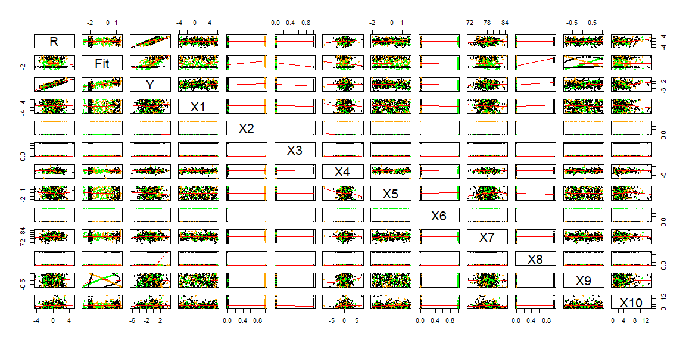

```r
# Use this R-Chunk to import all your datasets!
RB.Danny <- read.csv("../../../Data/RBdata_Danny.csv")
RB.Milca <- read.csv("../../../Data/RBdata_Milca.csv")
```

----

# Peer Attacking {.tabset .tabset-pills .tabset-fade}

## Danny 

### 1st Attempt


```r
#View(RB.Danny)

pairs(RB.Danny, panel = panel.smooth, pch=16, cex=0.7, col=rgb(.2,.2,.2,.5))
```

<!-- -->

More than 1 dummy variable? I think X3 may be needed, but let's start with X7.

### Use X7


```r
#pairs(RB.Danny, panel = panel.smooth, pch=16, cex=0.7, col=rgb(.2,.2,.2,.5))

Danny.lm <- lm(Y ~ X7, data = RB.Danny)
summary(Danny.lm)
```

```
## 
## Call:
## lm(formula = Y ~ X7, data = RB.Danny)
## 
## Residuals:
##     Min      1Q  Median      3Q     Max 
## -4.7824 -1.6964  0.1814  1.6413  5.2369 
## 
## Coefficients:
##             Estimate Std. Error t value Pr(>|t|)    
## (Intercept)   3.6938     0.2760   13.38   <2e-16 ***
## X7           -5.3820     0.4153  -12.96   <2e-16 ***
## ---
## Signif. codes:  0 '***' 0.001 '**' 0.01 '*' 0.05 '.' 0.1 ' ' 1
## 
## Residual standard error: 2.259 on 118 degrees of freedom
## Multiple R-squared:  0.5873,	Adjusted R-squared:  0.5838 
## F-statistic: 167.9 on 1 and 118 DF,  p-value: < 2.2e-16
```

```r
pairs(cbind(R = Danny.lm$res, Fit = Danny.lm$fit, RB.Danny), panel = panel.smooth, pch=16, cex=0.7, col=interaction(RB.Danny$X7))
```

<!-- -->

Looks like there is a bend in X6 and X9 from X7. I think X3 was used.

### Try X6 or X9; See how X3 goes


```r
#pairs(RB.Danny, panel = panel.smooth, pch=16, cex=0.7, col=rgb(.2,.2,.2,.5))

Danny2.lm <- lm(Y ~ X3 + X7, data = RB.Danny)
summary(Danny2.lm)
```

```
## 
## Call:
## lm(formula = Y ~ X3 + X7, data = RB.Danny)
## 
## Residuals:
##    Min     1Q Median     3Q    Max 
## -4.476 -1.561  0.214  1.623  4.855 
## 
## Coefficients:
##             Estimate Std. Error t value Pr(>|t|)    
## (Intercept)   3.3839     0.3300  10.256   <2e-16 ***
## X3            0.6922     0.4109   1.685   0.0947 .  
## X7           -5.3985     0.4123 -13.095   <2e-16 ***
## ---
## Signif. codes:  0 '***' 0.001 '**' 0.01 '*' 0.05 '.' 0.1 ' ' 1
## 
## Residual standard error: 2.242 on 117 degrees of freedom
## Multiple R-squared:  0.5971,	Adjusted R-squared:  0.5902 
## F-statistic: 86.68 on 2 and 117 DF,  p-value: < 2.2e-16
```

```r
pairs(cbind(R = Danny2.lm$res, Fit = Danny2.lm$fit, RB.Danny), panel = panel.smooth, pch=16, cex=0.7, col=interaction(RB.Danny$X7, RB.Danny$X3)) 
```

<!-- -->

I think I need to look into X4

### Look at X4


```r
######### Oops! I used Milca's data here! ##############
plot(Y ~ X4, data = RB.Milca, col=interaction(RB.Danny$X7, RB.Danny$X3))
```

<!-- -->

This is a mess. **Update**: Oops! I used Milca's data here!


```r
plot(Y ~ X10, data = RB.Milca, col=interaction(RB.Danny$X7))
```

<!-- -->

**Update**: Oops! I used Milca's data here too!


```r
plot(Y ~ X4, data = RB.Danny, col=interaction(RB.Danny$X7))
```

<!-- -->

### Take a step back


```r
Danny3.lm <- lm(Y ~ X7 + X3, data = RB.Danny)
summary(Danny3.lm)
```

```
## 
## Call:
## lm(formula = Y ~ X7 + X3, data = RB.Danny)
## 
## Residuals:
##    Min     1Q Median     3Q    Max 
## -4.476 -1.561  0.214  1.623  4.855 
## 
## Coefficients:
##             Estimate Std. Error t value Pr(>|t|)    
## (Intercept)   3.3839     0.3300  10.256   <2e-16 ***
## X7           -5.3985     0.4123 -13.095   <2e-16 ***
## X3            0.6922     0.4109   1.685   0.0947 .  
## ---
## Signif. codes:  0 '***' 0.001 '**' 0.01 '*' 0.05 '.' 0.1 ' ' 1
## 
## Residual standard error: 2.242 on 117 degrees of freedom
## Multiple R-squared:  0.5971,	Adjusted R-squared:  0.5902 
## F-statistic: 86.68 on 2 and 117 DF,  p-value: < 2.2e-16
```

```r
pairs(cbind(R = Danny3.lm$res, Fit = Danny3.lm$fit, RB.Danny), panel = panel.smooth, pch=16, cex=0.7, col=interaction(RB.Danny$X7, RB.Danny$X3)) 
```

<!-- -->

It's got to be X4. 

### Use X4


```r
Danny4.lm <- lm(Y ~ X7 + X4 + X4:X3 + X4:X7 + X4:X3:X7, data = RB.Danny)
summary(Danny4.lm)
```

```
## 
## Call:
## lm(formula = Y ~ X7 + X4 + X4:X3 + X4:X7 + X4:X3:X7, data = RB.Danny)
## 
## Residuals:
##      Min       1Q   Median       3Q      Max 
## -2.67165 -0.71588  0.04424  0.81001  1.96057 
## 
## Coefficients:
##             Estimate Std. Error t value Pr(>|t|)    
## (Intercept)  3.41408    0.13496  25.298  < 2e-16 ***
## X7          -4.96718    0.20383 -24.370  < 2e-16 ***
## X4          -0.89685    0.07459 -12.023  < 2e-16 ***
## X4:X3        2.03489    0.12603  16.146  < 2e-16 ***
## X7:X4        0.31227    0.11370   2.747 0.007002 ** 
## X7:X4:X3    -0.68684    0.17454  -3.935 0.000143 ***
## ---
## Signif. codes:  0 '***' 0.001 '**' 0.01 '*' 0.05 '.' 0.1 ' ' 1
## 
## Residual standard error: 1.086 on 114 degrees of freedom
## Multiple R-squared:  0.9079,	Adjusted R-squared:  0.9038 
## F-statistic: 224.7 on 5 and 114 DF,  p-value: < 2.2e-16
```

```r
pairs(cbind(R = Danny4.lm$res, Fit = Danny4.lm$fit, RB.Danny), panel = panel.smooth, pch=16, cex=0.7, col=interaction(RB.Danny$X7, RB.Danny$X3)) 
```

<!-- -->

### Let's see how things look


```r
Danny5.lm <- lm(Y ~ X7 + X3 + X4 + X4:X3 + X4:X7 + X4:X3:X7, data = RB.Danny)
summary(Danny5.lm)
```

```
## 
## Call:
## lm(formula = Y ~ X7 + X3 + X4 + X4:X3 + X4:X7 + X4:X3:X7, data = RB.Danny)
## 
## Residuals:
##      Min       1Q   Median       3Q      Max 
## -2.72463 -0.67326  0.05152  0.78974  1.89960 
## 
## Coefficients:
##             Estimate Std. Error t value Pr(>|t|)    
## (Intercept)  3.37050    0.16122  20.907  < 2e-16 ***
## X7          -4.97350    0.20489 -24.273  < 2e-16 ***
## X3           0.10168    0.20413   0.498 0.619369    
## X4          -0.89690    0.07484 -11.984  < 2e-16 ***
## X3:X4        2.02694    0.12745  15.904  < 2e-16 ***
## X7:X4        0.31812    0.11468   2.774 0.006479 ** 
## X7:X3:X4    -0.68648    0.17512  -3.920 0.000152 ***
## ---
## Signif. codes:  0 '***' 0.001 '**' 0.01 '*' 0.05 '.' 0.1 ' ' 1
## 
## Residual standard error: 1.09 on 113 degrees of freedom
## Multiple R-squared:  0.9081,	Adjusted R-squared:  0.9032 
## F-statistic:   186 on 6 and 113 DF,  p-value: < 2.2e-16
```

```r
Danny6.lm <- lm(Y ~ X7 + X4 + X4:X3 + X4:X7 + X4:X3:X7, data = RB.Danny)
summary(Danny6.lm)
```

```
## 
## Call:
## lm(formula = Y ~ X7 + X4 + X4:X3 + X4:X7 + X4:X3:X7, data = RB.Danny)
## 
## Residuals:
##      Min       1Q   Median       3Q      Max 
## -2.67165 -0.71588  0.04424  0.81001  1.96057 
## 
## Coefficients:
##             Estimate Std. Error t value Pr(>|t|)    
## (Intercept)  3.41408    0.13496  25.298  < 2e-16 ***
## X7          -4.96718    0.20383 -24.370  < 2e-16 ***
## X4          -0.89685    0.07459 -12.023  < 2e-16 ***
## X4:X3        2.03489    0.12603  16.146  < 2e-16 ***
## X7:X4        0.31227    0.11370   2.747 0.007002 ** 
## X7:X4:X3    -0.68684    0.17454  -3.935 0.000143 ***
## ---
## Signif. codes:  0 '***' 0.001 '**' 0.01 '*' 0.05 '.' 0.1 ' ' 1
## 
## Residual standard error: 1.086 on 114 degrees of freedom
## Multiple R-squared:  0.9079,	Adjusted R-squared:  0.9038 
## F-statistic: 224.7 on 5 and 114 DF,  p-value: < 2.2e-16
```

Did Danny forget to add X3 as an individual variable since p-value is `0.619369`?


```r
plot(Y ~ X4, data=RB.Danny, col=interaction(X3, X7, X7*X3))
points(Danny6.lm$fitted ~ X10, data=RB.Danny, col=interaction(X3, X7), cex=0.5, pch=16)
```

<!-- -->

### Time to draw it!

#### ggPlot


```r
ggplot(RB.Danny, aes(x=X4, y=Y, col=interaction(X3,X7))) + 
  geom_point() +
  geom_smooth(method="lm", se=F, formula=y ~ poly(x, 2, raw=TRUE) )
```

<!-- -->

#### baseR


```r
palette(c("black","orange","green", "red"))

plot(Y ~ X4, data=RB.Danny, col=interaction(X3,X7))
b.d <- coef(Danny6.lm)

X3 = 0; X7 = 0;
curve(b.d[1] + b.d[2]*X7 + b.d[3]*x + b.d[4]*x*X3 + b.d[5]*x*X7 + b.d[6]*x*X3*X7, add=TRUE, col=palette()[1])

X3 = 1; X7 = 0;
curve(b.d[1] + b.d[2]*X7 + b.d[3]*x + b.d[4]*x*X3 + b.d[5]*x*X7 + b.d[6]*x*X3*X7, add=TRUE, col=palette()[2])

X3 = 0; X7 = 1;
curve(b.d[1] + b.d[2]*X7 + b.d[3]*x + b.d[4]*x*X3 + b.d[5]*x*X7 + b.d[6]*x*X3*X7, add=TRUE, col=palette()[3])

X3 = 1; X7 = 1;
curve(b.d[1] + b.d[2]*X7 + b.d[3]*x + b.d[4]*x*X3 + b.d[5]*x*X7 + b.d[6]*x*X3*X7, add=TRUE, col=palette()[4])
```

<!-- -->

$$
  \hat{Y_i} = b_0 + b_1X_4 + b_2X_7 + b_3X_4 X_7 + b_4X_4 X_3 + b_5X_4 X_3 X_7 + \underbrace{b_6X_3}_\text{Needed, but p = 0.619369}
$$


## Milca

### 1st Attempt


```r
#View(RB.Milca)

pairs(RB.Milca, panel = panel.smooth, pch=16, cex=0.7, col=rgb(.2,.2,.2,.5))
```

<!-- -->

X2, X3, X8 were used

Odd number base: X1, X5, X7, X9

* X1 = .192

* X5 = .1946

* X7 = .1991

* X9 = .194


### Look at X2, X3, X8; Maybe X6?


```r
Milca1.lm <- lm(Y ~ X2 + X8, data = RB.Milca)
summary(Milca1.lm)
```

```
## 
## Call:
## lm(formula = Y ~ X2 + X8, data = RB.Milca)
## 
## Residuals:
##     Min      1Q  Median      3Q     Max 
## -4.6072 -1.1586 -0.1127  1.2267  4.7795 
## 
## Coefficients:
##             Estimate Std. Error t value Pr(>|t|)    
## (Intercept) -1.66361    0.09744 -17.074  < 2e-16 ***
## X2           1.54166    0.19487   7.911 1.67e-14 ***
## X8           2.55506    0.19487  13.112  < 2e-16 ***
## ---
## Signif. codes:  0 '***' 0.001 '**' 0.01 '*' 0.05 '.' 0.1 ' ' 1
## 
## Residual standard error: 1.688 on 497 degrees of freedom
## Multiple R-squared:  0.2816,	Adjusted R-squared:  0.2787 
## F-statistic: 97.41 on 2 and 497 DF,  p-value: < 2.2e-16
```

```r
pairs(cbind(R = Milca1.lm$res, Fit = Milca1.lm$fit, RB.Milca), panel = panel.smooth, pch=16, cex=0.7, col=interaction(RB.Milca$X2, RB.Milca$X8))
```

<!-- -->

X3 does a better job in this pairs plot explaining Y and maybe X9 than what X6 is showing.


### Add X3


```r
Milca2.lm <- lm(Y ~ X2 + X3 + X8, data = RB.Milca)
summary(Milca2.lm)
```

```
## 
## Call:
## lm(formula = Y ~ X2 + X3 + X8, data = RB.Milca)
## 
## Residuals:
##     Min      1Q  Median      3Q     Max 
## -4.7802 -1.1243 -0.0762  1.1532  5.1255 
## 
## Coefficients:
##             Estimate Std. Error t value Pr(>|t|)    
## (Intercept)  -1.4906     0.1187 -12.558  < 2e-16 ***
## X2            1.3686     0.2056   6.657 7.41e-11 ***
## X3           -0.5191     0.2056  -2.525   0.0119 *  
## X8            2.3820     0.2056  11.587  < 2e-16 ***
## ---
## Signif. codes:  0 '***' 0.001 '**' 0.01 '*' 0.05 '.' 0.1 ' ' 1
## 
## Residual standard error: 1.679 on 496 degrees of freedom
## Multiple R-squared:  0.2907,	Adjusted R-squared:  0.2864 
## F-statistic: 67.77 on 3 and 496 DF,  p-value: < 2.2e-16
```

```r
pairs(cbind(R = Milca2.lm$res, Fit = Milca2.lm$fit, RB.Milca), panel = panel.smooth, pch=16, cex=0.7, col=interaction(RB.Milca$X2, RB.Milca$X3, RB.Milca$X8))
```

<!-- -->

X3 doesn't show significance when adding X6 into the lm(). Looking back in the beginning, X3 is more sloped than X6 is.


### Replace with X6


```r
Milca3.lm <- lm(Y ~ X2 + X6 + X8, data = RB.Milca)
summary(Milca3.lm)
```

```
## 
## Call:
## lm(formula = Y ~ X2 + X6 + X8, data = RB.Milca)
## 
## Residuals:
##     Min      1Q  Median      3Q     Max 
## -4.2715 -1.1443 -0.0564  1.2446  5.1151 
## 
## Coefficients:
##             Estimate Std. Error t value Pr(>|t|)    
## (Intercept)  -1.9992     0.1166 -17.151  < 2e-16 ***
## X2            1.8773     0.2019   9.298  < 2e-16 ***
## X6            1.0069     0.2019   4.987 8.49e-07 ***
## X8            2.8907     0.2019  14.317  < 2e-16 ***
## ---
## Signif. codes:  0 '***' 0.001 '**' 0.01 '*' 0.05 '.' 0.1 ' ' 1
## 
## Residual standard error: 1.649 on 496 degrees of freedom
## Multiple R-squared:  0.3159,	Adjusted R-squared:  0.3118 
## F-statistic: 76.35 on 3 and 496 DF,  p-value: < 2.2e-16
```

```r
pairs(cbind(R = Milca3.lm$res, Fit = Milca3.lm$fit, RB.Milca), panel = panel.smooth, pch=16, cex=0.7, col=interaction(RB.Milca$X2, RB.Milca$X6, RB.Milca$X8))
```

<!-- -->

I think X3 is better because X2 and X3 show some residuals.


### Trying base options now


```r
Milca4a.lm <- lm(Y ~ X2 + X8 + X1 + X1:X2 + X1:X8, data = RB.Milca)
summary(Milca4a.lm)
```

```
## 
## Call:
## lm(formula = Y ~ X2 + X8 + X1 + X1:X2 + X1:X8, data = RB.Milca)
## 
## Residuals:
##     Min      1Q  Median      3Q     Max 
## -4.5906 -1.1949 -0.1046  1.1799  4.7129 
## 
## Coefficients:
##             Estimate Std. Error t value Pr(>|t|)    
## (Intercept) -1.63151    0.10445 -15.620  < 2e-16 ***
## X2           1.35209    0.20838   6.489 2.11e-10 ***
## X8           2.54391    0.21786  11.677  < 2e-16 ***
## X1          -0.02917    0.03502  -0.833   0.4052    
## X2:X1        0.16048    0.06459   2.485   0.0133 *  
## X8:X1        0.01625    0.06614   0.246   0.8060    
## ---
## Signif. codes:  0 '***' 0.001 '**' 0.01 '*' 0.05 '.' 0.1 ' ' 1
## 
## Residual standard error: 1.682 on 494 degrees of freedom
## Multiple R-squared:  0.2911,	Adjusted R-squared:  0.2839 
## F-statistic: 40.56 on 5 and 494 DF,  p-value: < 2.2e-16
```

```r
Milca4b.lm <- lm(Y ~ X2 + X8 + X5 + X5:X2 + X5:X8, data = RB.Milca)
summary(Milca4b.lm)
```

```
## 
## Call:
## lm(formula = Y ~ X2 + X8 + X5 + X5:X2 + X5:X8, data = RB.Milca)
## 
## Residuals:
##     Min      1Q  Median      3Q     Max 
## -4.5993 -1.1772 -0.0787  1.1702  4.8103 
## 
## Coefficients:
##             Estimate Std. Error t value Pr(>|t|)    
## (Intercept) -1.66493    0.09754 -17.069  < 2e-16 ***
## X2           1.54147    0.19518   7.898 1.86e-14 ***
## X8           2.48030    0.20185  12.288  < 2e-16 ***
## X5          -0.04009    0.09026  -0.444    0.657    
## X2:X5        0.00961    0.18529   0.052    0.959    
## X8:X5       -0.18042    0.17583  -1.026    0.305    
## ---
## Signif. codes:  0 '***' 0.001 '**' 0.01 '*' 0.05 '.' 0.1 ' ' 1
## 
## Residual standard error: 1.689 on 494 degrees of freedom
## Multiple R-squared:  0.285,	Adjusted R-squared:  0.2778 
## F-statistic: 39.39 on 5 and 494 DF,  p-value: < 2.2e-16
```

```r
Milca4c.lm <- lm(Y ~ X2 + X8 + X7 + X7:X2 + X7:X8, data = RB.Milca)
summary(Milca4c.lm)
```

```
## 
## Call:
## lm(formula = Y ~ X2 + X8 + X7 + X7:X2 + X7:X8, data = RB.Milca)
## 
## Residuals:
##    Min     1Q Median     3Q    Max 
## -4.479 -1.101 -0.069  1.210  4.760 
## 
## Coefficients:
##             Estimate Std. Error t value Pr(>|t|)  
## (Intercept) -7.91539    3.79593  -2.085   0.0376 *
## X2           8.56836    7.41737   1.155   0.2486  
## X8          -2.33692    7.49305  -0.312   0.7553  
## X7           0.08019    0.04868   1.648   0.1001  
## X2:X7       -0.09011    0.09497  -0.949   0.3432  
## X8:X7        0.06312    0.09627   0.656   0.5123  
## ---
## Signif. codes:  0 '***' 0.001 '**' 0.01 '*' 0.05 '.' 0.1 ' ' 1
## 
## Residual standard error: 1.683 on 494 degrees of freedom
## Multiple R-squared:  0.2898,	Adjusted R-squared:  0.2826 
## F-statistic: 40.32 on 5 and 494 DF,  p-value: < 2.2e-16
```

```r
Milca4d.lm <- lm(Y ~ X2 + X8 + X9 + X9:X2 + X9:X8, data = RB.Milca)
summary(Milca4d.lm)
```

```
## 
## Call:
## lm(formula = Y ~ X2 + X8 + X9 + X9:X2 + X9:X8, data = RB.Milca)
## 
## Residuals:
##     Min      1Q  Median      3Q     Max 
## -4.9811 -1.0618  0.0135  1.1035  4.2292 
## 
## Coefficients:
##             Estimate Std. Error t value Pr(>|t|)    
## (Intercept) -1.71458    0.09288 -18.459  < 2e-16 ***
## X2           1.65279    0.18481   8.943  < 2e-16 ***
## X8           2.57365    0.18587  13.847  < 2e-16 ***
## X9           0.74932    0.17805   4.209 3.05e-05 ***
## X2:X9       -2.62530    0.33856  -7.754 5.11e-14 ***
## X8:X9       -0.32004    0.33975  -0.942    0.347    
## ---
## Signif. codes:  0 '***' 0.001 '**' 0.01 '*' 0.05 '.' 0.1 ' ' 1
## 
## Residual standard error: 1.595 on 494 degrees of freedom
## Multiple R-squared:  0.3621,	Adjusted R-squared:  0.3557 
## F-statistic: 56.09 on 5 and 494 DF,  p-value: < 2.2e-16
```

```r
#pairs(cbind(R = Milca4.lm$res, Fit = Milca4.lm$fit, RB.Milca), panel = panel.smooth, pch=16, cex=0.7, col=interaction(RB.Milca$X2, RB.Milca$X6, RB.Milca$X8))
```

X9 is definitely the way to go


### X3 vs. X6


```r
Milca5.lm <- lm(Y ~ X2 + X3 + X8 + X9 + X9:X2 + X9:X3 + X9:X8, data = RB.Milca)
summary(Milca5.lm)
```

```
## 
## Call:
## lm(formula = Y ~ X2 + X3 + X8 + X9 + X9:X2 + X9:X3 + X9:X8, data = RB.Milca)
## 
## Residuals:
##     Min      1Q  Median      3Q     Max 
## -4.8929 -1.0559  0.0299  1.0840  4.0330 
## 
## Coefficients:
##             Estimate Std. Error t value Pr(>|t|)    
## (Intercept)  -1.5175     0.1130 -13.427  < 2e-16 ***
## X2            1.4557     0.1940   7.504 2.91e-13 ***
## X3           -0.5314     0.1939  -2.740  0.00637 ** 
## X8            2.3766     0.1950  12.190  < 2e-16 ***
## X9            0.3059     0.2234   1.369  0.17153    
## X2:X9        -2.1819     0.3615  -6.036 3.11e-09 ***
## X3:X9         1.1046     0.3625   3.047  0.00244 ** 
## X8:X9         0.1233     0.3626   0.340  0.73387    
## ---
## Signif. codes:  0 '***' 0.001 '**' 0.01 '*' 0.05 '.' 0.1 ' ' 1
## 
## Residual standard error: 1.574 on 492 degrees of freedom
## Multiple R-squared:  0.3814,	Adjusted R-squared:  0.3726 
## F-statistic: 43.34 on 7 and 492 DF,  p-value: < 2.2e-16
```

```r
Milca5b.lm <- lm(Y ~ X2 + X6 + X8 + X9 + X9:X2 + X9:X6 + X9:X8, data = RB.Milca)
summary(Milca5b.lm)
```

```
## 
## Call:
## lm(formula = Y ~ X2 + X6 + X8 + X9 + X9:X2 + X9:X6 + X9:X8, data = RB.Milca)
## 
## Residuals:
##     Min      1Q  Median      3Q     Max 
## -4.3599 -1.0122  0.0386  1.1380  4.9469 
## 
## Coefficients:
##             Estimate Std. Error t value Pr(>|t|)    
## (Intercept)  -2.0163     0.1082 -18.637  < 2e-16 ***
## X2            1.9545     0.1864  10.484  < 2e-16 ***
## X6            0.9062     0.1871   4.844 1.70e-06 ***
## X8            2.8754     0.1874  15.346  < 2e-16 ***
## X9            0.2309     0.2002   1.154    0.249    
## X2:X9        -2.1069     0.3390  -6.215 1.10e-09 ***
## X6:X9         1.8702     0.3747   4.991 8.35e-07 ***
## X8:X9         0.1983     0.3401   0.583    0.560    
## ---
## Signif. codes:  0 '***' 0.001 '**' 0.01 '*' 0.05 '.' 0.1 ' ' 1
## 
## Residual standard error: 1.516 on 492 degrees of freedom
## Multiple R-squared:  0.4264,	Adjusted R-squared:  0.4182 
## F-statistic: 52.25 on 7 and 492 DF,  p-value: < 2.2e-16
```

```r
pairs(cbind(R = Milca5.lm$res, Fit = Milca5.lm$fit, RB.Milca), panel = panel.smooth, pch=16, cex=0.7, col=interaction(RB.Milca$X2, RB.Milca$X3, RB.Milca$X8))
```

<!-- -->


### Throw in some parabolas


```r
Milca6.lm <- lm(Y ~ X2 + X3 + X8 + X9 + X9:X2 + X9:X3 + X9:X8 + I(X9^2):X2 + I(X9^2):X3 + I(X9^2):X8, data = RB.Milca)
summary(Milca6.lm)
```

```
## 
## Call:
## lm(formula = Y ~ X2 + X3 + X8 + X9 + X9:X2 + X9:X3 + X9:X8 + 
##     I(X9^2):X2 + I(X9^2):X3 + I(X9^2):X8, data = RB.Milca)
## 
## Residuals:
##     Min      1Q  Median      3Q     Max 
## -4.8929 -1.0010 -0.0356  1.0359  3.7895 
## 
## Coefficients:
##             Estimate Std. Error t value Pr(>|t|)    
## (Intercept)  -1.5175     0.1111 -13.663  < 2e-16 ***
## X2            1.4955     0.2552   5.861 8.45e-09 ***
## X3           -1.2238     0.2624  -4.664 4.01e-06 ***
## X8            2.7875     0.2580  10.806  < 2e-16 ***
## X9            0.3059     0.2196   1.393  0.16413    
## X2:X9        -2.1702     0.3588  -6.049 2.90e-09 ***
## X3:X9         0.9699     0.3580   2.709  0.00698 ** 
## X8:X9         0.3388     0.3676   0.922  0.35716    
## X2:I(X9^2)   -0.1304     0.5561  -0.235  0.81467    
## X3:I(X9^2)    2.2850     0.5952   3.839  0.00014 ***
## X8:I(X9^2)   -1.3799     0.5801  -2.379  0.01775 *  
## ---
## Signif. codes:  0 '***' 0.001 '**' 0.01 '*' 0.05 '.' 0.1 ' ' 1
## 
## Residual standard error: 1.547 on 489 degrees of freedom
## Multiple R-squared:  0.4062,	Adjusted R-squared:  0.3941 
## F-statistic: 33.46 on 10 and 489 DF,  p-value: < 2.2e-16
```

```r
Milca6b.lm <- lm(Y ~ X2 + X6 + X8 + X9 + X9:X2 + X9:X6 + X9:X8 + I(X9^2):X2 + I(X9^2):X6 + I(X9^2):X8, data = RB.Milca)
summary(Milca6b.lm)
```

```
## 
## Call:
## lm(formula = Y ~ X2 + X6 + X8 + X9 + X9:X2 + X9:X6 + X9:X8 + 
##     I(X9^2):X2 + I(X9^2):X6 + I(X9^2):X8, data = RB.Milca)
## 
## Residuals:
##     Min      1Q  Median      3Q     Max 
## -4.3599 -1.0184  0.0389  1.1459  4.9469 
## 
## Coefficients:
##             Estimate Std. Error t value Pr(>|t|)    
## (Intercept)  -2.0163     0.1078 -18.696  < 2e-16 ***
## X2            1.9943     0.2489   8.011 8.40e-15 ***
## X6            0.8534     0.2364   3.610 0.000337 ***
## X8            3.2863     0.2517  13.056  < 2e-16 ***
## X9            0.2309     0.1995   1.157 0.247654    
## X2:X9        -2.0951     0.3415  -6.136 1.75e-09 ***
## X6:X9         1.8488     0.3781   4.890 1.37e-06 ***
## X8:X9         0.4138     0.3504   1.181 0.238117    
## X2:I(X9^2)   -0.1304     0.5432  -0.240 0.810354    
## X6:I(X9^2)    0.2329     0.6400   0.364 0.716074    
## X8:I(X9^2)   -1.3799     0.5666  -2.435 0.015233 *  
## ---
## Signif. codes:  0 '***' 0.001 '**' 0.01 '*' 0.05 '.' 0.1 ' ' 1
## 
## Residual standard error: 1.511 on 489 degrees of freedom
## Multiple R-squared:  0.4335,	Adjusted R-squared:  0.4219 
## F-statistic: 37.42 on 10 and 489 DF,  p-value: < 2.2e-16
```

```r
pairs(cbind(R = Milca6.lm$res, Fit = Milca6.lm$fit, RB.Milca), panel = panel.smooth, pch=16, cex=0.7, col=interaction(RB.Milca$X2, RB.Milca$X3, RB.Milca$X8))
```

<!-- -->

```r
pairs(cbind(R = Milca6b.lm$res, Fit = Milca6b.lm$fit, RB.Milca), panel = panel.smooth, pch=16, cex=0.7, col=interaction(RB.Milca$X2, RB.Milca$X6, RB.Milca$X8))
```

<!-- -->


### Zoom in on X9


```r
plot(Y ~ X9, data = RB.Milca, col=interaction(RB.Milca$X2, RB.Milca$X3, RB.Milca$X8))
```

<!-- -->

### Double straight lines on X2?


```r
Milca7.lm <- lm(Y ~ X2 + X3 + X8 + X9 + X9:X2 + X9:X3 + I(X9^2):X3 + I(X9^2):X8, data = RB.Milca)
summary(Milca7.lm)
```

```
## 
## Call:
## lm(formula = Y ~ X2 + X3 + X8 + X9 + X9:X2 + X9:X3 + I(X9^2):X3 + 
##     I(X9^2):X8, data = RB.Milca)
## 
## Residuals:
##     Min      1Q  Median      3Q     Max 
## -4.9517 -1.0040 -0.0135  1.0419  3.7597 
## 
## Coefficients:
##             Estimate Std. Error t value Pr(>|t|)    
## (Intercept)  -1.5282     0.1103 -13.849  < 2e-16 ***
## X2            1.4664     0.1901   7.715 6.80e-14 ***
## X3           -1.2132     0.2619  -4.633 4.62e-06 ***
## X8            2.7738     0.2572  10.783  < 2e-16 ***
## X9            0.4268     0.1759   2.426 0.015613 *  
## X2:X9        -2.3028     0.3298  -6.983 9.42e-12 ***
## X3:X9         0.8490     0.3327   2.552 0.011023 *  
## X3:I(X9^2)    2.2850     0.5945   3.843 0.000137 ***
## X8:I(X9^2)   -1.2482     0.5616  -2.223 0.026693 *  
## ---
## Signif. codes:  0 '***' 0.001 '**' 0.01 '*' 0.05 '.' 0.1 ' ' 1
## 
## Residual standard error: 1.545 on 491 degrees of freedom
## Multiple R-squared:  0.4051,	Adjusted R-squared:  0.3955 
## F-statistic:  41.8 on 8 and 491 DF,  p-value: < 2.2e-16
```

```r
pairs(cbind(R = Milca7.lm$res, Fit = Milca7.lm$fit, RB.Milca), panel = panel.smooth, pch=16, cex=0.7, col=interaction(RB.Milca$X2, RB.Milca$X3, RB.Milca$X8))
```

<!-- -->


### What do I do next?


```r
Milca8.lm <- lm(Y ~ X2 + X3 + X8 + X9 + X9:X2 + X9:X3 + I(X9^2):X3 + I(X9^2):X8, data = RB.Milca)
summary(Milca8.lm)
```

```
## 
## Call:
## lm(formula = Y ~ X2 + X3 + X8 + X9 + X9:X2 + X9:X3 + I(X9^2):X3 + 
##     I(X9^2):X8, data = RB.Milca)
## 
## Residuals:
##     Min      1Q  Median      3Q     Max 
## -4.9517 -1.0040 -0.0135  1.0419  3.7597 
## 
## Coefficients:
##             Estimate Std. Error t value Pr(>|t|)    
## (Intercept)  -1.5282     0.1103 -13.849  < 2e-16 ***
## X2            1.4664     0.1901   7.715 6.80e-14 ***
## X3           -1.2132     0.2619  -4.633 4.62e-06 ***
## X8            2.7738     0.2572  10.783  < 2e-16 ***
## X9            0.4268     0.1759   2.426 0.015613 *  
## X2:X9        -2.3028     0.3298  -6.983 9.42e-12 ***
## X3:X9         0.8490     0.3327   2.552 0.011023 *  
## X3:I(X9^2)    2.2850     0.5945   3.843 0.000137 ***
## X8:I(X9^2)   -1.2482     0.5616  -2.223 0.026693 *  
## ---
## Signif. codes:  0 '***' 0.001 '**' 0.01 '*' 0.05 '.' 0.1 ' ' 1
## 
## Residual standard error: 1.545 on 491 degrees of freedom
## Multiple R-squared:  0.4051,	Adjusted R-squared:  0.3955 
## F-statistic:  41.8 on 8 and 491 DF,  p-value: < 2.2e-16
```

```r
Milca8a.lm <- lm(Y ~ X2 + X3 + X8 + X9 + X9:X2 + X9:X3 + X9:X8 + I(X9^2):X3 + I(X9^2):X8, data = RB.Milca)
summary(Milca8a.lm)
```

```
## 
## Call:
## lm(formula = Y ~ X2 + X3 + X8 + X9 + X9:X2 + X9:X3 + X9:X8 + 
##     I(X9^2):X3 + I(X9^2):X8, data = RB.Milca)
## 
## Residuals:
##     Min      1Q  Median      3Q     Max 
## -4.8929 -1.0040 -0.0356  1.0359  3.7895 
## 
## Coefficients:
##             Estimate Std. Error t value Pr(>|t|)    
## (Intercept)  -1.5175     0.1110 -13.676  < 2e-16 ***
## X2            1.4557     0.1904   7.644 1.12e-13 ***
## X3           -1.2238     0.2621  -4.668 3.92e-06 ***
## X8            2.7875     0.2577  10.816  < 2e-16 ***
## X9            0.3059     0.2194   1.395 0.163727    
## X2:X9        -2.1819     0.3549  -6.148 1.63e-09 ***
## X3:X9         0.9699     0.3577   2.712 0.006926 ** 
## X8:X9         0.3388     0.3673   0.923 0.356699    
## X3:I(X9^2)    2.2850     0.5946   3.843 0.000138 ***
## X8:I(X9^2)   -1.3799     0.5795  -2.381 0.017640 *  
## ---
## Signif. codes:  0 '***' 0.001 '**' 0.01 '*' 0.05 '.' 0.1 ' ' 1
## 
## Residual standard error: 1.545 on 490 degrees of freedom
## Multiple R-squared:  0.4062,	Adjusted R-squared:  0.3953 
## F-statistic: 37.24 on 9 and 490 DF,  p-value: < 2.2e-16
```

```r
####### Only produces NA's #############
# Milca8a.lm <- lm(Y ~ X2:X3:X8 + X9 + X9:X2:X3:X8 + I(X9^2):X2:X3:X8 + I(X9^2):X2:X3:X8, data = RB.Milca)
# summary(Milca8a.lm)

par(mfrow=c(1,3))
plot(Milca8.lm, which=1:2)
plot(Milca8.lm$residuals, type = "b", main = "Residuals vs Order")
```

<!-- -->

I think I have captured everything, but it seems like X8:X9 is missing for this model to work.


### Plot it


#### ggPlot


```r
ggplot(RB.Milca, aes(x=X9, y=Y, col=interaction(X2, X3, X8))) + 
  geom_point() +
  geom_smooth(method="lm", se=F, formula=y ~ poly(x, 2, raw=TRUE) )
```

<!-- -->


#### BaseR


```r
palette(c("black", "orange", "green", "red", "blue", "purple"))

plot(Y ~ X9, data=RB.Milca, col=interaction(X2, X3, X8))
m.d <- coef(Milca8.lm)

X2 = 0; X3 = 0; X8 = 0;
curve(m.d[1] + m.d[2]*X2 + m.d[3]*X3 + m.d[4]*X8 + m.d[5]*x + m.d[6]*x*X2 + m.d[7]*x*X3 + m.d[8]*x^2*X3 +m.d[9]*x^2*X8, add=TRUE, col=palette()[1])

X2 = 1; X3 = 0; X8 = 0;
curve(m.d[1] + m.d[2]*X2 + m.d[3]*X3 + m.d[4]*X8 + m.d[5]*x + m.d[6]*x*X2 + m.d[7]*x*X3 + m.d[8]*x^2*X3 +m.d[9]*x^2*X8, add=TRUE, col=palette()[2])

X2 = 1; X3 = 1; X8 = 0;
curve(m.d[1] + m.d[2]*X2 + m.d[3]*X3 + m.d[4]*X8 + m.d[5]*x + m.d[6]*x*X2 + m.d[7]*x*X3 + m.d[8]*x^2*X3 +m.d[9]*x^2*X8, add=TRUE, col=palette()[3])

X2 = 1; X3 = 1; X8 = 1;
curve(m.d[1] + m.d[2]*X2 + m.d[3]*X3 + m.d[4]*X8 + m.d[5]*x + m.d[6]*x*X2 + m.d[7]*x*X3 + m.d[8]*x^2*X3 +m.d[9]*x^2*X8, add=TRUE, col=palette()[4])

X2 = 1; X3 = 0; X8 = 1;
curve(m.d[1] + m.d[2]*X2 + m.d[3]*X3 + m.d[4]*X8 + m.d[5]*x + m.d[6]*x*X2 + m.d[7]*x*X3 + m.d[8]*x^2*X3 +m.d[9]*x^2*X8, add=TRUE, col=palette()[5])

X2 = 0; X3 = 1; X8 = 1;
curve(m.d[1] + m.d[2]*X2 + m.d[3]*X3 + m.d[4]*X8 + m.d[5]*x + m.d[6]*x*X2 + m.d[7]*x*X3 + m.d[8]*x^2*X3 +m.d[9]*x^2*X8, add=TRUE, col=palette()[6])
```

<!-- -->

I don't believe the baseR is working because the model data isn't correct. Not sure though.

$$
  \hat{Y_i} = b_0 + b_1 X_9 + b_2 X_2 + b_3 X_9 X_2 + b_4 X_3 + b_5 X_9 X_3 + b_6 X_9^2 X_3 + b_7 X_8 + \underbrace{b_8 X_9 X_8}_\text{MISSING} + b_9 X_9^2 X_8
$$
