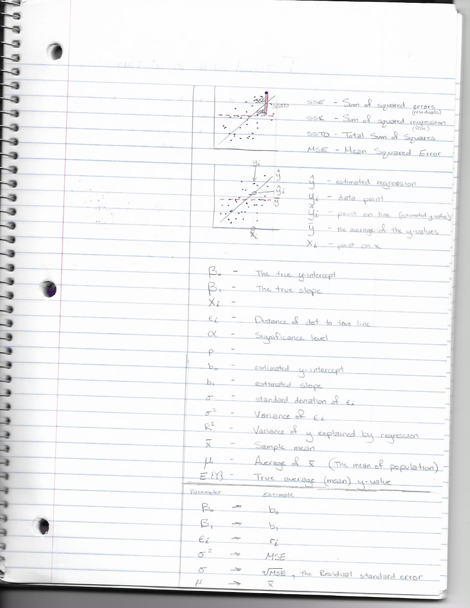

```{r load_library, include=FALSE}
# Use this R-Chunk to load your libraries!

pacman::p_load(readr, haven, readxl, downloader, tidyverse, ggbeeswarm, mosaic, stringr, pander, DT, ggplot2, alr3, foreign, measurements, nycflights13, Lahman, blscrapeR, lubridate, riem, ggthemes, ggrepel)

```

```{r load_data, include=FALSE}
# Use this R-Chunk to load your datasets!

laptops <- read.csv("../../../Data/laptops.csv", header=TRUE)

#View(laptops)
```

```{r Data Wrangling, eval=FALSE, message=FALSE, warning=FALSE, include=FALSE}

# Euro to USD is 1 to 1.1075 on Janruary 22, 2020

# I don't understand why this isn't working
laptops1 <- laptops %>%
  str_remove_all(as.character(Weight), "kg") %>%
  mutate(Price_USD = round((Price_euros * 1.1075), digits = 2),
         Lbs_Weight = as.numeric(Weight) * 2.2046226218)


laptops1 <- laptops %>%
  mutate(Price_USD = round((Price_euros * 1.1075), digits = 2))

# View(laptops1)
```

### Background {.tabset .tabset-pills .tabset-fade}

This assignment will help me better understand SSE, SSR, SSTO, and $R^2$. Inadvertently, the distinction between $Y_i$, $\hat{Y}$, $\hat{Y}_i$, $\bar{Y}$, and $X_i$ will be noted.  

**Differences in Y**



#### What is a residual?

1. What is a residual? What use does a single residual provide within a regression analysis?

A residual is the difference between our observed data point, $Y_i$, and the estimated y-value, $\hat{Y_i}$. They are similar to an error because the error shows the true distance from an observed data point, $Y_i$, and the true regression, $E{(Y_i)}$. So while errors create the data, the residuals are created after we try to determine how the data was created with our regression model.


```{r eval=FALSE, include=FALSE}
mylm <- lm(circumference ~ age, data = laptops1)
summary(mylm)
```

```{r Residual Graph, eval=FALSE, message=FALSE, warning=FALSE, include=FALSE}
# Insert graph here

```

A residual is the distance a data point is from the regression line. 

For example, if you compare your laptop to some subset of the laptops data set, did you pay over, under, or right on average for what similar laptops cost? 

Hint: points(x-value, y-value, col="...", pch=...) would allow you to add a single point to a base R regression plot in a way similar to how abline(...) adds a regression line to a plot. You ggplotters should already know how to do this with geom_point(...)


#### SSE, SSR, and SSTO

2. What are each of SSTO, SSR, and SSE? How are they related? How do they differ? Find a way to both show and explain these values. How are they used to gain insight about data within a regression analysis?

SSE is how much the residuals deviate from $\hat{Y}$ the estiated regression. SSR is how much the regression line deviates from $\bar{Y}$ or the average y-value. SSTO is how far the values deviate from $\bar{Y}$. I don't understand the relation part that well. I'm not sure about the insights.


#### What is $R^2$?

3. What is R-squared? How is it properly interpreted? How is it calculated? What information does it provide about a regression analysis? How does it differ from the information provided in the p-value for the slope term? How does it relate to the residual standard error?

R-squared is the average deviation each data point has from $\hat{Y}$. It is calculated by `SSR/SSTO` or `1 - SSE/SSTO`. We use the residual assumption plots to determine how well the regression model does. The p-value tells us how well the model is doing for the mean or the group, if you will. The $R^2$ tells us how well the model is doing for an individual. The residual standard error is the MSE. The MSE describes the estimation of sigma. We get the MSE by squaring the error, adding them all up, and dividing by the degrees of freedom.


