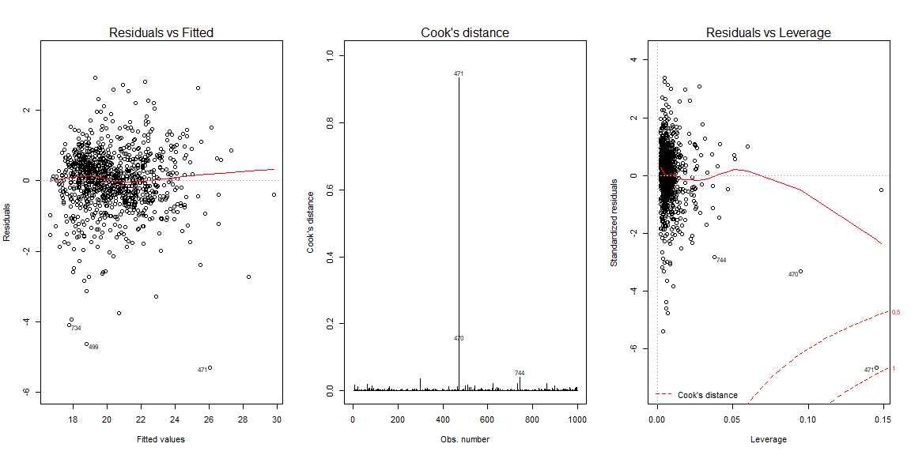

```r
# Use this R-Chunk to import all your datasets!
train <- read.csv("train.csv")

################## No need to join() anything. Use datatable to see all columns ######################
#sample <- read.csv("sample_submission.csv")
# new.train <- train %>%
#   left_join(sample, by = c("Id", "Id"))
#View(train)
# View(sample)
# View(new.train)

set.seed(121)

num_rows <- 1000 #1460 total
keep <- sample(1:nrow(train), num_rows)

mytrain <- train[keep, ] #Use this in the lm(..., data=mytrain)

mytest <- train[-keep, ] #Use this in the predict(..., newdata=mytest)
```

----

**Changes Made**

1. I finished it for the first time. Final model selected, plots created, and final adjusted values were `Train` 0.8463 and `Test` 0.7837.
2. The rlm() can be found at the bottom of the Interpreting Work -> Assumptions section.
3. This is not well done, but I've spent a lot of time on it and need to finish other things.

**Questions**

1. What is the test dataset for? Is that if I get above 0.86 that's what will be used to submit my guess to Kaggle?

----

## Overview

Kaggle.com is one website among many that hosts "data challenges" where participants can compete for the "best" model. Many of these competitions award cash prizes of thousands of dollars to the winning team. These are often listed as "machine learning" competitions, but regression models can often be among the top models as well.

For this week's analysis, you will be working on one of the "friendly competition" (no cash prize) data sets from Kaggle.com. Here is a picture of the main page of the website listing the competition. You are welcome to click on the image to visit the actual page.

## Analysis {.tabset .tabset-pills .tabset-fade}

### Original Summary {.tabset .tabset-pills .tabset-fade}


```r
mytrain2 <- mytrain %>% 
  mutate(Old_New = as.factor(case_when(YearBuilt >= 1990 ~ "Old",
                            YearBuilt < 1990 ~ "New")),
         PorchSF = OpenPorchSF + EnclosedPorch + X3SsnPorch + ScreenPorch,
         PorchSF = as.numeric(ifelse(is.na(PorchSF), 0, PorchSF)),
         Any.Porch = ifelse(PorchSF > 0, 1, PorchSF),
         GrandTotalSF = LotArea + MasVnrArea + TotalBsmtSF + GrLivArea + GarageArea + WoodDeckSF + OpenPorchSF + EnclosedPorch + X3SsnPorch + ScreenPorch,
         GrandTotalSF = as.numeric(ifelse(is.na(GrandTotalSF), 0, GrandTotalSF)),
         TotalHomeSF = TotalBsmtSF + GrLivArea + GarageArea,
         NeighborhoodGroups = case_when(Neighborhood %in% c("StoneBr","NoRidge","NridgHt") ~ "Expensive",
                                        Neighborhood %in% c("NPkVill", "Mitchel", "SawyerW","Gilbert","NWAmes","Blmngtn","CollgCr","ClearCr","Crawfor","Veenker","Somerst","Timber") ~ "Moderate",
                                        TRUE ~ "Poorer"),
         NeighborhoodGroups = as.factor(NeighborhoodGroups),
         Has2ndFl = as.factor(ifelse(X2ndFlrSF > 0, "Yes", "No")),
         Pool = as.numeric(ifelse(X2ndFlrSF > 0, 1, X2ndFlrSF)),
         Deck = as.numeric(ifelse(WoodDeckSF > 0, 1, WoodDeckSF)),
         Has.Porch = as.numeric(ifelse(ScreenPorch > 0, 1, ScreenPorch)),
         Has.Porch1 = as.numeric(ifelse(X3SsnPorch > 0, 1, X3SsnPorch)),
         Has.Porch2 = as.numeric(ifelse(EnclosedPorch > 0, 1, EnclosedPorch)),
         Has.Porch3 = as.numeric(ifelse(OpenPorchSF > 0, 1, OpenPorchSF)),
         Fence1 = as.numeric(case_when(!is.na(Fence) ~ 1,
                           is.na(Fence) ~ 0)),
         Feature = as.numeric(case_when(!is.na(MiscFeature) ~ 1,
                           is.na(MiscFeature) ~ 0)),
         Paved = as.numeric(ifelse(PavedDrive == "Y", 1, 0)),
         Fireplace = as.numeric(ifelse(Fireplaces > 0, 1, Fireplaces)),
         Masonry = as.numeric(ifelse(MasVnrType %in% c("BrkCmn", "BrkFace", "Stone"), 1, 0)),
         Amenities = Pool + Deck + Has.Porch + Has.Porch1 + Has.Porch2 + Has.Porch3 + Fence1 + Feature + Paved + Fireplace,
         #Amenities2 = as.factor(Amenities),
         Any.Garage = as.numeric(ifelse(GarageCars > 0, 1, GarageCars)),
         Bathrooms = FullBath + HalfBath,
         Three.Four.Bath = as.numeric(ifelse(Bathrooms %in% c(3,4), 1, 0)))
```


```r
mytest2 <- mytest %>% 
  mutate(Old_New = as.factor(case_when(YearBuilt >= 1990 ~ "Old",
                            YearBuilt < 1990 ~ "New")),
         PorchSF = OpenPorchSF + EnclosedPorch + X3SsnPorch + ScreenPorch,
         PorchSF = as.numeric(ifelse(is.na(PorchSF), 0, PorchSF)),
         Any.Porch = ifelse(PorchSF > 0, 1, PorchSF),
         GrandTotalSF = LotArea + MasVnrArea + TotalBsmtSF + GrLivArea + GarageArea + WoodDeckSF + OpenPorchSF + EnclosedPorch + X3SsnPorch + ScreenPorch,
         GrandTotalSF = as.numeric(ifelse(is.na(GrandTotalSF), 0, GrandTotalSF)),
         TotalHomeSF = TotalBsmtSF + GrLivArea + GarageArea,
         NeighborhoodGroups = case_when(Neighborhood %in% c("StoneBr","NoRidge","NridgHt") ~ "Expensive",
                                        Neighborhood %in% c("NPkVill", "Mitchel", "SawyerW","Gilbert","NWAmes","Blmngtn","CollgCr","ClearCr","Crawfor","Veenker","Somerst","Timber") ~ "Moderate",
                                        TRUE ~ "Poorer"),
         NeighborhoodGroups = as.factor(NeighborhoodGroups),
         Has2ndFl = as.factor(ifelse(X2ndFlrSF > 0, "Yes", "No")),
         Pool = as.numeric(ifelse(X2ndFlrSF > 0, 1, X2ndFlrSF)),
         Deck = as.numeric(ifelse(WoodDeckSF > 0, 1, WoodDeckSF)),
         Has.Porch = as.numeric(ifelse(ScreenPorch > 0, 1, ScreenPorch)),
         Has.Porch1 = as.numeric(ifelse(X3SsnPorch > 0, 1, X3SsnPorch)),
         Has.Porch2 = as.numeric(ifelse(EnclosedPorch > 0, 1, EnclosedPorch)),
         Has.Porch3 = as.numeric(ifelse(OpenPorchSF > 0, 1, OpenPorchSF)),
         Fence1 = as.numeric(case_when(!is.na(Fence) ~ 1,
                           is.na(Fence) ~ 0)),
         Feature = as.numeric(case_when(!is.na(MiscFeature) ~ 1,
                           is.na(MiscFeature) ~ 0)),
         Paved = as.numeric(ifelse(PavedDrive == "Y", 1, 0)),
         Fireplace = as.numeric(ifelse(Fireplaces > 0, 1, Fireplaces)),
         Masonry = as.numeric(ifelse(MasVnrType %in% c("BrkCmn", "BrkFace", "Stone"), 1, 0)),
         Amenities = Pool + Deck + Has.Porch + Has.Porch1 + Has.Porch2 + Has.Porch3 + Fence1 + Feature + Paved + Fireplace,
         #Amenities2 = as.factor(Amenities),
         Any.Garage = as.numeric(ifelse(GarageCars > 0, 1, GarageCars)),
         Bathrooms = FullBath + HalfBath,
         Three.Four.Bath = as.numeric(ifelse(Bathrooms %in% c(3,4), 1, 0)))

# Perform lm()
House.lm3 <- lm(SalePrice ~ TotalHomeSF + Old_New + NeighborhoodGroups + Amenities + TotalHomeSF:NeighborhoodGroups,  data = mytrain2)

# Get y-hat for each model on new data.
  yhTru <- predict(House.lm3, newdata=mytest2)
  
  # Compute y-bar
  ybar <- mean(mytest2$SalePrice) #Yi is given by Ynew
  
  # Compute SSTO
  SSTO <- sum( (mytest2$SalePrice - ybar)^2 )
  
  # Compute SSE for each model
  SSEtru <- sum( (mytest2$SalePrice - yhTru)^2 )
  
  # Compute R-squared for each
  rstru <- 1 - SSEtru/SSTO
  
  # Compute adjusted R-squared for each
  n <- length(mytest2$SalePrice)
  ptre <- length(coef(House.lm3))
  
  
  rs.T.a <- 1 - (n-1)/(n-ptre)*SSEtru/SSTO
  
  # Differences
  difTRUE <- rstru - rs.T.a
```

#### Age of Home {.tabset}


```r
#House.lm3 <- lm(SalePrice ~ TotalHomeSF + Old_New + NeighborhoodGroups + Amenities + TotalHomeSF:NeighborhoodGroups,  data = mytrain2)

House.age <- lm(SalePrice ~ TotalHomeSF + Old_New,  data = mytrain2)
age <- House.age$coefficients

mytrain2 %>% 
  ggplot(aes(x = TotalHomeSF, y = SalePrice/100000, color = Old_New)) +
  geom_point() +
  #stat_function(fun = function(x)(age[1] + age[2]*x + age[3]*x*X2)) +
  labs(title = "Predicting the value of a home",
       x = "Total Square Feet of the Home \n(Basement, Liveable Above Ground, and Garage areas)",
       y = "Price of Home by $100,000",
       color = "20+ Years Old or Not")
```

<!-- -->

$$
  \underbrace{\hat{Y}_i}_\text{Home Price} = \overbrace{b_0}^\text{y-int} + \overbrace{b_1}^\text{slope} \overbrace{X_{1i}}^\text{ Total Sq Ft of Home} + b_2 \overbrace{X_{2i}}^\text{Old or New} + b_3 \overbrace{X_{3i}}^\text{Type of Neighborhood} + \\ b_4 \underbrace{X_{4i}}_\text{Amenities} + b_3 \underbrace{X_{1i}X_{3i}}_\text{Interaction of Sq Ft and Type of Neighborhood}
$$

The value of a home based on this linear model can be determined if the number of square feet (basement area, liveable area above ground, and garage area), if it's older than 1990, if the home is in a neighborhood worth `$80,000`-`$145,000`, `$146,000`-`$230,000`, or >`$230,000`, and if the home has any amenities (a pool, deck, porch, fence, paved driveway, fireplace, and other miscellaneous features).

In this analysis, I show that each variable plays a significant part in predicting the price of a home. The average home value goes up `$101` for every one increase in square footage, `$1741` if it's newer than 1990, `$14,310` if it's in a moderate neighborhood, `$20,3100` if it's in a poorer neighborhood, `$6,945` if it has amenities, decreases by `$43` per square foot if it's in a moderate neighborhood, and decreases by `$72` per square foot if it's in a poorer neighborhood.

| Model | $R^2$ | Adjusted $R^2$ | Difference |
|----------|------------|----------------|-------------|
| Test | 0.7870682 | 0.7837706 | 0.0032976 |

Total difference in adjusted values is `Train` 0.8463 - `Test` 0.7837 = `0.0626`. 

#### Type of Neighborhood 


```r
mytrain2 %>% 
  ggplot(aes(x = TotalHomeSF, y = SalePrice/100000, color = NeighborhoodGroups)) +
  geom_point() +
  labs(title = "Predicting the value of a home",
       x = "Total Square Feet of the Home \n(Basement, Liveable Above Ground, and Garage areas)",
       y = "Price of Home by $100,000",
       color = "Type of Neighborhood")
```

<!-- -->

#### Number of Amenities


```r
mytrain2 %>% 
  ggplot(aes(x = TotalHomeSF, y = SalePrice/100000, color = Amenities)) +
  geom_point() +
  facet_wrap(vars(Amenities)) +
  labs(title = "Predicting the value of a home",
       x = "Total Square Feet of the Home \n(Basement, Liveable Above Ground, and Garage areas)",
       y = "Price of Home by $100,000",
       color = "Number of Amenities")
```

<!-- -->


```r
mytrain2 %>% 
  ggplot(aes(x = TotalHomeSF, y = SalePrice/100000, color = Amenities)) +
  geom_point() +
  #facet_grid(vars(Amenities)) +
  labs(title = "Predicting the value of a home",
       x = "Total Square Feet of the Home \n(Basement, Liveable Above Ground, and Garage areas)",
       y = "Price of Home by $100,000",
       color = "Number of Amenities")
```

<!-- -->

#### Attempt at 3D


```r
#Perform the multiple regression
House.lm3 <- lm(SalePrice ~ TotalHomeSF + Old_New + NeighborhoodGroups + Amenities + TotalHomeSF:NeighborhoodGroups,  data = mytrain2)

#Graph Resolution (more important for more complex shapes)
graph_reso <- 0.5

#Setup Axis
axis_x <- seq(min(mytrain2$TotalHomeSF), max(mytrain2$TotalHomeSF), by = graph_reso)
axis_y <- seq(min(mytrain2$Amenities), max(mytrain2$Amenities), by = graph_reso)

#Sample points
air_surface <- expand.grid(TotalHomeSF = axis_x, Amenities = axis_y, KEEP.OUT.ATTRS=F)
air_surface$Z <- predict.lm(House.lm3, newdata = air_surface)
air_surface <- acast(air_surface, Amenities ~ TotalHomeSF, value.var = "Z") #y ~ x

plot_ly(mytrain2, 
        x = ~TotalHomeSF, 
        y = ~SalePrice/100000, 
        z = ~Amenities,
        text = rownames(mytrain2), 
        type = "scatter3d", 
        mode = "markers") %>%
  add_trace(z = air_surface,
            x = axis_x,
            y = axis_y,
            type = "surface")
```

### Interpreting Work {.tabset .tabset-pills .tabset-fade}

#### Linear Models {.tabset}


```r
# pairs(mytrain[, c("SalePrice", "GarageCars", "LotFrontage", "LotArea", "LandContour", "OverallQual", "OverallCond", "YearBuilt", "YearRemodAdd", "MasVnrArea", "BsmtFinSF1", "BsmtUnfSF", "TotalBsmtSF", "CentralAir", "X1stFlrSF", "X2ndFlrSF", "GrLivArea", "FullBath", "TotRmsAbvGrd", "FireplaceQu", "GarageCars", "GarageArea", )], panel = panel.smooth)

House.lm <- lm(SalePrice ~ TotalHomeSF + Old_New + NeighborhoodGroups + Amenities + GrandTotalSF + PorchSF,  data = mytrain2)

summary(House.lm)
```

```
## 
## Call:
## lm(formula = SalePrice ~ TotalHomeSF + Old_New + NeighborhoodGroups + 
##     Amenities + GrandTotalSF + PorchSF, data = mytrain2)
## 
## Residuals:
##     Min      1Q  Median      3Q     Max 
## -298696  -18601    -220   15619  253241 
## 
## Coefficients:
##                              Estimate Std. Error t value Pr(>|t|)    
## (Intercept)                 5.932e+04  7.918e+03   7.492 1.50e-13 ***
## TotalHomeSF                 4.737e+01  1.771e+00  26.752  < 2e-16 ***
## Old_NewOld                  2.374e+04  3.426e+03   6.929 7.61e-12 ***
## NeighborhoodGroupsModerate -5.421e+04  4.380e+03 -12.376  < 2e-16 ***
## NeighborhoodGroupsPoorer   -7.203e+04  5.432e+03 -13.259  < 2e-16 ***
## Amenities                   4.770e+03  1.060e+03   4.499 7.62e-06 ***
## GrandTotalSF                6.461e-01  1.547e-01   4.175 3.24e-05 ***
## PorchSF                     1.007e+01  1.231e+01   0.818    0.414    
## ---
## Signif. codes:  0 '***' 0.001 '**' 0.01 '*' 0.05 '.' 0.1 ' ' 1
## 
## Residual standard error: 36670 on 992 degrees of freedom
## Multiple R-squared:  0.7975,	Adjusted R-squared:  0.796 
## F-statistic:   558 on 7 and 992 DF,  p-value: < 2.2e-16
```

```r
# try <- lm(SalePrice ~ PorchSF, data = mytrain2)
# summary(try)
```


```r
House.lm2 <- lm(SalePrice ~ TotalHomeSF + Old_New + NeighborhoodGroups + Amenities + GrandTotalSF,  data = mytrain2)

summary(House.lm2)
```

```
## 
## Call:
## lm(formula = SalePrice ~ TotalHomeSF + Old_New + NeighborhoodGroups + 
##     Amenities + GrandTotalSF, data = mytrain2)
## 
## Residuals:
##     Min      1Q  Median      3Q     Max 
## -297182  -18721    -427   15506  251646 
## 
## Coefficients:
##                              Estimate Std. Error t value Pr(>|t|)    
## (Intercept)                 5.845e+04  7.845e+03   7.451 2.01e-13 ***
## TotalHomeSF                 4.759e+01  1.751e+00  27.185  < 2e-16 ***
## Old_NewOld                  2.350e+04  3.413e+03   6.886 1.02e-11 ***
## NeighborhoodGroupsModerate -5.420e+04  4.380e+03 -12.376  < 2e-16 ***
## NeighborhoodGroupsPoorer   -7.174e+04  5.420e+03 -13.237  < 2e-16 ***
## Amenities                   5.076e+03  9.921e+02   5.116 3.74e-07 ***
## GrandTotalSF                6.456e-01  1.547e-01   4.173 3.27e-05 ***
## ---
## Signif. codes:  0 '***' 0.001 '**' 0.01 '*' 0.05 '.' 0.1 ' ' 1
## 
## Residual standard error: 36660 on 993 degrees of freedom
## Multiple R-squared:  0.7973,	Adjusted R-squared:  0.7961 
## F-statistic: 651.1 on 6 and 993 DF,  p-value: < 2.2e-16
```

```r
#apply(mytrain2, 2, function(x) sum(is.na(x)))

#length(House.lm2$residuals)
#nrow(mytrain2)

#pairs(cbind(R=House.lm2$res, Fit=House.lm2$fit, mytrain2[]), pch=16, cex=1, panel=panel.smooth, col=interaction(mytrain2$TotalHomeSF, mytrain2$Old_New, mytrain2$NeighborhoodGroups, mytrain2$Amenities, mytrain2$GrandTotalSF))
```


```r
House.lm3 <- lm(SalePrice ~ TotalHomeSF + Old_New + NeighborhoodGroups + Amenities + TotalHomeSF:NeighborhoodGroups,  data = mytrain2)

summary(House.lm3)
```

```
## 
## Call:
## lm(formula = SalePrice ~ TotalHomeSF + Old_New + NeighborhoodGroups + 
##     Amenities + TotalHomeSF:NeighborhoodGroups, data = mytrain2)
## 
## Residuals:
##     Min      1Q  Median      3Q     Max 
## -161724  -16112    -709   14413  181312 
## 
## Coefficients:
##                                          Estimate Std. Error t value
## (Intercept)                            -1.649e+05  1.592e+04 -10.362
## TotalHomeSF                             1.010e+02  3.548e+00  28.469
## Old_NewOld                              1.741e+04  2.903e+03   5.995
## NeighborhoodGroupsModerate              1.431e+05  1.715e+04   8.344
## NeighborhoodGroupsPoorer                2.031e+05  1.661e+04  12.224
## Amenities                               6.945e+03  8.647e+02   8.032
## TotalHomeSF:NeighborhoodGroupsModerate -4.342e+01  4.107e+00 -10.574
## TotalHomeSF:NeighborhoodGroupsPoorer   -7.275e+01  4.027e+00 -18.063
##                                        Pr(>|t|)    
## (Intercept)                             < 2e-16 ***
## TotalHomeSF                             < 2e-16 ***
## Old_NewOld                             2.84e-09 ***
## NeighborhoodGroupsModerate             2.39e-16 ***
## NeighborhoodGroupsPoorer                < 2e-16 ***
## Amenities                              2.71e-15 ***
## TotalHomeSF:NeighborhoodGroupsModerate  < 2e-16 ***
## TotalHomeSF:NeighborhoodGroupsPoorer    < 2e-16 ***
## ---
## Signif. codes:  0 '***' 0.001 '**' 0.01 '*' 0.05 '.' 0.1 ' ' 1
## 
## Residual standard error: 31830 on 992 degrees of freedom
## Multiple R-squared:  0.8474,	Adjusted R-squared:  0.8463 
## F-statistic: 787.1 on 7 and 992 DF,  p-value: < 2.2e-16
```

| Model | $R^2$ | Adjusted $R^2$ | Difference |
|----------|------------|----------------|-------------|
| Test | 0.7870682 | 0.7837706 | 0.0032976 |

Total difference in adjusted values is `Train` 0.8463 - `Test` 0.7837 = `0.0626`.

#### Pairs Plot


```r
# pairs(mytrain[, c("SalePrice", "GarageCars", "LotFrontage", "LotArea", "LandContour", "OverallQual", "OverallCond", "YearBuilt", "YearRemodAdd", "MasVnrArea", "ExterCond", "BsmtFinSF1", "BsmtFinType2", "BsmtFinSF2", "BsmtUnfSF", "TotalBsmtSF", "CentralAir", "X1stFlrSF", "X2ndFlrSF", "LowQualFinSF", "GrLivArea", "FullBath", "BedroomAbvGr", "KitchenAbvGr", "TotRmsAbvGrd", "Functional", "Fireplaces", "FireplaceQu", "GarageYrBlt", "GarageCars", "GarageArea", "WoodDeckSF", "OpenPorchSF", "EnclosedPorch", "X3SsnPorch", "ScreenPorch", "SaleCondition")], panel = panel.smooth)

pairs(mytrain[, c("SalePrice", "GarageCars", "LotFrontage", "LotArea", "LandContour", "OverallQual", "OverallCond", "YearBuilt", "YearRemodAdd", "MasVnrArea", "ExterCond")], panel = panel.smooth)
```

<!-- -->

```r
pairs(mytrain[, c("SalePrice", "BsmtFinSF1", "BsmtFinType2", "BsmtFinSF2", "BsmtUnfSF", "TotalBsmtSF", "CentralAir", "X1stFlrSF", "X2ndFlrSF", "LowQualFinSF", "GrLivArea")], panel = panel.smooth)
```

<!-- -->

```r
pairs(mytrain[, c("SalePrice", "FullBath", "BedroomAbvGr", "KitchenAbvGr", "TotRmsAbvGrd", "Functional", "Fireplaces", "FireplaceQu", "GarageYrBlt", "GarageCars", "GarageArea")], panel = panel.smooth)
```

<!-- -->

```r
pairs(mytrain[, c("SalePrice", "WoodDeckSF", "OpenPorchSF", "EnclosedPorch", "X3SsnPorch", "ScreenPorch", "SaleCondition")], panel = panel.smooth)
```

<!-- -->

```r
pairs(mytrain2[, c("SalePrice", "Old_New", "PorchSF", "GrandTotalSF", "TotalHomeSF", "NeighborhoodGroups", "Has2ndFl", "Pool", "Deck", "Has.Porch", "Has.Porch1")], panel = panel.smooth)
```

<!-- -->

```r
pairs(mytrain2[, c("SalePrice", "Has.Porch2", "Has.Porch3", "Fence1", "Feature", "Paved", "Fireplace", "Masonry", "Amenities")], panel = panel.smooth)
```

<!-- -->


#### Assumptions


```r
# Check Assumptions
par(mfrow=c(1,3))
plot(House.lm3, which=1:2)
plot(House.lm3$residuals, main = "Residuals vs Order")
```

<!-- -->

```r
boxCox(House.lm3)

House.lm5 <- lm(sqrt(sqrt(SalePrice)) ~ TotalHomeSF + Old_New + NeighborhoodGroups + Amenities + TotalHomeSF:NeighborhoodGroups,  data = mytrain2)

summary(House.lm5)
```

```
## 
## Call:
## lm(formula = sqrt(sqrt(SalePrice)) ~ TotalHomeSF + Old_New + 
##     NeighborhoodGroups + Amenities + TotalHomeSF:NeighborhoodGroups, 
##     data = mytrain2)
## 
## Residuals:
##     Min      1Q  Median      3Q     Max 
## -5.2859 -0.4347  0.0502  0.5196  2.9117 
## 
## Coefficients:
##                                          Estimate Std. Error t value
## (Intercept)                            14.6140550  0.4310528  33.903
## TotalHomeSF                             0.0017305  0.0000961  18.007
## Old_NewOld                              0.5211252  0.0786219   6.628
## NeighborhoodGroupsModerate              0.5899023  0.4645748   1.270
## NeighborhoodGroupsPoorer                1.0364953  0.4498922   2.304
## Amenities                               0.2242485  0.0234175   9.576
## TotalHomeSF:NeighborhoodGroupsModerate -0.0002869  0.0001112  -2.580
## TotalHomeSF:NeighborhoodGroupsPoorer   -0.0007273  0.0001091  -6.669
##                                        Pr(>|t|)    
## (Intercept)                             < 2e-16 ***
## TotalHomeSF                             < 2e-16 ***
## Old_NewOld                             5.57e-11 ***
## NeighborhoodGroupsModerate               0.2045    
## NeighborhoodGroupsPoorer                 0.0214 *  
## Amenities                               < 2e-16 ***
## TotalHomeSF:NeighborhoodGroupsModerate   0.0100 *  
## TotalHomeSF:NeighborhoodGroupsPoorer   4.28e-11 ***
## ---
## Signif. codes:  0 '***' 0.001 '**' 0.01 '*' 0.05 '.' 0.1 ' ' 1
## 
## Residual standard error: 0.8619 on 992 degrees of freedom
## Multiple R-squared:  0.8323,	Adjusted R-squared:  0.8311 
## F-statistic: 703.2 on 7 and 992 DF,  p-value: < 2.2e-16
```

```r
par(mfrow=c(1,3))
```

<!-- -->

```r
plot(House.lm5, which=1:2)
plot(House.lm5$residuals, main = "Residuals vs Order")
```

<!-- -->


```r
par(mfrow=c(1,3))
plot(House.lm5, which=c(1,4,5))
```

<!-- -->

```r
House.rlm <- rlm(SalePrice ~ TotalHomeSF + Old_New + NeighborhoodGroups + Amenities + TotalHomeSF:NeighborhoodGroups,  data = mytrain2)

summary(House.rlm)
```

```
## 
## Call: rlm(formula = SalePrice ~ TotalHomeSF + Old_New + NeighborhoodGroups + 
##     Amenities + TotalHomeSF:NeighborhoodGroups, data = mytrain2)
## Residuals:
##       Min        1Q    Median        3Q       Max 
## -163122.2  -15204.3     609.3   14620.4  179161.0 
## 
## Coefficients:
##                                        Value        Std. Error  
## (Intercept)                            -162854.8337   12421.6242
## TotalHomeSF                                101.7342       2.7693
## Old_NewOld                               16921.5647    2265.6439
## NeighborhoodGroupsModerate              155805.8812   13387.6269
## NeighborhoodGroupsPoorer                200656.7737   12964.5201
## Amenities                                 5822.3501     674.8211
## TotalHomeSF:NeighborhoodGroupsModerate     -48.1319       3.2049
## TotalHomeSF:NeighborhoodGroupsPoorer       -71.8812       3.1430
##                                        t value     
## (Intercept)                                -13.1106
## TotalHomeSF                                 36.7366
## Old_NewOld                                   7.4688
## NeighborhoodGroupsModerate                  11.6381
## NeighborhoodGroupsPoorer                    15.4774
## Amenities                                    8.6280
## TotalHomeSF:NeighborhoodGroupsModerate     -15.0180
## TotalHomeSF:NeighborhoodGroupsPoorer       -22.8702
## 
## Residual standard error: 22150 on 992 degrees of freedom
```

```r
par(mfrow=c(1,3))
plot(House.rlm, which=c(1,4,5))
```

<!-- -->

```r
Remove.lm <- lm(SalePrice ~ TotalHomeSF + Old_New + NeighborhoodGroups + Amenities + TotalHomeSF:NeighborhoodGroups,  data = mytrain2[-c(471,775,470,575)])

summary(Remove.lm)
```

```
## 
## Call:
## lm(formula = SalePrice ~ TotalHomeSF + Old_New + NeighborhoodGroups + 
##     Amenities + TotalHomeSF:NeighborhoodGroups, data = mytrain2[-c(471, 
##     775, 470, 575)])
## 
## Residuals:
##     Min      1Q  Median      3Q     Max 
## -161724  -16112    -709   14413  181312 
## 
## Coefficients:
##                                          Estimate Std. Error t value
## (Intercept)                            -1.649e+05  1.592e+04 -10.362
## TotalHomeSF                             1.010e+02  3.548e+00  28.469
## Old_NewOld                              1.741e+04  2.903e+03   5.995
## NeighborhoodGroupsModerate              1.431e+05  1.715e+04   8.344
## NeighborhoodGroupsPoorer                2.031e+05  1.661e+04  12.224
## Amenities                               6.945e+03  8.647e+02   8.032
## TotalHomeSF:NeighborhoodGroupsModerate -4.342e+01  4.107e+00 -10.574
## TotalHomeSF:NeighborhoodGroupsPoorer   -7.275e+01  4.027e+00 -18.063
##                                        Pr(>|t|)    
## (Intercept)                             < 2e-16 ***
## TotalHomeSF                             < 2e-16 ***
## Old_NewOld                             2.84e-09 ***
## NeighborhoodGroupsModerate             2.39e-16 ***
## NeighborhoodGroupsPoorer                < 2e-16 ***
## Amenities                              2.71e-15 ***
## TotalHomeSF:NeighborhoodGroupsModerate  < 2e-16 ***
## TotalHomeSF:NeighborhoodGroupsPoorer    < 2e-16 ***
## ---
## Signif. codes:  0 '***' 0.001 '**' 0.01 '*' 0.05 '.' 0.1 ' ' 1
## 
## Residual standard error: 31830 on 992 degrees of freedom
## Multiple R-squared:  0.8474,	Adjusted R-squared:  0.8463 
## F-statistic: 787.1 on 7 and 992 DF,  p-value: < 2.2e-16
```

```r
summary(House.lm3)
```

```
## 
## Call:
## lm(formula = SalePrice ~ TotalHomeSF + Old_New + NeighborhoodGroups + 
##     Amenities + TotalHomeSF:NeighborhoodGroups, data = mytrain2)
## 
## Residuals:
##     Min      1Q  Median      3Q     Max 
## -161724  -16112    -709   14413  181312 
## 
## Coefficients:
##                                          Estimate Std. Error t value
## (Intercept)                            -1.649e+05  1.592e+04 -10.362
## TotalHomeSF                             1.010e+02  3.548e+00  28.469
## Old_NewOld                              1.741e+04  2.903e+03   5.995
## NeighborhoodGroupsModerate              1.431e+05  1.715e+04   8.344
## NeighborhoodGroupsPoorer                2.031e+05  1.661e+04  12.224
## Amenities                               6.945e+03  8.647e+02   8.032
## TotalHomeSF:NeighborhoodGroupsModerate -4.342e+01  4.107e+00 -10.574
## TotalHomeSF:NeighborhoodGroupsPoorer   -7.275e+01  4.027e+00 -18.063
##                                        Pr(>|t|)    
## (Intercept)                             < 2e-16 ***
## TotalHomeSF                             < 2e-16 ***
## Old_NewOld                             2.84e-09 ***
## NeighborhoodGroupsModerate             2.39e-16 ***
## NeighborhoodGroupsPoorer                < 2e-16 ***
## Amenities                              2.71e-15 ***
## TotalHomeSF:NeighborhoodGroupsModerate  < 2e-16 ***
## TotalHomeSF:NeighborhoodGroupsPoorer    < 2e-16 ***
## ---
## Signif. codes:  0 '***' 0.001 '**' 0.01 '*' 0.05 '.' 0.1 ' ' 1
## 
## Residual standard error: 31830 on 992 degrees of freedom
## Multiple R-squared:  0.8474,	Adjusted R-squared:  0.8463 
## F-statistic: 787.1 on 7 and 992 DF,  p-value: < 2.2e-16
```

| Parameter | OLS   | Robust | OLS -Outlier |
|-----------|-------|--------|--------------|
| $\beta_0$ |   -1.649e+05   |   -179403.1763     |    -1.790e+05         |
| $\beta_1$ |   1.010e+02    |    101.7687    |       1.007e+02       |
| $\beta_2$ |   1.741e+04    |    16900.6365     |        1.753e+04      |
| $\beta_3$ |   1.431e+05    |    155305.7878    |       1.427e+05       |
| $\beta_3$ |   2.031e+05    |   202076.2367     |      2.024e+05        |
| $\beta_3$ |   1.199e+04    |        |              |
| $\beta_3$ |   6.945e+03    |   -47.9310     |      -4.331e+01        |
| $\beta_3$ |   -4.342e+01   |    -72.4423    |       -7.257e+01       |
| $\sigma$  |   31790   |    22140    |        31790      |
