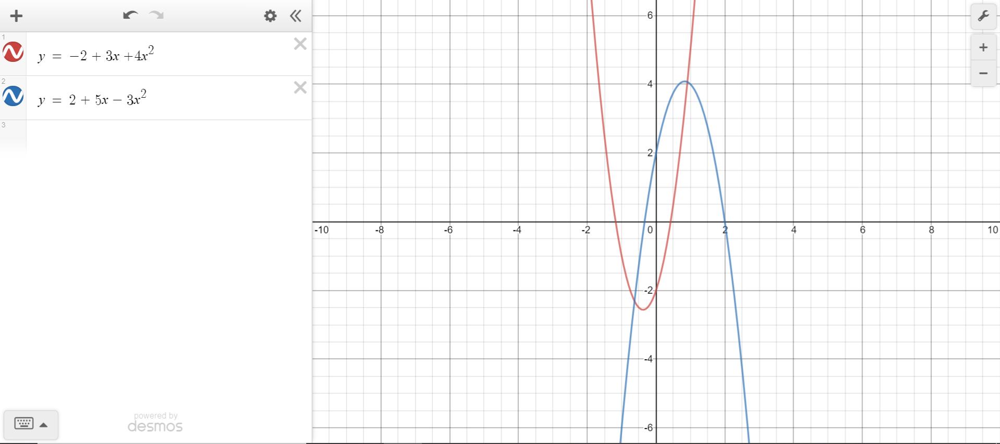

## Instructions

Use this file to keep a record of your work as you complete the "Skills Quiz: Different Types of Models" assignment in Canvas.


```{r, message=FALSE, warning=FALSE}
pacman::p_load(readr, haven, readxl, downloader, tidyverse, ggbeeswarm, mosaic, stringr, pander, DT, ggplot2, alr3, foreign, measurements, mosaicData)
```


----

<!-- Note: The {} after each Problem and Part header allows you to keep track of what work you have completed. Write something like {Done} once you complete each problem and your html file will then show you a nice summary of what you have "done" already. -->


## Problem 1 {Done}

Consider the scatterplot shown here of a single residence's monthly gas bill according to the month of the year. See `?Utilities` for more details on the data.

```{r}
#Base R
plot(gasbill ~ month, data=Utilities, main="Single Residence in Minnisota", xlab="Month of the Year", ylab="Monthly Gas Bill (US Dollars)")

```


### Part (a)

Add the estimated regression function to the scatterplot above and state the function below.

```{r}
Utilities.lm <- lm(gasbill ~ month + I(month^2), data = Utilities)
Util.lm.co <- Utilities.lm$coefficients
```

<div class="YourAnswer">

```{r ggplot_graph, message=FALSE, warning=FALSE}
#ggplot
ggplot(Utilities, mapping = aes(y = gasbill, x = month)) +
  geom_point() +
  stat_function(fun = function(x) Util.lm.co[1] + Util.lm.co[2]*x + Util.lm.co[3]*x^2) +
  labs(title="Single Residence in Minnisota", 
       x="Month of the Year", 
       y="Monthly Gas Bill (US Dollars)")

pander(summary(Utilities.lm))
```


$$
  \underbrace{\hat{Y}_i}_\text{Monthly Gas Bill} = \overbrace{\underbrace{284.4558}_\text{Y-Int} + \underbrace{-76.6165x}_\text{Slope}}^\text{Regression Relation} + \underbrace{5.4807x^2}_\text{Regression Curve}
$$

</div>

### Part (b)

Diagnose the appropriateness of this regression model. How well does it fit the data? 

<span style="font-size:.8em;">Be sure to provide diagnostic plots and supporting arguments for your claims.</span>

<div class="YourAnswer">

```{r}
# Check Assumptions
par(mfrow=c(1,3))
plot(Utilities.lm, which=1:2)
plot(Utilities.lm$residuals, main = "Residuals vs Order")
# plot(Utilities.lm, which = 1)
# qqPlot(Utilities.lm$residuals, main = "Q-Q Plot of Residuals", id = FALSE)

#View(Utilities)
```

The variance of the error terms are unconstant, linearity relation between x and y seems to be linear, the error terms are not normally distributed, and the error terms may or may not be totally independent of each other.

</div>


### Part (c)

What range of possible gas bill amounts do you predict for the September bill? How confident are you in your prediction?

<div class="YourAnswer">

```{r}
predict(Utilities.lm, data.frame(month=9), interval="prediction")
```

Lower limit of prediction (0), higher limit of prediction (99.70), and estimated prediction (38.85). Bills can't be below zero hence the limit of 0 instead of -22. I think this is a little high, yet fairly good prediction. I would probably place my prediction around `$30-35` instead of `$38`.

</div>


### Part (d)

Compute the mean of just September's gas bills and draw a horizontal reference line for this mean on your scatterplot. How does this mean compare to your prediction in Part (c)?

<div class="YourAnswer">

```{r}
Util.Gas.Avg <- Utilities %>% 
  group_by(month) %>% 
  mutate(Avg.Gas = mean(gasbill))
#View(Utilities)
#View(Util.Gas.Avg)
#View(Util.Sep.Avg)

Utilities %>% 
ggplot(aes(y = gasbill, x = as.factor(month))) +
  geom_point() +
  geom_hline(yintercept = 22.81500, color = "firebrick") +
  stat_function(fun = function(x) Util.lm.co[1] + Util.lm.co[2]*x + Util.lm.co[3]*x^2) +
  labs(title="Single Residence in Minnisota", 
       x="Month of the Year", 
       y="Monthly Gas Bill (US Dollars)") +
  theme(plot.title = element_text(hjust = 0.5),
        legend.position = c(0.25, .85)) +
  geom_text(x = 2, 
            y = 30, 
            label = "Sept. Avg. Gas Bill", 
            color = "firebrick", 
            size = 3)
```

The mean of September (`$22.82`) is much lower than my predicted amount of `$38.85`. It is $38.85 - 22.82 = 16.03$ dollars cheaper. However, the variability among all months is taken into consideration when the regression curve is created. Hence the predicted amount of `$38.85`. Yet, September doesn't vary a considerable amount and this is why we get an amount lower than what's expected. In fact this is seen through months 1, 9, and 10. More work is needed to really determine what's occurring here.

</div>


### Part (e) 

State the values of $R^2$, $MSE$, and the residual standard error. What do each of these values tell us about the regression model?

<div class="YourAnswer">

```{r}
(sum( (Utilities$gasbill - Utilities.lm$fit)^2 )) / (117 - 3)

pander(summary(Utilities.lm))
```

| Estimate | Value |
|----------|-------|
| $R^2$ | 0.7937 |
| $MSE$ | 929.1179 | <!--Bro.Saunders took 30.48^2 to get the MSE, but isn't this more precise/correct (sum( (Utilities$gasbill - Utilities.lm$fit)^2 )) / (117 - 3) -->
| $\sqrt{MSE}$ | 30.48 |

The $R^2$ value tells us how much we have been able to explain the data points' deviation from the average $y$-value, $\bar{Y}$, using the regression curve. Or in relation to the $x$-value's, `Months`, impact upon the $y$-value, `gas bill price`. This is the proportion of variation in Y explained by the regression.

The $MSE$ is the average total amount, or area of the squared residuals. <!-- I could use a bit of an explanation here -->

The Residual Standard Error, the estimation of $\epsilon_i$, is the average estimated deviation amount a data point will have from the regression curve. 

</div>

<br />


## Problem 2 {Done}

View the `mtcars` dataset and corresponding help file `?mtcars`.

Perform a regression that predicts the miles per gallon `mpg` of the vehicle based on the quarter mile time `qsec` and transmission type `am` of the vehicle.


### Part (a)

Plot the data and your fitted regression model.

<div class="YourAnswer">

```{r}
mtcars.lm <- lm(mpg ~ qsec + am + qsec:am, data = mtcars)
mtcars.lm.co <- mtcars.lm$coefficients
```

```{r}
mtcars %>%
  ggplot(aes(y = mpg, x = qsec, fill = factor(am))) +
  geom_point(pch=21) +
  stat_function(fun = function(x, am = 0) mtcars.lm.co[1] + mtcars.lm.co[2]*x + mtcars.lm.co[3]*am + mtcars.lm.co[4]*x*am, 
                aes(color = "a", linetype = "a")) +
  stat_function(fun = function(x, am = 1) mtcars.lm.co[1] + mtcars.lm.co[2]*x + mtcars.lm.co[3]*am + mtcars.lm.co[4]*x*am, 
                aes(color = "b", linetype = "b")) +
  labs(title="Transmission Type Influences Gas Mileage \nmtcars dataset",
       x = "Speed by 1/4 Mile Time (qsec)",
       y = "Miles per Gallon (mpg)") + 
  scale_fill_discrete(name = "Tranmission Type (am)") + 
  scale_color_manual(name = "Type of Line",
                     values = c("firebrick", "lightseagreen"),
                     labels = c("Estimated Automatic Regression", "Estimated Manual Regression")) +
  scale_linetype_manual(name = "Type of Line",
                     values = c(1,1),
                     labels = c("Estimated Automatic Regression", "Estimated Manual Regression")) +
  theme(legend.position = "right")
```

<!-- $$ -->
<!--  \underbrace{Y_i}_\text{mpg} = \beta_0 + \beta_1 \underbrace{X_{1i}}_\text{qsec} + \beta_2 \underbrace{X_{2i}}_\text{am == 1} + \beta_3{X_{1i}:X_{2i}} + \epsilon_i -->
<!-- $$ -->

</div>


### Part (b)

State the fitted regression model.

<div class="YourAnswer">

$$
 \underbrace{Y_i}_\text{mpg} = \beta_0 + \beta_1 \underbrace{X_{1i}}_\text{qsec} + \beta_2 \underbrace{X_{2i}}_\text{am == 1} + \beta_3{X_{1i}:X_{2i}} + \epsilon_i
$$

</div>

### Part (c)

Use `summary(...)` to perform an appropriate t test to determine if the interaction term is needed in this regression model.

<div class="YourAnswer">

```{r}
pander(summary(mtcars.lm))
```

The interaction term between the two is not significant enough, $p = 0.07012$, to have this in the regression model.

</div>


### Part (d)

Diagnose the appropriateness of this regression model. How well does it fit the data? 

<span style="font-size:.8em;">Be sure to provide diagnostic plots and supporting arguments for your claims.</span>

<div class="YourAnswer">

```{r}
# Check Your Assumptions
par(mfrow=c(1,3))
plot(mtcars.lm, which=1:2)
plot(mtcars.lm$residuals, main = "Residuals vs Order")
#plot(mtcars.lm, which = 1)
# qqPlot(mtcars.lm$residuals, main = "Q-Q Plot of Residuals", id = FALSE)
```

The variance of the residuals is normal, the linearity has a few problems most likely from the outliers, but overall is good, the normality of the residuals is good except for a few outliers, and the independence of the residuals does not seem normal.


</div>


### Part (e)

State the $R^2$ and residual standard error values for this model. What do these values show?

<div class="YourAnswer">

```{r}
pander(summary(mtcars.lm))
```

| Estimate | Value |
|----------|-------|
| $R^2$ | 0.722 |
| $\sqrt{MSE}$ | 3.343 |

<!------ Could I get a more thorough explaination to the residual standard error? ------>

The $R^2$ value states how much of the variability in our data points can be explained. This is done by noting how far the points deviate from $\hat{Y}$ using the regression line. This is the proportion of variation in Y explained by the regression. The $\sqrt{MSE}$, the estimation of $\epsilon_i$, shows us the average estimated deviation a data point will have from the regression curve. 

</div>

<br />


## Problem 3 {Done}

View the `mtcars` dataset and corresponding help file `?mtcars`.

Perform a regression that predicts the quarter mile time `qsec` of the vehicle based on the displacement of the engine `disp` and transmission type `am` of the vehicle according to the model:

$$
  \underbrace{Y_i}_\text{qsec} = \beta_0 + \beta_1 \underbrace{X_{1i}}_\text{disp} + \beta_2 X_{1i}^2 + \beta_3 \underbrace{X_{2i}}_\text{am == 1} + \beta_4 X_{1i}X_{2i} + \beta_5 X_{1i}^2X_{2i} + \epsilon_i
$$

where $\epsilon_i \sim N(0, \sigma^2)$.

### Part (a) 

Plot the data and your fitted regression model.

<div class="YourAnswer">

```{r}
#fab.lm <- lm(y ~ x + I(x^2) + x2 + x:x2 + I(x^2):x2, data=fabData)
mtcars.big.lm <- lm(qsec ~ disp + I(disp^2) + am + disp:am + I(disp^2):am, data = mtcars)
mtcars.big.lm.co <- mtcars.big.lm$coefficients
```

```{r}
mtcars %>%
  ggplot(aes(y = qsec, x = disp, fill = as.factor(am))) +
  geom_point(pch = 21) +
  stat_function(fun = function(x, am = 0)mtcars.big.lm.co[1] + mtcars.big.lm.co[2]*x + mtcars.big.lm.co[3]*x^2 + mtcars.big.lm.co[4]*am + mtcars.big.lm.co[5]*x*am + mtcars.big.lm.co[6]*x^2*am,
                aes(color = "a", linetype = "a")) +
  stat_function(fun = function(x, am = 1)mtcars.big.lm.co[1] + mtcars.big.lm.co[2]*x + mtcars.big.lm.co[3]*x^2 + mtcars.big.lm.co[4]*am + mtcars.big.lm.co[5]*x*am + mtcars.big.lm.co[6]*x^2*am,
                aes(color = "b", linetype = "b")) +
  theme_light() +
  labs(title="Transmission Type Influences Gas Mileage \nmtcars dataset",
       x = "Miles per Gallon (mpg)",
       y = "Speed by 1/4 Mile Time (qsec)") + 
  scale_fill_discrete(name = "Tranmission Type (am)") + 
  scale_color_manual(name = "Type of Line",
                     values = c("firebrick", "lightseagreen"),
                     labels = c("Estimated Automatic Displacement Regression", "Estimated Manual Displacement Regression")) +
  scale_linetype_manual(name = "Type of Line",
                     values = c(1, 1),
                     labels = c("Estimated Automatic Displacement Regression", "Estimated Manual Displacement Regression")) +
  theme(legend.position = "right")

```


</div>

### Part (b)

State the fitted regression model.

<div class="YourAnswer">

<!-- lm(qsec ~ disp + I(disp^2) + am + disp:am + I(disp^2):am, data = mtcars) -->

$$
  \underbrace{\hat{Y_i}}_\text{Estimated 1/4 Mile Time} = \overbrace{2.62}^\text{Y-Int. of Automatic} + \overbrace{-4.94 \underbrace{X_{1i}}_\text{Displ. of Automatic}}^\text{Slope of Automatic} + \overbrace{6.61 X_{1i}^2}^\text{Quadratic of Automatic} + \overbrace{-3.66 \underbrace{X_{2i}}_\text{am == 1}}^\text{Change in Y-Int. for Manual} + \overbrace{-2.93 \underbrace{X_{1i}X_{2i}}_\text{Displ. of Manual}}^\text{Change in Slope for Manual} + \overbrace{1.87 X_{1i}^2X_{2i}}^\text{Change in Quadratic for Manual}
$$

</div>


### Part (c)

Use `summary(...)` to perform appropriate t tests to determine which interaction terms are needed in this regression model.

<div class="YourAnswer">

```{r}
pander(summary(mtcars.big.lm))
```

A manual transmission does not have any significant impact on the estimated 1/4 mile time of the cars measured in this dataset.

</div>

### Part (d) {Question for Bro.Saunders}

Diagnose the appropriateness of this regression model. How well does it fit the data? 

<span style="font-size:.8em;">Be sure to provide diagnostic plots and supporting arguments for your claims.</span>


<div class="YourAnswer">

```{r}
# Check Your Assumptions
par(mfrow=c(2,4))
plot(mtcars.big.lm, which=1:2)
plot(mtcars.big.lm$residuals, main = "Residuals vs Order")
plot(mtcars.big.lm, which=3:6)
#plot(mtcars.big.lm, which = 1)
# qqPlot(mtcars.big.lm$residuals, main = "Q-Q Plot of Residuals", id = FALSE)
```

The variance and linearity of the residuals is not normal. Yet, Brother Saunders states that there isn't enough evidence to discredit them, why?

</div>

### Part (e) 

Drop the "least significant" term from the model. This is a silly statement really, but is an accepted practice when searching for a "best" model in regression analysis. What has changed?

<div class="YourAnswer">

```{r}
mtcars.2big.lm <- lm(qsec ~ disp + I(disp^2) + am + I(disp^2):am, data = mtcars)
pander(summary(mtcars.2big.lm))
```

Interestingly, the p-value for the "am" term, $\beta_3$, in the original model, is now significant. The p-value for this term is now, 2.86e-05, whereas it was previously 0.130076. This shows why we should only drop one term at a time from a regression, rather than dropping all non-significant terms all at once. Everything can change with the addition or deletion of just a single term.

</div>


## Problem 4 {Done}

Recreate the following model from Desmos in R using simulation. 

*Hint: This is like a "Two Lines Model" but is instead a "Two-Quadratic Model." How to do this is not in your Statistics-Notebook. But if you apply the same logic that you used to create the "Quadratic Model" and the "Two-Lines Model" you will be able to create this "Two-Quadratic Model."*




Email a picture of your resulting R Plot to your teacher. They will send you back a completion code that you can enter for credit on this quiz.

* Use a `sample size` of 100 points in your graph.
* Make sure the dots in your graph are at least somewhat `off of the curves`.
* Color your curves and your dots `two different colors`.
* Draw both the `"true curves"` and the `"estimated curves"` on the graph.
* `Email` a picture of your final graph to your teacher.

<div class="YourAnswer">

```{r Two_Quadratic_Simulation, message=FALSE, warning=FALSE}
## Simulating Data from a Regression Model
## This R-chunk is meant to be played in your R Console.
## It allows you to explore how the various elements
## of the regression model combine together to "create"
## data and then use the data to "re-create" the line.

set.seed(101) #Allows us to always get the same "random" sample
              #Change to a new number to get a new sample

n <- 100 #set the sample size
X_i <- runif(n, -2, 3) 
X2_i <- sample(c(0,1), n, replace = TRUE)
  #Gives n random values from a uniform distribution between 15 to 45.

beta0 <- -2 #Our choice for the y-intercept. 

beta1 <- 3 #Our choice for the slope. 

beta2 <- 4 #DEVIN - beta2 variable

beta3 <- 4

beta4 <- 2

beta5 <- -7

sigma <- 3.5 #Our choice for the std. deviation of the error terms.


epsilon_i <- rnorm(n, 0, sigma) 
  #Gives n random values from a normal distribution with mean = 0, st. dev. = sigma.

Y_i <- beta0 + beta1 * X_i + beta2 * X_i^2 + beta3 * X2_i + beta4 * X_i * X2_i + beta5 * X_i^2 * X2_i + epsilon_i 
  #Create Y using the normal error regression model

fabData <- data.frame(y=Y_i, x=X_i, x2=X2_i) 
  #Store the data as data

#View(fabData) 
  

#In the real world, we begin with data (like fabData) and try to recover the model that 
# (we assume) was used to created it.

fab.lm <- lm(y ~ x + I(x^2) + x2 + x:x2 + I(x^2):x2, data=fabData) #Fit an estimated regression model to the fabData.

summary(fab.lm) #Summarize your model. 


```

```{r Two_Quadratic_Graph}
fab.lm.co <- fab.lm$coefficients

fabData %>%
  ggplot(aes(y = y, x = x, fill = as.factor(x2))) +
  geom_point(pch = 21) +
  stat_function(fun = function(x, x2 = 0)fab.lm.co[1] + fab.lm.co[2]*x + fab.lm.co[3]*x^2 + fab.lm.co[4]*x2 + fab.lm.co[5]*x*x2 + fab.lm.co[6]*x^2*x2,
                aes(color = "a"), linetype = 1) +
  stat_function(fun = function(x, x2 = 1)fab.lm.co[1] + fab.lm.co[2]*x + fab.lm.co[3]*x^2 + fab.lm.co[4]*x2 + fab.lm.co[5]*x*x2 + fab.lm.co[6]*x^2*x2,
                aes(color = "b"), linetype = 1) +
  stat_function(fun = function(x, x2 = 0)beta0 + beta1*x + beta2*x^2 + beta3*x2 + beta4*x*x2 + beta5*x^2*x2,
                aes(color = "c"), linetype = 2) +
  stat_function(fun = function(x, x2 = 1)beta0 + beta1*x + beta2*x^2 + beta3*x2 + beta4*x*x2 + beta5*x^2*x2,
                aes(color = "d"), linetype = 2) +
  theme_light() +
  labs(title="Two Quadratic Regression Relations Diagram",
       x = "X Variable",
       y = "Y Variable") +
  scale_fill_discrete(name = "Data Points") + 
  scale_color_manual(name = "Type of Line",
                     values = c("brown3", "darkcyan", "brown3", "darkcyan"),
                     labels = c("Estimated Two-Lines Brown3", "Estimated Two-Lines Darkcyan", "True Two-Lines Brown3", "True Two-Lines Darkcyan")) +
  scale_linetype_manual(name = "Type of Line",
                        values = c(1,1,2,2),
                        labels = c("Estimated Two-Lines Brown3", "Estimated Two-Lines Darkcyan", "True Two-Lines Brown3", "True Two-Lines Darkcyan")) +
  theme(legend.position = "right")

```

</div>


<style>

.YourAnswer {
  color: #317eac;
  padding: 10px;
  border-style: solid;
  border-width: 2px;
  border-color: skyblue4;
  border-radius: 5px;
}

</style>

 
 