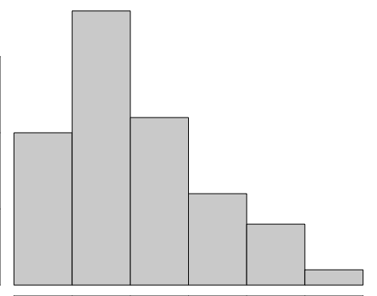
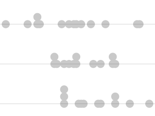

<!-- You can delete the following copyright statement if you wish: -->

<div style="color:gray;"><!-- Code to change the following paragraphs to gray text -->

This page, and all pages of this notebook, are meant to be customized to become a useful *Guide to Statistical Analysis* in R for your *current* and *future* self. 

<div style="font-size:.8em;"><!-- Code to shrink font-size of following paragraph -->


</div><!-- Ends smaller font-size section -->

</div><!-- End gray text section -->

<!-- End of download and copyright instructions. -->


## Table of Contents

<!-- This is how to comment text out. You can comment out the above instructions if you wish. Comments allow the text to remain in the Rmd file, but not be displayed in the html file. -->


## {.tabset .tabset-fade}

### Hide 

### Q & A

<!-- This is a great place to add general notes --------------- -->

[Customization Help](RMarkdownHints.html)

| Questions | Answsers |
|-----------|----------|
| What is a R-chunk?| It is the section where R code can be entered.|
| What is a variable?|It can be particular point of information. A column, a specific point in a table, or in mathmatics, it is the symbol for something.|
| What is a Table of Counts?| All of your data is counted up in this tool.|
| What is a data set?| It is a data set. The two words are synonmous.|
| Is datatable a function? What can you do with datatable? | Yes, it is a function. You are able to look at the data itself.|
| What is qualitative vs. quantitative?| Names, Categories, etc. vs. #'s|
| How do you use c()?| It allows me to pick my groups or variables. |
| What is the difference between:| |
| group_by and summarise| Group_by looks at a column and individuals (or variables) but you must use summarise to look at the individuals|
| select| Select looks <b>only</b> at a column|
| filter| Filter() lets me look at <b>my</b> XC career. Group_by lets me look at the summary of all runners and my XC career.|
| What is the difference between a confidence and significance level?| Confidence: 95%  Significance: 0.05|
| What is alpha ($\alpha$)? | It is our significance level i.g. 0.05 |
| What is sigma ($\sigma$)? | It is our standard deviations. |
| How does a Type I error occur?| When you reject truth or correct hypothesis.|
| How does a Type II error ($\beta$) occur?| When you reject to act or stay in the dark because you like false information better.|
| What is a test statistic?| It is a way, t-test/ANOVA/Chi-Squared, to evaluate how far the data is from my hypothesis? |
| What is a distribution?| It's where the data lands.|
| What is degrees of freedom?| Simply, it is one number less than the sample size.|
| What is a one-sample test?| I simply collect body temperature.|
| What is a two-sample test?| I look at body temperature and gender to see differences|
| What is a paired test?| I look at body temperature before and after someone does jumping jacks.|
| What is a parametric method?| A test used to find a p-value using a degree of freedom.|
| Why do we use this?| We use a parametric test to create a p-value. A p-value comes from the sampling distribution. We use a p-value to determine how far the sample data is from the hypothesis.|
| What is mu?| Mean of the population or $\mu$|
| What is a standard deviation?| Standard deviation of the population or $\sigma$|
| What is inference?| Using information, patterns, or trends from the sample to make a conclusion whether it's true for the whole population.|
| What is a Q-Q plot?| Quantile-Quantile plot or Theory vs. Actual or it helps show the distribution of data and if it is skewed or not.|
| What is a percentile? | The quartile: I'm in the 83rd quartile. It is the percentage of data at or below a given quantile.|
| What is a quantile?| My actual score: 98%|
| Can you use a histogram to verify if the data is skewed?| Yes, but it can be deceiving. So we use a Q-Q plot because there is only one Q-Q plot.|
| When do you use a boxplot or dot plot?| Boxplot is for large data. Dotplot is for small data.|
| What is cardinal, ordinal, and nominal data?| Cardinal: How many, quantitative, only counts|
| | Ordinal: Position/Order, Position of something|
| | Nominal: Name, Qualitative, Identifying feature. Nominal is a name.|
| What is a donkey and a hula-hoop?| Test statistic and distribution of statistic.|

|Wilcoxon Test: Question | Answer |
|------------|------------|
| Which style of tests can be performed with the Wilcoxon Signed-Rank Test? | One Sample: testing hypotheses about the center of a distribution (where the center is subtracted from each value).  
Paired Samples: testing hypotheses about the center of the distribution of differences.|
| Which style of tests can be performed with the Wilcoxon Rank Sum Test? | Independent Samples: test of the difference in the location of the centers of two distributions. |
| True or False. The Wilcoxon Rank Sum Test, also known as the Mann-Whitney Test, is the nonparametric equivalent of the Independent Samples t Test.| True|
|How is the p-value calculated in a Wilcoxon Test? | By adding up the  
probability of all the possible sums of ranks that are as extreme or more extreme than the observed sum of ranks. |

|ANOVA: Question | Answer|
|---------------|-----------|
| What do the words "factor" and "level" mean when using R?| They refer to the column and row of a dataset. |
| What is a factor? |  A factor is defined as a **qualitative** variable containing at least two categories. The categories of the factor are referred to as the “levels” of the factor. |
| What is a responsive variable? | This is your dependent variable. |
| What do the phrases "one-way ANOVA" and "two-way ANOVA" mean?| |
| What advantage does the two-way ANOVA have over the one-way ANOVA? | |
| What does degrees of freedom mean?| |
| What does ANOVA mean? | Analysis of Variance |
| What is a [variance](./NumericalSummaries.html#variance)? | A measure of the spread of data or a statistical measure of the variability in data.|
| What is the F distribution? | ANOVA's test statistic. It is also two chi squared random variables divided by their degrees of freedom |
| What are the two variances of ANOVA? | *Within groups* variance and the *between groups* variance |
| Explain what *Between Group* Variance measures. | The variablity of the sample means, $\bar{x}$, are measured.|
| Explain what *Within Group* Variance measures. | The variablity of the data within each group is measured.|
| How is the sample variance calculated? | The sum of squares is divided by the degrees of freedom. |
| What is $\bar{y_i}$ | The sample mean of group $i$.|
| What is $n_i$? | The sample size in group $i$.|
| What is $\bar{y}$? | The sample mean of all $n$ or data points.|
| Do I have to compute the mean for each $\bar{y_i}$? Why or why not?| |
| What assumptions do you have to check with ANOVA? | 1. The errors are normally distributed.  2. The variance of the errors is constant.|
| If you check one numerical responsive factor against qualitative factors, then what test do you use when checking if another quantitative factor plays a part? | |
| What so great about being able to use a two-way or block ANOVA? | A two-way or block ANOVA allows for you to check the effect several qualitative or independent factors may have on the data. |
| What is $y_{ik}$? | The data points.|
| What is $\mu_i$?| The true population mean for group i.|
| What is $\epsilon_{ik}$ ? | The error term for the $k^th$ data point of the $i^th$ group. In other words, how far that data point is from the true mean $\mu_i$. |
| When do you keep an ANOVA null hypothesis? | When the variances are roughly equal. |
| When do you reject the ANOVA's null hypothesis? | When the between group variance is significantly larger than the within group variance. |
| What does the Q-Q Plot measure in ANOVA? | Whether the errors are normally distributed. |
| What does the Residuals vs. Fitted plot measure? | The variance of the errors is constant. |


|Linear Regression: Question | Answer|
|-------------|-------|
| What is a residual?| A dot has an x value. There are infinite many points for a residual. Grouping happens by X. Y is the response to splitting up the data.|
| If I took my Y data and averaged them, what would be my notation?| I would get y bar.|
| What is notation?| It is something to call the data.|
| What does the regression line?| The line is the mean or average. It does NOT pass minimum, max, Q1, etc.|
| What is a dot?| A Y value.|
| What is $Y_i$| It is me or a specific point. It's like a personalized mass e-mail.|
| What is $\hat{Y}$| It is the mean or average. It is a mass e-mail.|
| What is $X_i$| It is the value that splits the data up. |
| What is $\beta_0$| It is the Y-intercept. |
| What is $\beta_0$| It is the slope.|
| What is $\epsilon_i$| It is the error term. |
| What does changing "a" do to the regression line?| |
| What does changing "b" do to the regression line?| |
| What does the phrase "least squares regression line" mean?| |


| Logistical Regression: Question | Answer|
|-----|-----|
|What does $P(Y_i=1|X_i)$ represent in logistic regression?| |
|What is the difference between odds and probability?| |
|How are the following statements true for this $\frac{π_i}{1−π_i}=e^{β_0}e^{{β_1}{x_i}}$  : 1) 	
$\frac{π_i}{1−π_i}$ is the odds of success, i.e., the odds that $$Y_i=1$$.  2) The odds of success equal $$e^{β_0}$$ when $$x_i=0$$.  3) The odds of succes increase by the factor of $$e^β_1$$ for every one unit increase in $$x_i$$.| |
|When is it appropriate to use the Hosmer-Lemeshow goodness of fit test for a logistic regression model?| |
| | |


| Chi Squared Test: Question | Answer |
|-------------------|----------------|
| How do you find ____? | You find your row, column, and total total. |
| What does this mean? $| The variables need to be independent of one another. |


| Permutation Test: Question | Answer |
|---------------|--------------|
|How does the picture of Legos in your Permutation Tesing Overview page demonstrate the idea of permutation testing?| |
| How is the distribution of the test statistic created using permutation testing?| |
| How does this distribution differ from a parametric distribution? | |
| How is the p-value calculated from a permutation test?| |
| What is a for loop? What does it allow you to do?| |

<!-- End your notes before here. ------------------------------------- -->
##

----

<div style="float:left;width:125px;" align=center class="tooltipimage">

  <span class="tooltipimagetext">Y is a single quantitative variable of interest. This would be like "heights" of BYU-Idaho students.</span>
</div>

### One Quantitative Response Variable Y {.tabset .tabset-pills}

#### Graphics
<div style="padding-left:125px;color:gray;">
<!-- Add your customizations in the area below: -->

Tests to use: [t-Test One Sample](./tTests.html#One-Sample), [t-Test Paired Sample](./tTests.html#Paired-Samples), and [Wilcoxon Signed-Rank Test](./WilcoxonTests.html#Wilcoxon-Signed)  

Histograms: Great for showing distribution or where the data falls. Better for large amounts of data.  
Dotplots: Used for smaller data to show the distribution of data with several categories.  
Boxplot: Shows five points; Minimum, Q1, Median, Q3, and max. Great for large amounts of data.  


<a href="GraphicalSummaries.html#histogram">
  
</a>
<a href="GraphicalSummaries.html#dot-plots">
  
</a>
<a href="GraphicalSummaries.html#boxplots">
  
</a>


<!--- End your notes before here.  ------------------>
</div>

#### Tests
<div style="padding-left:125px;color:gray;">
<!-- Add your customizations in the area below: -->

Typically used to find the mean of one set of data.

* t-Test One Sample: Average of my data
* t-Test Paired Sample: Difference between doing and not doing. Outcome is tied together.
* Wilcoxon Signed-Rank Test: Used to find the median of data.
* Symbols mean: `Type something here, Devin.` 

<br>

**t-Test Examples**: [SleepOne](./Analyses/t%20Tests/Examples/SleepOneSamplet.html), [SleepPaired](./Analyses/t%20Tests/Examples/SleepPairedt.html), [studentPaired](./Analyses/t%20Tests/Examples/Student1Paired.html),  
**Wilcoxon Examples**: [Sleep](./Analyses/Wilcoxon%20Tests/Examples/SleepPairedWilcoxon.html), [CornHeights](./Analyses/Wilcoxon%20Tests/Examples/CornHeightsPairedWilcoxon.html)


</div>

#### Coding

<div style="padding-left:125px;color:gray;">
<!-- Add your customizations in the area below: -->

##### One-Sample t-Test

Summary

```{r eval=FALSE}
t.test(NameOfYourData$Y, mu = YourNull, alternative = YourAlternative, conf.level = 0.95)
library(car)
qqPlot(NameOfYourData$Y)
```


To run the t-Test:

```{r t-Test Code, eval=FALSE}
t.test(NameOfYourData$Y, mu = YourNull, alternative = YourAlternative, conf.level = 0.95)
```


* Y is numeric
* alternative = "two.sided", "greater", "less"
* conf.level = 1-$\alpha$, usually 0.95

To test assumptions:

```{r t-Test One Assumption, eval=FALSE}
library(car)
qqPlot(NameOfYourData$Y)
```


##### Paired Sample t Test

Summary

```{r eval=FALSE}
```{r t-Test Paired Assumption, eval=FALSE}
# Option 1
library(car)
qqPlot(Y1 - Y2)

# Option 2
library(car)
qqPlot(differences)
```


To run the Paired t-Test:

```{r Paired t-Test 1, eval=FALSE}
# Option 1
t.test(NameOfYourData$Y1, NameOfYourData$Y2, paired = TRUE, mu = YourNull, alternative = YourAlternative, conf.level = 0.95)
```

```{r Paired t-Test 2, eval=FALSE}
# Option 2

# Compute the differences yourself instead of using paired=TRUE.

differences = NameOfYourData$Y1 - NameOfYourData$Y2

t.test(differences, mu = YourNull, alternative = YourAlternative, conf.level = 0.95)
```

* Y1 is numeric from first sample of data
* Y2 is numeric from second sample of data
* alternative = "two.sided", "greater", "less"
* conf.level = 1-$\alpha$, usually 0.95

To test assumptions:

```{r eval=FALSE}
# Option 1
library(car)
qqPlot(Y1 - Y2)

# Option 2
library(car)
qqPlot(differences)
```

##### Graphs

```{r eval=FALSE}
# Histogram code:
hist(DataSet$Column)

# Dot plot code:
# Basic
stripchart(DataSet$Column, method = "stack")

# Side-by-side
stripchart(object ~ group, data=NameOfYourData, method = "stack")

# Basic boxplot code:
# Basic
boxplot(DataSet$Column)

#Side-by-side
boxplot(object ~ group, data=NameOfYourData)

```


<!--- End of Add content area.  ------------------>
</div>

##
<div style="clear:both;"></div>

----

<div style="float:left;width:125px;" align=center class="tooltipimage">

  <span class="tooltipimagetext">Y is a single quantitative variable of interest. This would be like "heights" of BYU-Idaho students. X is a qualitative (categorical) variable of interest like "gender" that has just two groups "A" and "B". So this logo represents situtations where we would want to compare heights of male (group A) and female (group B) students.</span>
</div>

### Quantitative Y | Categorical X (2 Groups) {.tabset .tabset-pills}

#### Graphics
<div style="padding-left:125px;color:gray;">
<!-- Add your customizations in the area below: -->

Tests to use: [Independent Samples t Test](./tTests.html) and [Wilcoxon Rank Sum (Mann-Whitney) Test](./WilcoxonTests.html#Wilcoxon Rank Sum (Mann-Whitney) Test)  

Side-by-side Boxplot: Shows five points; Minimum, Q1, Median, Q3, and max. Great for large amounts of data.  
Side-by-side Dotplot: Used for smaller data to show the distribution of data with several categories.  


<a href="GraphicalSummaries.html#boxplots">
  
</a>
<a href="GraphicalSummaries.html#dot-plots">
  
</a>


<!--- End of Add content area.  ------------------>
</div>

#### Tests
<div style="padding-left:125px;color:gray;">
<!-- Add your customizations in the area below: -->

Typically used to find what the difference is between two variables' midpoints.  

* Independent Samples t Test: Trying to find the difference in population means. Use with large or normal data.
* Wilcoxon Rank Sum (Mann-Whitney) Test: You're answering - What's the differences between the midpoints? Use with small or skewed data.
* Symbols: Y is quantitative. X is qualitative.

$$
  H_0 : \mu_1−\mu_2 = \text{some number, but typically 0}
$$

$$
  H_0 : \text{difference in medians = 0}
$$


$$
  H_0 : \text{the distributions are stochastically equal}
$$
<br>

**Independent t-Test Examples**: [sleepInd](./Analyses/t%20Tests/Examples/SleepIndependentt.html), [student1](./Analyses/t%20Tests/Examples/Student1Independent.html), [student2](./Analyses/t%20Tests/Examples/Student2Independent.html)  
**Wilcoxon Rank Sum**: [Bug Spray](./Analyses/Wilcoxon%20Tests/Examples/BugSprayWilcoxonRankSum.html), [Moral Integregration of American Cities](./Analyses/Wilcoxon%20Tests/Examples/MoralIntegration.html)


<!--- End of Add content area.  ------------------>

</div>

#### Coding

<div style="padding-left:125px;color:gray;">
<!-- Add your customizations in the area below: -->

##### Independent t-Test

Summary

```{r eval=FALSE}
# Option 1
t.test(Y ~ X, data = YourData, mu = YourNull, alternative = YourAlternative, conf.level = 0.95)

# Test assumptions:
library(car)
qqPlot(Y ~ X, data=YourData)

# The test (Option 2):
t.test(NameOfYourData$Y1, NameOfYourData$Y2, mu = YourNull, alternative = YourAlternative, conf.level = 0.95)

#Test assumptions:
library(car)
par(mfrow=c(1,2))
qqPlot(NameOfYourData$Y1)
qqPlot(NameOfYourData$Y2)

```


##### Wilcoxon Rank Sum Test

```{r eval=FALSE}
# The Test (Option 1):
wilcox.test(Y ~ X, data = YourData, mu = YourNull, alternative = YourAlternative, conf.level = 0.95)

# The Test (Option 2):
wilcox.test(object1, object2, mu = YourNull, alternative = YourAlternative, conf.level = 0.95)
```

* Y = numeric
* X = “factor” or “character” of 2 groups  

(or)

* Y = numeric, 1st group
* X = numeric, 2nd group


##### Graphs

```{r eval=FALSE}
# Side-by-side boxplots:
boxplot(object ~ group, data=NameOfYourData)

# To add dots to boxplots:
stripchart(object ~ group, data=NameOfYourData, method = "stack", add = TRUE, vertical = TRUE, pch = 16, col = "YourChoice")

# Side-by-side Dot Plots:
stripchart(object ~ group, data=NameOfYourData)
```

* object = numeric column
* group = "factor" or "character" column

<!--- End of Add content area.  ------------------>
</div>

##
<div style="clear:both;"></div>

----

<div style="float:left;width:125px;" align=center class="tooltipimage">

  <span class="tooltipimagetext">Y is a single quantitative variable of interest, like "heights" of BYU-Idaho students. X is a categorical (qualitative) variable like which Math 221 you took, 221A, 221B, or 221C. In other words, X has three or more groups. So "Classrank" could be X, with groups "Freshman", "Sophomore", "Junior", and "Senior".</span>
</div>

### Quantitative Y | Categorical X (3+ Groups) {.tabset .tabset-pills}

#### Graphics
<div style="padding-left:125px;color:gray;">
<!-- Add your customizations in the area below: -->

Tests to use: [One-way ANOVA](./ANOVA.html), [Two-way ANOVA](./ANOVA.html), [Block Design](./ANOVA.html), and [Kruskal-Wallis Rank Sum](./Kruskal.html)  

Side-by-side Boxplot (3+ groups): Provides the five-summaries.  
Side-by-side Dotplot (3+ groups): Shows each point, distribution, and good for small data. If large, use a histogram or boxplot.  


<a href="GraphicalSummaries.html#boxplots">
  
</a>
<a href="GraphicalSummaries.html#dot-plots">
  
</a>

<!--- End of Add content area.  ------------------>
</div>

#### Tests
<div style="padding-left:125px;color:gray;">
<!-- Add your customizations in the area below: -->

You are trying to measure `Type something here, Devin.`

* Normal distribution will use an ANOVA parametric test.  
* ANOVA is measuring a factor/column/group of interest and seeing how the level/row/individual is measuring up with another variable. 
* ?? Get $F$-Statistic by (number of observations - sum of all DF) ??
* Skewed distribution will use the Kruskal-Wallis nonparametric test.
* Symbol: Y is quantitative data. X is qualitatitive/responsive/dependent data.  

$$
  H_0 : \alpha_1 \text{ or } \beta_1 = 0
$$

$$
  H_0 : \text{All samples are from the same distribution. No stochastical difference.}
$$

<br>

**ANOVA Examples**: [chickwts](./Analyses/ANOVA/Examples/chickwtsOneWayANOVA.html) (One-way), [warpbreaks](./Analyses/ANOVA/Examples/warpbreaksTwoWayANOVA.html) (Two-way), [CO2](./Analyses/ANOVA/Examples/CO2ThreeWayANOVA.html) (Three-way), [ChickWeight](./Analyses/ANOVA/Examples/ChickWeightANOVABlock.html) (Block)  
**Kruskal Wallis Examples**: [wages](./Analyses/Kruskal-Wallis%20Test/Examples/wagesKruskal.html), [pigweights](./Analyses/Kruskal-Wallis%20Test/Examples/pigweightsKruskal.html)


<!--- End of Add content area.  ------------------>

</div>

#### Coding

<div style="padding-left:125px;color:gray;">
<!-- Add your customizations in the area below: -->

##### One-Way ANOVA

One-Way Summary

```{r eval=FALSE}
# Perform the ANOVA
myaov <- aov(y ~ A, data=YourDataSet) 

# View the ANOVA Results
summary(myaov)  

# Check ANOVA Assumptions
par(mfrow = c(1,2))
plot(myaov, which=1:2)
```

Two-Way Summary

```{r eval=FALSE}
# Perform the ANOVA
myaov <- aov(y ~ A+B+A:B, data=YourDataSet) 

# View the ANOVA Results
summary(myaov)  

# Check ANOVA Assumptions
par(mfrow = c(1,2))
plot(myaov, which=1:2)
```


Block Summary : See [ChickWeight](./Analyses/ANOVA/Examples/ChickWeightANOVABlock.html) for an example

```{r eval=FALSE}
# Perform the ANOVA
myaov <- aov(y ~ Block+A+B+A:B, data=YourDataSet) 

# View the ANOVA Results
summary(myaov)  

# Check ANOVA Assumptions
par(mfrow = c(1,2))
plot(myaov, which=1:2)

```

Evaluate the [Two Assumptions](./LinearRegression.html):

1. (2.) Normal Errors: the error terms $\epsilon_i$ are normally distributed with a mean of zero.
2. (3.) Constant Variance: the variance $\sigma^2$ of the error terms is constant (the same) over all $X_i$ values.

##### Kruskal-Wallis

Kruskal-Wallis Summary

```{r eval=FALSE}
pander(kruskal.test(x ~ g, data=YourDataSet))
```

* x is a numeric vector of data values that represents the quantatitive response variable.
* g is a qualitative grouping variable defining which groups each value in x belongs to. It must either be a character vector or a factor vector.


##### Graphics

Graphics

```{r eval=FALSE}
#Side-by-side boxplots:
boxplot(object ~ group, data=NameOfYourData)

#To add dots to boxplots:
stripchart(object ~ group, data=NameOfYourData, method = "stack", add = TRUE, vertical = TRUE, pch = 16, col = "YourChoice")

#Side-by-side Dot Plots:
stripchart(object ~ group, data=NameOfYourData)

#XYPlot (Side-by-side dot plot with a connecting line and grouped by color)
xyplot(object ~ group, data = NameOfYourData, type = c("p", "a"), groups = group2, jitter.x = TRUE, pch = 16, auto.key = list(corner = c(1,1)))
```

* object = numeric column
* group = “factor” or “character” column

<!--- End of Add content area.  ------------------>

</div>

##
<div style="clear:both;"></div>

----

<div style="float:left;width:125px;" align=center class="tooltipimage">

  <span class="tooltipimagetext">Y is a single quantitative variable of interest, like "height". X is another single quantitative variable of interest, like "shoe-size". This would imply we are using "shoe-size" (X) to explain "height" (Y).</span>
</div>

### Quantitative Y | Quantitative X {.tabset .tabset-pills}

#### Graphics
<div style="padding-left:125px;color:gray;">
<!-- Add your customizations in the area below: -->

Tests to use: [Simple Linear Regression](./LinearRegression.html)  

Scatterplot: Used to visualize the data points. Good to use with small or large sample sizes.  


<a href="GraphicalSummaries.html#scatterplots">
  
</a>

<!--- End of Add content area.  ------------------>
</div>

#### Tests
<div style="padding-left:125px;color:gray;">
<!-- Add your customizations in the area below: -->

You are trying to measure `Type something here, Devin.`

* Simple Linear Regression: Used to understand the correlation between two quantitative variables. You may also use the relationship to predict future results.
* Symbols: `Type something here, Devin.`  

$$
  H_0 : \beta_1 = 0
$$

**Examples**: [bodyweight](./Analyses/Linear%20Regression/Examples/BodyWeightSLR.html), [cars](./Analyses/Linear%20Regression/Examples/carsSLR.html)


<!--- End of Add content area.  ------------------>

</div>

#### Coding

<div style="padding-left:125px;color:gray;">
<!-- Add your customizations in the area below: -->

##### Simple Linear Regression

Summary

```{r eval=FALSE}
# Perform the Test
mylm <- lm(Y ~ X, data = NameOfYourDataset)
summary(mylm)


# Check Assumptions
par(mfrow=c(1,3))
plot(mylm, which=1:2)
plot(mylm$residuals, type = "b", main = "Residuals vs Order")
#plot(mylm, which = 1)
# qqPlot(mylm$residuals, main = "Q-Q Plot of Residuals", id = FALSE)

#Plot the Regression Line
plot(Y ~ X, data=YourDataSet)
abline(mylm)
```

* Y is quantitative response. X is quantitative explanatory.


Evaluate the [Five Assumptions](./LinearRegression.html):

1. Linear Relation: the true regression relation between $Y$ and $X$ is linear.
2. Normal Errors: the error terms $\epsilon_i$ are normally distributed with a mean of zero.
3. Constant Variance: the variance $\sigma^2$ of the error terms is constant (the same) over all $X_i$ values.
4. Fixed X: the $X_i$ values can be considered fixed and measured without error.
5. Independent Errors: the error terms $\epsilon_i$ are independent.

<!--- End of Add content area.  ------------------>

</div>

##
<div style="clear:both;"></div>

----

<div style="float:left;width:125px;" align=center class="tooltipimage">

  <span class="tooltipimagetext">Y is a single quantitative variable of interest, like height. While we could use an X1 of "shoe-size" to explain height, we might also want to use a second x-variable, X2, like "gender" to help explain height. Further x-variables could also be used.</span>
</div>

### Quantitative Y | Multiple X {.tabset .tabset-pills}

#### Graphics
<div style="padding-left:125px;color:gray;">
<!-- Add your customizations in the area below: -->

Tests to use: [Multiple Linear Regression](./LinearRegression.html)  

Scatterplot with Color and Sizing: Used to visualize the data points. Good to use with small or large sample sizes. 


<a href="GraphicalSummaries.html#scatterplots">
  
</a>

<!--- End of Add content area.  ------------------>
</div>

#### Tests
<div style="padding-left:125px;color:gray;">
<!-- Add your customizations in the area below: -->

You are trying to measure something here `Type something here, Devin.` 

* Linear Regression: `Type something here, Devin.`
* Symbols: Y is numeric response. X1 and X2 are either numeric or qualitative.

$$
  H_0 : \beta_j = 0
$$

<br>

**Examples**: [Civic vs Corolla](./Analyses/Linear%20Regression/Examples/CivicVsCorollaMLR.html), [cadillacs](./Analyses/Linear%20Regression/Examples/cadillacsMLR.html)


<!--- End of Add content area.  ------------------>

</div>

#### Coding

<div style="padding-left:125px;color:gray;">
<!-- Add your customizations in the area below: -->

##### Multiple Linear Regression

Summary

```{r eval=FALSE}
# Perform the Test
mylm <- lm(Y ~ X1 + X2 + X1:X2, data = NameOfYourDataset)
pander(summary(mylm))

# Check Your Assumptions
par(mfrow=c(1,3))
plot(mylm, which=1:2)
plot(mylm$residuals, type = "b", main = "Residuals vs Order")
#plot(mylm, which = 1)
# qqPlot(mylm$residuals, main = "Q-Q Plot of Residuals", id = FALSE)

# Plot Regression Line
predict(mylm, data.frame(X1=X1h, X2=X2h), type="response")
myPlot(NameOfYourDataset)

```


Plot Regression Line with Base R

```{r eval=FALSE}
plot(Y ~ X1, col = as.factor(X2), data = YourDataSet)
b <- mylm$coefficients
abline(b[1], b[2], col = "firebrick")
abline((b[1]+b[3]), (b[2]+b[4]), col = "royalblue3")
```

Making Predictions

```{r eval=FALSE}
predict(mylm, data.frame(X1=X1h, X2=X2h), type="response")

Here is an example:
mylm <- lm(mpg ~ hp + am + hp:am, data = mtcars)
predict(mylm, data.frame(hp = 120, am = 1), data = mtcars, type = "response")
```


Evaluate the [Five Assumptions](./LinearRegression.html):

1. Linear Relation: the true regression relation between $Y$ and $X$ is linear.
2. Normal Errors: the error terms $\epsilon_i$ are normally distributed with a mean of zero.
3. Constant Variance: the variance $\sigma^2$ of the error terms is constant (the same) over all $X_i$ values.
4. Fixed X: the $X_i$ values can be considered fixed and measured without error.
5. Independent Errors: the error terms $\epsilon_i$ are independent.

<!--- End of Add content area.  ------------------>
</div>

##
<div style="clear:both;"></div>

----

<div style="float:left;width:125px;" align=center class="tooltipimage">

  <span class="tooltipimagetext">Y is a single categorical (qualitative) variable of interest where 1 (success) or 0 (failure) are the only possible values for Y. This would be like "getting an A in Math 325" where 1 means you got an A and 0 means you didn't. We might use an explanatory variable X of "height" to see if taller students are more likely to get an A in Math 325 than shorter students. (They aren't, if you were wondering.)</span>
</div>

### Binomial Y | Quantitative X {.tabset .tabset-pills}

#### Graphics
<div style="padding-left:125px;color:gray;">
<!-- Add your customizations in the area below: -->

Tests to use: [Simple Logistic Regression Model](./LogisticRegression.html)  

Scatterplot with Binomial Y: Values are actually shown by data points. Helps show the correlation between the variables. 


<a href="GraphicalSummaries.html#scatterplots">
  
</a>

<!--- End of Add content area.  ------------------>
</div>

#### Tests
<div style="padding-left:125px;color:gray;">
<!-- Add your customizations in the area below: -->

You are taking qualitiative data and turning into binomial data (1's and 0's). You are using quantitative data to predict information about a qualitative variable.`Type something here, Devin,` regarding an overview of what we are trying to measure.

* What is an inferential procedure? `Type something here, Devin.`
* Logistical Regression: `Type something here, Devin.`
* Symbols: 1 is a sucess of the question. 0 is a failure of the question. # is quantitative data.  

$$
  H_0 : \beta_1 = 0
$$

<br>

**Logistic Examples**: [Challenger](./Analyses/Logistic%20Regression/Examples/challengerLogisticReg.html)


<!--- End of Add content area.  ------------------>

</div>

#### Coding

<div style="padding-left:125px;color:gray;">
<!-- Add your customizations in the area below: -->

##### Simple Logistic Regression Test

To perform a logistic regression:

```{r eval=FALSE}
YourObjectName <- glm(Y (Do something i.g. > 0) ~ X, data = YourDataset, family = binomial)
summary(YourObjectName)
```

Goodness of fit test with many replicated x-values:

```{r eval=FALSE}
pchisq(residual deviance, df for residual deviance, lower.tail = FALSE)
```

Goodness of fit test with few or no replicated x-values

```{r eval=FALSE}
library(ResourcesSelection)
hoslem.test(YourObjectName$y, YourObjectName$fitted)
```

To predict the probability that $Y_i = 1$ for a given x-value:

```{r eval=FALSE}
predict(YourObjectName, data.frame(ColumnName = DesiredValue), type = "response")

# Challenger Example
predict(chall.glm, data.frame(Temp=31), type='response')
```

To predict by-hand

```{r eval=FALSE}
exp(b[1]+b[2]*x)/(1+exp(b[1]+b[2]*x))
```

To find the estimated value of $e^{\beta_1}$

```{r eval=FALSE}
exp(b1)
```

<!--- End of Add content area.  ------------------>

</div>

##
<div style="clear:both;"></div>

----

<div style="float:left;width:125px;" align=center class="tooltipimage">

  <span class="tooltipimagetext">Y is a single categorical (qualitative) variable of interest where 1 (success) or 0 (failure) are the only possible values for Y. This would be like "getting an A in Math 325" where 1 means you got an A and 0 means you didn't. We might use an explanatory variable X1 of "height" and a second explanatory variable X2 of "gender" to try to predict whether or not a student will get an A in Math 325.</span>
</div>

### Binomial Y | Multiple X {.tabset .tabset-pills}

#### Graphics
<div style="padding-left:125px;color:gray;">
<!-- Add your customizations in the area below: -->

Tests to use: [Multiple Logistic Regression Model](./LogisticRegression.html)


<a href="GraphicalSummaries.html#scatterplots">
  
</a>

<!--- End of Add content area.  ------------------>
</div>

#### Tests
<div style="padding-left:125px;color:lightgray;">
<!-- Add your customizations in the area below: -->

Add your own notes about appropriate inferential procedures for this type of data here.


<!--- End of Add content area.  ------------------>


</div>

##
<div style="clear:both;"></div>

----

<div style="float:left;width:125px;" align=center class="tooltipimage">

  <span class="tooltipimagetext">Y is a single categorical variable of interest, like gender. X is another categorical variable of interest, like "hair color". This type of data would help us understand if men or women are more likely to have certain hair colors than the other gender.</span>
</div>

### Caterogical Y | Categorical X {.tabset .tabset-pills}

#### Graphics
<div style="padding-left:125px;color:gray;">
<!-- Add your customizations in the area below: -->

Tests to use: [Chi-Squared](./ChiSquaredTests.html)  

Bar Chart: Best for counts within each category.


<a href="GraphicalSummaries.html#bar-charts">
  
</a>

<!--- End of Add content area.  ------------------>
</div>

#### Tests
<div style="padding-left:125px;color:gray;">
<!-- Add your customizations in the area below: -->

You are trying to see if two qualitative variables are associated with one another.  

* Expected counts must be 5 or greater (or) All expected counts are at least 1 *and* average expected counts are at least 5  

$$ 
  H_0 = \text{Column1 is independent of Column2} 
$$

**Examples**: [StudentRatings](./Analyses/Chi%20Squared%20Tests/Examples/Math325StudentRatings.html), [HairEyeColor](./Analyses/Chi%20Squared%20Tests/Examples/HairEyeColorChiSquaredTest.html)

<!--- End of Add content area.  ------------------>

</div>

#### Coding

<div style="padding-left:125px;color:gray;">
<!-- Add your customizations in the area below: -->

##### Chi-squared Test of Independence

Summary

```{r eval=FALSE}
pander(table(Dataset$Column1, Dataset$Column2), split.table=Inf)
x <- table(Dataset$Column1, Dataset$Column2)
YourNamedTestResults.chi <- chisq.test(x)
pander(YourNamedTestResults.chi)
pander((YourNamedTestResults.chi$expected), split.table=Inf)
pander((YourNamedTestResults.chi$expected > 5), split.table=Inf)
pander((YourNamedTestResults.chi$residuals), split.table=Inf)
```


To perform the test

```{r eval=FALSE}
YourNamedTestResults <- chisq.test(x)
pander(YourNamedTestResults)
```

**x must be a matrix or a table (of counts)**

To make a matrix

```{r eval=FALSE}
x <- cbind(column1, column2, ... column n)
OR
x <- rbind(row1, row2, ... row n)
```

To make a table from a dataset

```{r eval=FALSE}
x <- table(Dataset$Column1, Dataset$Column2)
```


<!--- End of Add content area.  ------------------>
</div>

##
<div style="clear:both;"></div>

----

<footer></footer>

